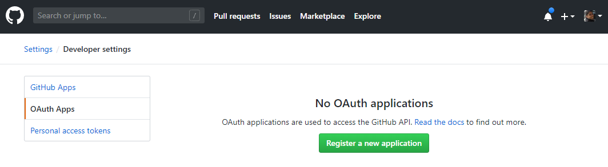
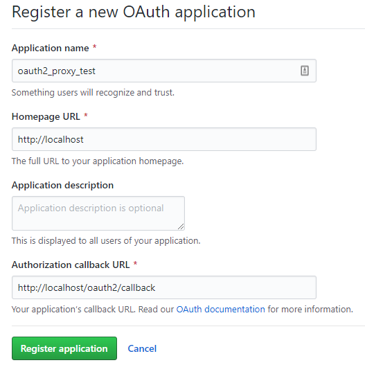
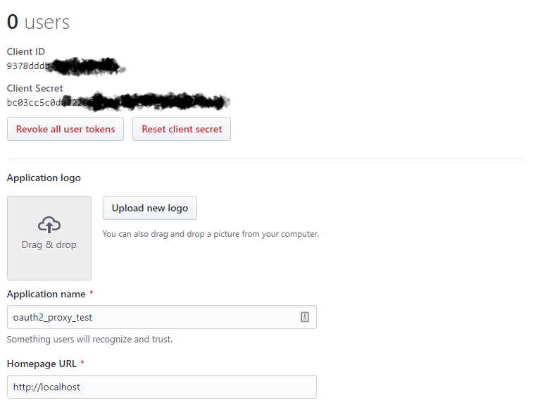
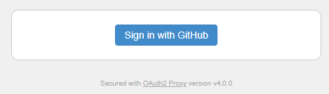
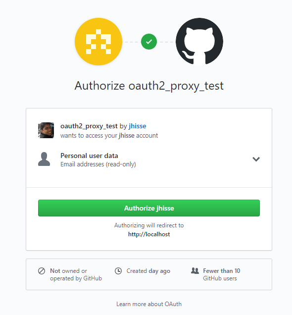
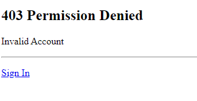

O objetivo deste artigo é implementarmos um método de autenticação de um website estático por oauth2 utilizando [nginx](https://www.nginx.com/) como servidor de arquivos estáticos e proxy reverso, [oauth2_proxy](https://oauth2-proxy.github.io/oauth2-proxy/) como backend para validação das requisições e o [Github](https://github.com/) como provedor de autorização.

Todo o projeto está disponível [neste repositório](https://github.com/jhisse/nginx-oauth2_proxy-github).

Para executar esse projeto é recomendado ter o Docker e o Docker-Compose instalado em sua máquina.

## Nginx para arquivos estáticos

Aqui iremos configurar o básico do nginx para servir uma página HTML estática, neste caso pode ser um build do Jekyll, Hugo ou um simples HTML.

Nossa página HTML de teste será o mais simples possível (index.html):

```html
<!DOCTYPE html>
<html>
  <head>
    <meta charset="utf-8" />
    <title>Index</title>
  </head>

  <body>
    <p>
      Lorem ipsum dolor sit amet, consectetur adipiscing elit. Praesent in nibh
      mi. Vivamus convallis lacinia dolor in pulvinar. Nulla mollis ultricies
      justo, ut fermentum dolor auctor a. Nullam consectetur nulla eget eros
      scelerisque tincidunt. Etiam in metus nisi. Donec vehicula nec erat eu
      aliquet. Fusce fermentum arcu sit amet purus suscipit tristique.
    </p>

    <p>
      Duis quis libero quis sapien tempor auctor. Morbi ut eros eu eros finibus
      blandit a vel ante. Praesent porta rutrum lorem, interdum tincidunt sem
      porttitor in. Morbi nunc nibh, aliquet hendrerit auctor sed, ultricies non
      ipsum. Nam a ante in dolor pharetra euismod. Donec aliquam turpis nec
      tortor ultricies molestie. Nunc dignissim, orci vitae tristique porta,
      magna erat dignissim dui, sit amet commodo tortor justo interdum nulla.
      Mauris dictum ex libero, at aliquet mauris sagittis sit amet. Etiam
      hendrerit elementum arcu at pulvinar. Nunc pellentesque tincidunt tortor,
      sit amet consequat felis blandit hendrerit. Nulla nibh sapien, sagittis
      quis cursus ac, luctus in neque. Nullam pellentesque maximus mollis. Fusce
      quam nisi, accumsan tincidunt nibh cursus, feugiat cursus urna.
      Pellentesque imperdiet aliquet quam, in gravida dolor vehicula eleifend.
    </p>

    <p>
      Proin sed sapien sit amet nisl faucibus dapibus. Cras sed cursus tellus.
      Nullam nunc metus, hendrerit et maximus in, tincidunt non sem. Etiam
      vehicula arcu nec erat posuere, nec tincidunt lorem rhoncus. Phasellus
      tincidunt fringilla enim. Vivamus porta ultricies enim vitae facilisis.
      Duis sit amet pulvinar dolor, maximus aliquam odio.
    </p>

    <p>
      Quisque eget volutpat nulla. Orci varius natoque penatibus et magnis dis
      parturient montes, nascetur ridiculus mus. Vivamus sagittis, magna non
      ullamcorper blandit, turpis nisi lacinia risus, eget tempus libero lorem
      vitae risus. Curabitur quis ligula eu dolor volutpat placerat. Integer
      iaculis, arcu non luctus ultricies, dolor est fermentum enim, quis
      ullamcorper magna sapien a est. Nulla facilisi. Nulla lectus leo,
      pellentesque quis iaculis non, mollis in neque. Cras porttitor lacinia
      dolor quis hendrerit.
    </p>

    <p>
      Etiam dictum rutrum ligula, sed eleifend nibh consectetur ut. Etiam
      pellentesque urna eget tempus hendrerit. Nullam faucibus convallis mauris,
      id hendrerit diam eleifend a. Curabitur ultrices ex diam, vitae accumsan
      lectus vulputate eu. Aliquam ultricies eu arcu quis dignissim. Sed
      pharetra leo non erat dapibus, vitae porta augue aliquet. Morbi porttitor
      pellentesque dui, sed vulputate nulla pulvinar sit amet. Aenean consequat
      luctus nisi. Maecenas imperdiet diam sit amet iaculis porttitor. Donec
      fermentum est sapien, maximus tempus nunc posuere sit amet. Nulla
      vestibulum elementum lacus quis placerat.
    </p>
  </body>
</html>
```

Agora vamos configurar o Dockerfile para inserir esta página HTML dentro de uma imagem Docker.

```dockerfile
FROM nginx:alpine

ADD index.html /usr/share/nginx/html
```

A estrutura do diretório irá ficar da seguinte forma:

```plaintext
./
└── nginx/
    ├── Dockerfile
    └── index.html
```

Temos que buildar nossa imagem do nginx e executa-lá em seguida:

```bash
cd nginx
docker build -t nginx_static .
docker run --rm -p 80:80 nginx_static
```

Podemos acessar o endereço `http://localhost` para verificarmos que nossa aplicação funcionou e a nossa página está sendo exibida corretamente.

Tendo nosso ponto de partida configurado, vamos seguir para a configuração da autenticação.

## Configurando o provedor de autorização

O Github funcionará como nosso provedor de autorização, ou seja, o usuário que deseja logar irá permitir que o nosso backend possa acessar os dados do solicitante. O provedor retornará a solicitação com um código de autorização que indica que o backend está autorizado a receber os dados do usuário.

Então o primeiro passo é criarmos um OAuth App em nosso provedor de autenticação. Entre no Github e vá para **Settings** -> **Developers Settings** -> **OAuth Apps** ([link direto](https://github.com/settings/developers)), clique em **Register a new application**.



Escolha um nome para sua aplicação e como estamos testando localmente em **Homepage URL** coloque `http://localhost` e em **Callback URL** coloque `http://localhost/oauth2/callback`.

Os endpoints disponíveis do oauth2_proxy podem ser consultados na [documentação oficial](https://oauth2-proxy.github.io/oauth2-proxy/features/endpoints).



Agora temos um _client_id_ e um _client_secret_ que serão utilizados pelo oauth2_proxy.



## Configurando oauth2_proxy, nginx e redis em conjunto

Para facilitar a orquestração dos nossos sistemas iremos utilizar o docker compose.

```yaml
version: '3'
services:
  redis:
    image: redis:5.0.6
    container_name: redis

  oauth2_proxy:
    image: quay.io/pusher/oauth2_proxy:v5.0.0-amd64
    container_name: oauth2_proxy
    environment:
      - OAUTH2_PROXY_HTTP_ADDRESS=http://0.0.0.0:4180
      - OAUTH2_PROXY_UPSTREAM=http://localhost
      # Restrictions (Not use in same time)
      # - OAUTH2_PROXY_AUTHENTICATED_EMAILS_FILE=/home/emails.txt
      - OAUTH2_PROXY_EMAIL_DOMAINS=*
      # Same url in Github Callback URL
      - OAUTH2_PROXY_REDIRECT_URL=http://localhost/oauth2/callback
      - OAUTH2_PROXY_SESSION_STORE_TYPE=redis
      - OAUTH2_PROXY_REDIS_CONNECTION_URL=redis://redis:6379
      # Generate secret -> python -c 'import os,base64; print(base64.urlsafe_b64encode(os.urandom(32)))'
      - OAUTH2_PROXY_COOKIE_SECRET=MoEZeM4UXo0Gznhw3D0rTUAFMH7_e1eklFaB5JcCRDw=
      - OAUTH2_PROXY_COOKIE_SECURE=false
      - OAUTH2_PROXY_COOKIE_REFRESH=2h
      - OAUTH2_PROXY_PASS_ACCESS_TOKEN=true
      - OAUTH2_PROXY_SET_AUTHORIZATION_HEADER=true
      - OAUTH2_PROXY_SET_XAUTHREQUEST=true
      - OAUTH2_PROXY_PROVIDER=github
      # Github CLIENT_ID and CLIENT_SECRET
      - OAUTH2_PROXY_CLIENT_ID=
      - OAUTH2_PROXY_CLIENT_SECRET=
    depends_on:
      - redis

  nginx:
    build: ./nginx
    container_name: nginx
    ports:
      - 80:80
    depends_on:
      - oauth2_proxy
```

Observando o compose acima, estamos configurando o container do oauth2_proxy com as variáveis de ambiente, como descrito [aqui](https://oauth2-proxy.github.io/oauth2-proxy/configuration/overview#environment-variables). Vamos chamar atenção para algumas configurações mais relevantes:

- "OAUTH2_PROXY_EMAIL_DOMAINS=\*": Domínios de e-mails permitidos. Aqui estamos permitindo todos os domínios.
- "OAUTH2_PROXY_REDIRECT_URL=`http://localhost/oauth2/callback`": Quando usamos o Github como provedor precisamos setar a url de redirecionamento igual a url de callback configurada no momento da criação do App.
- "OAUTH2_PROXY_PROVIDER=github": Provedor de autenticação.
- "OAUTH2_PROXY_CLIENT_ID=": Após o sinal de igual iremos colocar o Client ID que recebemos no momento da criação do App.
- "OAUTH2_PROXY_CLIENT_SECRET="Após o sinal de igual iremos colocar o Client Secret que recebemos no momento da criação do App.

O restante das configurações podem ser consultadas na [documentação](https://oauth2-proxy.github.io/oauth2-proxy/configuration/overview#command-line-options).

Agora precisamos substituir as configurações padrões do nginx para que toda requisição passe pelo backend de autenticação. Para isso vamos criar o arquivo _default.conf_ na pasta do nginx.

```nginx
server {
    listen       80;
    server_name  localhost;

    location / {
        root   /usr/share/nginx/html/;
        index  index.html;
        auth_request /oauth2/auth;
        error_page 401 = /oauth2/sign_in;
        # error_page 404 = /404.html;
        # error_page 500 502 503 504 = /50x.html;

        auth_request_set $user   $upstream_http_x_auth_request_user;
        auth_request_set $email  $upstream_http_x_auth_request_email;
        proxy_set_header X-User  $user;
        proxy_set_header X-Email $email;

        auth_request_set $token  $upstream_http_x_auth_request_access_token;
        proxy_set_header X-Access-Token $token;

        auth_request_set $auth_cookie $upstream_http_set_cookie;
        add_header Set-Cookie $auth_cookie;

        auth_request_set $auth_cookie_name_upstream_1 $upstream_cookie_auth_cookie_name_1;

        if ($auth_cookie ~* "(; .*)") {
            set $auth_cookie_name_0 $auth_cookie;
            set $auth_cookie_name_1 "auth_cookie_name_1=$auth_cookie_name_upstream_1$1";
        }

        if ($auth_cookie_name_upstream_1) {
            add_header Set-Cookie $auth_cookie_name_0;
            add_header Set-Cookie $auth_cookie_name_1;
        }
    }

    location /oauth2 {
        proxy_pass            http://oauth2_proxy:4180;
        proxy_set_header      Host                    $host;
        proxy_set_header      X-Real-IP               $remote_addr;
        proxy_set_header      X-Scheme                $scheme;
        proxy_set_header      X-Auth-Request-Redirect $request_uri;
    }

    location = /oauth2/auth {
        proxy_pass       http://oauth2_proxy:4180;
        proxy_set_header Host             $host;
        proxy_set_header X-Real-IP        $remote_addr;
        proxy_set_header X-Scheme         $scheme;
        proxy_set_header Content-Length   "";
        proxy_pass_request_body           off;
    }
}
```

Neste ponto algumas linhas merecem destaque:

- "auth_request /oauth2/auth;": Aqui indicamos que o endpoint /oauth2/auth será usado para autenticar nossos usuários.
- "proxy_pass `http://oauth2_proxy:4180`;": Presente nos dois endpoints, /oauth2 e /oauth2/auth. Indica que todas as requisições a esses endpoints serão passadas para o backend, disponível no endereço `http://oauth2_proxy:4180`.

Nosso novo Dockerfile para o nginx ficará seguinte forma:

```dockerfile
FROM nginx:alpine

ADD index.html /usr/share/nginx/html
ADD default.conf /etc/nginx/conf.d
```

A estrutura do diretório deve estar da seguinte forma:

```plaintext
./
├── docker-compose.yml
└── nginx/
    ├── Dockerfile
    └── index.html
```

Após a inserção do _Client ID_ e do _Client Secret_ no docker-compose.yml iremos executar nossas aplicações. Vá para a raiz do nosso projeto e execute o seguinte comando:

```bash
docker-compose up
```

Acessando o endereço `http://localhost` nos deparamos com a tela de login do backend.



Ao clicar em "**Sign in with Github**" iremos para a página de autorização da aplicação.



Em seguida iremos ser redirecionados de volta ao nosso website e nosso backend tendo autorizado a autenticação.


Até o momento montamos uma estrutura básica para que nosso website fique visível somente para usuários autenticados, mas queremos restringir ainda mais o acesso. Queremos que apenas que alguns usuários tenham acesso. Para isso iremos utilizar a funcionalidade do oauth2_proxy que permitirá a autorização de visualizar apenas para determinados e-mails.

## Restringindo acesso por e-mails

Agora queremos restringir o acesso apenas a determinados endereços de e-mails, ou seja, vamos restringir nossa aplicação.

Temos uma configuração do oauth2_proxy interessante em nosso compose:

```yaml
- OAUTH2_PROXY_EMAIL_DOMAINS=*
```

Com essa configuração estavamos permitindo que qualquer endereço de e-mail pudesse acessar nosso website. Caso quisessemos poderiamos restringir o acesso a somente endereços de e-mails de um ou mais domínios.

```yaml
- OAUTH2_PROXY_EMAIL_DOMAINS=hotmail.com,gmail.com
```

Porém queremos restringir ainda mais o acesso. Para isso vamos trabalhar mais uma vez com o Dockerfile.

Criaremos uma nova pasta na raiz do nosso projeto chamada _oauth2_proxy_. E dentro criaremos um arquivo chamado _emails.txt_ e outro chamado _Dockerfile_.

```plaintext
./
├── docker-compose.yml
├── nginx/
│   ├── Dockerfile
│   └── index.html
└── oauth2_proxy/
    ├── Dockerfile
    └── emails.txt
```

_emails.txt_:

```text
email_01@permitido.com
email_02@permitido.com
```

_Dockerfile_:

```dockerfile
FROM quay.io/pusher/oauth2_proxy:v4.0.0-amd64

ADD emails.txt /home
```

Modificaremos nosso _docker-compose.yml_

```yaml
version: '3'
services:
  redis:
    image: redis:5.0.6
    container_name: redis

  oauth2_proxy:
    build: ./oauth2_proxy
    container_name: oauth2_proxy
    environment:
      - OAUTH2_PROXY_HTTP_ADDRESS=http://0.0.0.0:4180
      - OAUTH2_PROXY_UPSTREAM=http://localhost
      # Restrictions (Not use in same time)
      - OAUTH2_PROXY_AUTHENTICATED_EMAILS_FILE=/home/emails.txt
      # - OAUTH2_PROXY_EMAIL_DOMAINS=*
      # Same url in Github Callback URL
      - OAUTH2_PROXY_REDIRECT_URL=http://localhost/oauth2/callback
      - OAUTH2_PROXY_SESSION_STORE_TYPE=redis
      - OAUTH2_PROXY_REDIS_CONNECTION_URL=redis://redis:6379
      # Generate secret -> python -c 'import os,base64; print(base64.urlsafe_b64encode(os.urandom(32)))'
      - OAUTH2_PROXY_COOKIE_SECRET=MoEZeM4UXo0Gznhw3D0rTUAFMH7_e1eklFaB5JcCRDw=
      - OAUTH2_PROXY_COOKIE_SECURE=false
      - OAUTH2_PROXY_COOKIE_REFRESH=2h
      - OAUTH2_PROXY_PASS_ACCESS_TOKEN=true
      - OAUTH2_PROXY_SET_AUTHORIZATION_HEADER=true
      - OAUTH2_PROXY_SET_XAUTHREQUEST=true
      - OAUTH2_PROXY_PROVIDER=github
      # Github CLIENT_ID and CLIENT_SECRET
      - OAUTH2_PROXY_CLIENT_ID=
      - OAUTH2_PROXY_CLIENT_SECRET=
    depends_on:
      - redis

  nginx:
    build: ./nginx
    container_name: nginx
    ports:
      - 80:80
    depends_on:
      - oauth2_proxy
```

Aqui vale a observação que não podemos utilizar as duas configurações de restrições ao mesmo tempo. Ou usamos **OAUTH2_PROXY_AUTHENTICATED_EMAILS_FILE** ou usamos **OAUTH2_PROXY_EMAIL_DOMAINS**.

Executando nossa aplicação novamente, podemos perceber que após a tentativa de acesso recebemos o erro _403 Permission Denied_.

E no stdout do terminal vemos algo do tipo "_\[AuthFailure\] Invalid authentication via OAuth2: unauthorized_".



Isso quer dizer que nosso acesso não foi autorizado. Para ter acesso neste caso, basta colocarmos nosso endereço de e-mail no arquivo _emails.txt_.

Nesse artigo mostramos um método de autenticação que nos possibilitou uma maneira simples de restringirmos o acesso somente a e-mails autorizados a alguns endpoints.
