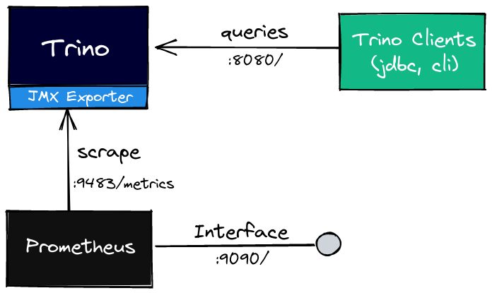
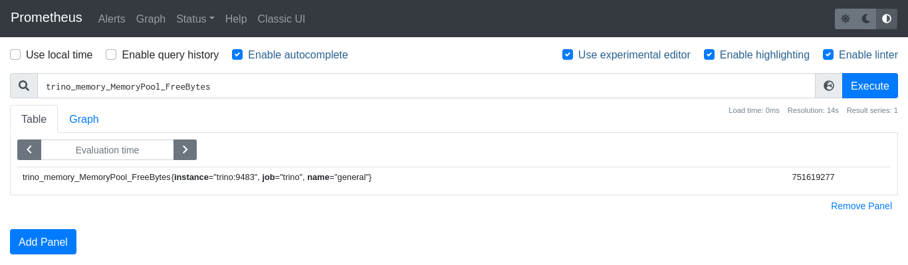
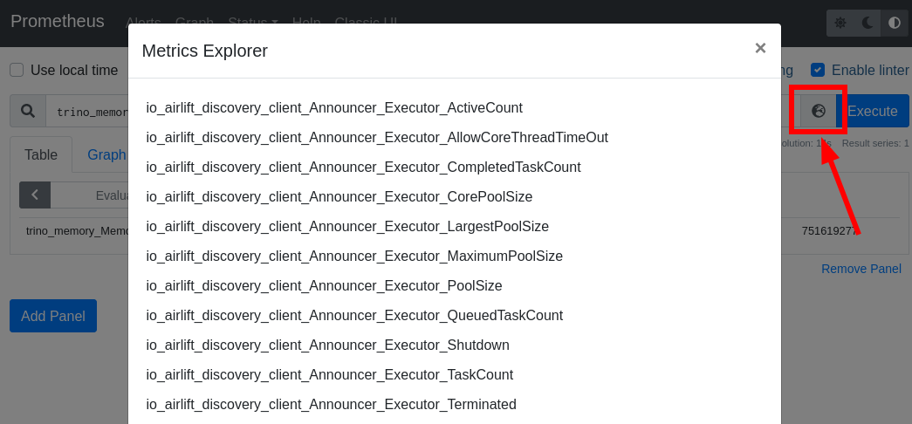
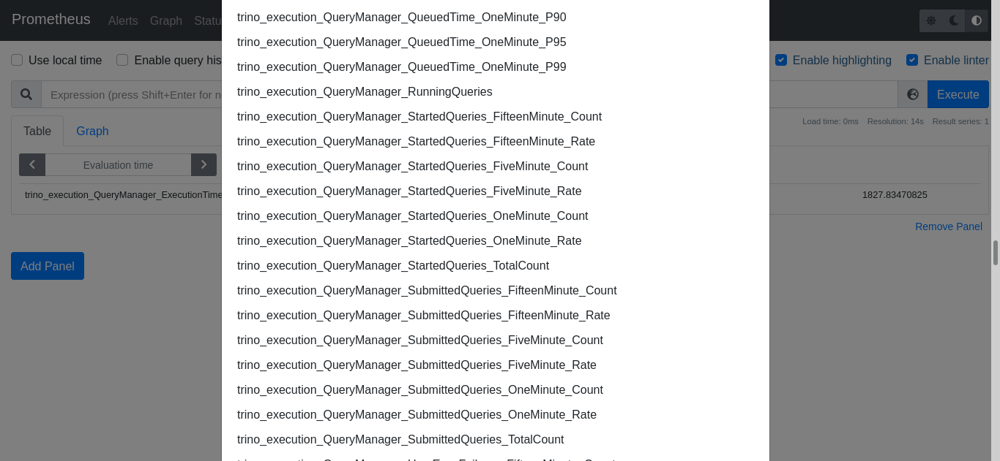
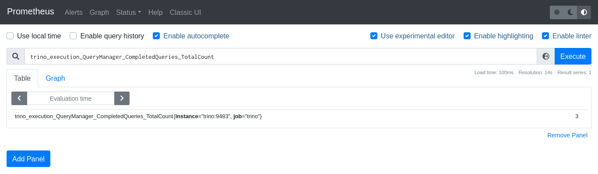
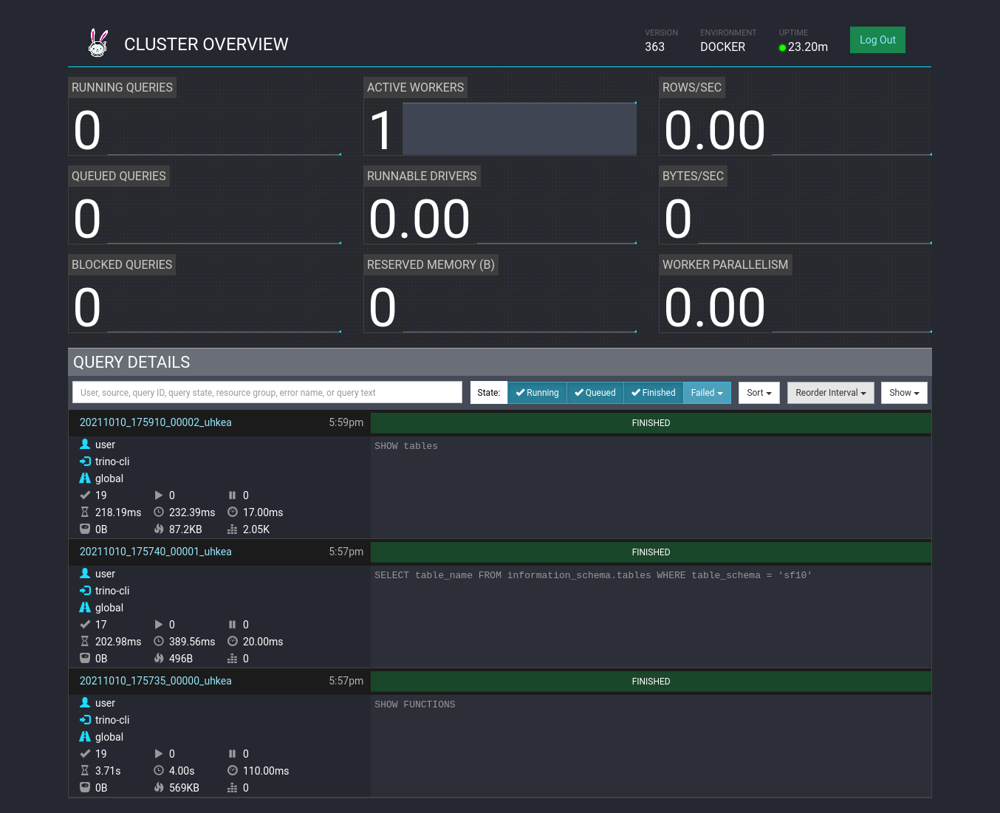
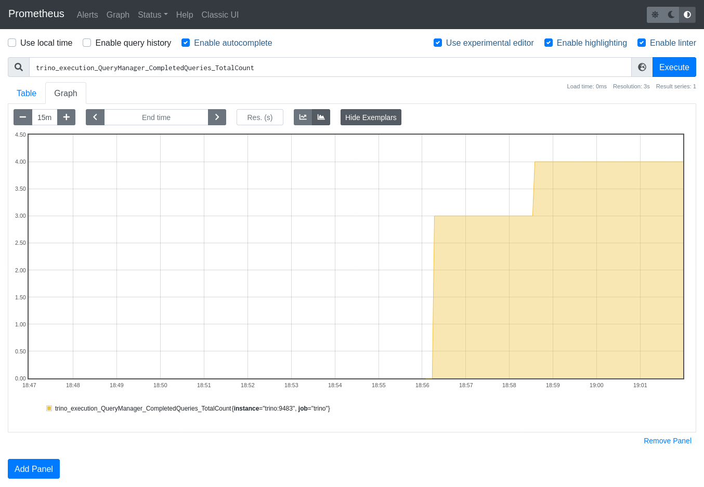
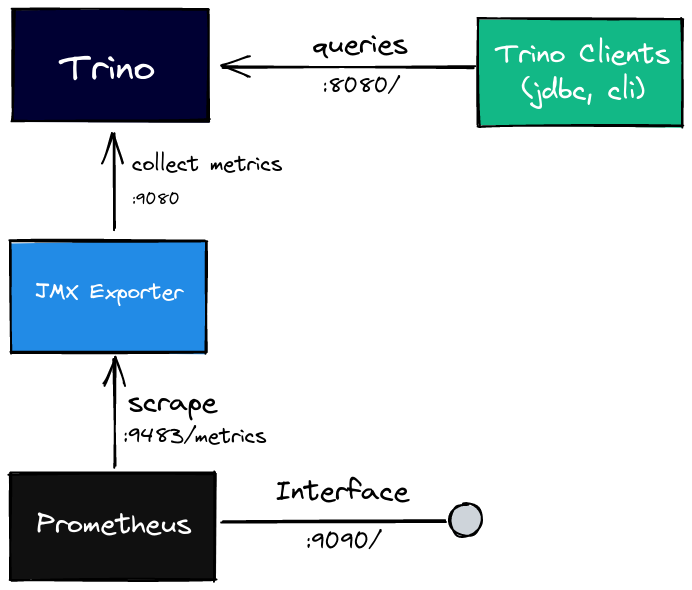
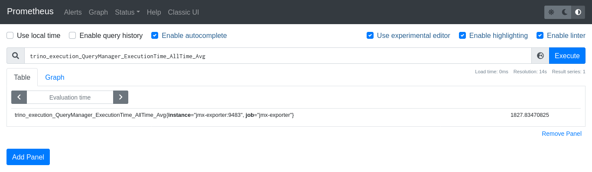

Monitorar a saúde da stack de dados é essencial para promover um ambiente analítico mais robusto. Ao longo desse artigo mostraremos como exportar algumas métricas do Trino para o Prometheus.

## Pré-requisitos

Você deverá ter instalado em sua máquina:

- Docker
- Docker-compose
- Trino cli

## Trino

O Trino, antes denominado PrestoSQL, é um componente essencial em uma stack de big data. Com ele é possível realizarmos consultas SQL de modo distribuído e escalável. Ele é responsável por se conectar em diversas fontes diferentes e processar um grande volume de dados. Ele se conecta, por exemplo, em um data lake no S3, em uma base no Postgres ou até em um cluster Kafka.

No nosso exemplo, iremos utilizar o [conector TPCDS](https://trino.io/docs/363/connector/tpcds.html), ele é muito utilizado para benchmark de banco de dados. Com ele, será possível realizar algumas queries sem precisar conectar o Trino em uma fonte de dados externa, pois esse conector gera os próprios dados quando uma consulta é realizada.

O Trino deve ser utilizado em modo cluster em sistemas em produção, porém ao longo desse artigo iremos utilizar somente um nó afim de simplificar o entendimento da solução, que atuará como coordinator e worker ao mesmo tempo.

## JMX Exporter

Vamos utilizar um pequeno agente chamado [JMX Exporter](https://github.com/prometheus/jmx_exporter). Sua função é capturar as métricas da máquina virtual java, JVM, e as expor via endpoint http.

Ele pode ser configurado de duas formas, uma é coletando as métricas de um endpoint JMX remoto e as exportando via endpoint http. A outra forma de configurar é a recomendada pela documentação e oferece vantagens em relação a anterior. Deve-se executar o JMX Exporter como um java agent.

## Exportando com o Java Agente

### Arquitetura da solução

Vamos a nossa solução utilizando o java agent. Para uma melhor compreensão da solução, vamos observar o seguinte diagrama e logo após vamos aos detalhes.



O primeiro componente que devemos observar é o Trino, ele é executado como um aplicativo java. Dessa forma o JMX Exporter será configurado para atuar em conjunto com ele, expondo as métricas da JVM através de um endpoint http.

O Prometheus irá realizar periodicamente um scraping no endpoint que iremos indicar e armazenar as métricas capturadas. Outras ferramentas poderão se conectar a ele para obter esse histórico de métricas e gerar visualizações, como o Grafana, por exemplo. Esse último tópico citado não será parte do escopo desse artigo.

### Preparando o ambiente

Vamos iniciar preparando uma estrutura de diretórios, como representado abaixo. Vamos criar duas pastas, uma chamada trino e outra Prometheus.

```console
.
├── trino
└── prometheus
```

O passo seguinte é criarmos o Dockerfile do Trino para realizar o download do jar do JMX Exporter e realizar as configurações necessárias.

De acordo com a documentação, precisamos colocar o seguinte trecho na instrução java que executa nosso programa principal, ```-javaagent:<jmx exporter jar>=<port>:<config file>```. Esse trecho será adicionado ao final do arquivo ```/etc/trino/jvm.config```.

```console
.
├── trino
│   └── Dockerfile
└── prometheus
```

```Dockerfile
# Imagem base do Trino
FROM trinodb/trino:363

# Download do JMX Exporter
ADD https://repo1.maven.org/maven2/io/prometheus/jmx/jmx_prometheus_javaagent/0.16.1/jmx_prometheus_javaagent-0.16.1.jar /usr/lib/trino/lib/

# Alterando o usuário para root para corrigir permissões
USER root

# Alterando o owner do jar para trino e o grupo para trino
RUN chown trino:trino /usr/lib/trino/lib/jmx_prometheus_javaagent-0.16.1.jar

# Alterando as permissões do jar
RUN chmod 644 /usr/lib/trino/lib/jmx_prometheus_javaagent-0.16.1.jar

# Voltando o usuário para trino
USER trino

# Criando uma arquivo de configuração do JMX Exporter vazio
RUN touch /etc/trino/jmx_config.yml

# Adicionando a flag javaagent para execução do JMX Exporter junto ao Trino
RUN echo "-javaagent:/usr/lib/trino/lib/jmx_prometheus_javaagent-0.16.1.jar=9483:/etc/trino/jmx_config.yml" >> /etc/trino/jvm.config
```

O Prometheus funciona realizando o scraping das métricas nos serviços que ele está monitorando. Isso significa que precisamos configurar os endpoints que ele precisará monitorar. Para isso vamos criar um arquivo yaml chamado ```prometheus/prometheus.yml```.

```console
.
├── trino
│   └── Dockerfile
└── prometheus
    └── prometheus.yml
```

```yaml
global:
  scrape_interval: "10s"
  scrape_timeout: "10s"

scrape_configs:
  - job_name: "trino"
    metrics_path: "/metrics"
    static_configs:
      - targets:
          - "trino:9483"
```

As 3 primeiras linhas se refere a configurações globais do Prometheus. A segunda linha, ```scrape_interval```, é sobre o intervalo de scraping, ou seja, ele irá realizar a coleta de métricas de 10 em 10 segundos. Já a terceira linha é o tempo limite de resposta da requisição http que o Prometheus irá aguardar para obter uma resposta.

A partir da quinta linha começa as configurações relacionadas aos serviços que queremos monitorar. O ```job_name``` é o nome que daremos a esse job em especifico e ```metrics_path``` é o path que as métricas estão expostas no endpoint. Em ```static_configs``` iremos colocar em ```targets``` os endpoints que serão monitorados.

Por fim devemos criar um arquivo ```docker-compose.yml``` contendo as definições de nossos containers.

```console
.
├── trino
│   └── Dockerfile
├── prometheus
│   └── prometheus.yml
└── docker-compose.yml
```

```yaml
version: "3"

services:
  trino:
    # Realizar o build do Dockerfile presente na pasta trino
    build: "trino"
    # Expor as portas 8080 do Trino e 9483 das métricas
    ports:
      - "8080:8080"
      - "9483:9483"

  prometheus:
    # Imagem do prometheus
    image: "prom/prometheus:v2.30.2"
    # Arquivo de configuração
    volumes:
      - "./prometheus/:/etc/prometheus/"
    # Flag indicando local do arquivo de configuração
    command:
      - "--config.file=/etc/prometheus/prometheus.yml"
    # Expor a porta do prometheus
    ports:
      - "9090:9090"
```

### Executando a stack de monitoramento

Agora basta executarmos nossa stack com o Docker Compose e visualizar as métricas no Prometheus.

```console
docker-compose up -d
```

Podemos acessar o endereço ```localhost:9090``` e visualizar as métricas do Trino na interface do Prometheus.



Para explorar mais métrica, podemos clicar no *Metrics Explorer* como mostrado na imagem abaixo.



As métricas relacionadas com ao Trino iniciam com o prefixo *trino_*.



Vou realizar algumas queries no catálogo *TPCDS* utilizando o [trino-cli](https://trino.io/docs/current/installation/cli.html). O catálogo *TPCDS* tem diversos schemas, *sf1*, *sf10*, *sf100* e mais, o número inteiro após o prefixo *sf* indica a quantidade de gigabytes de dados que o schema terá. Nos nossos testes a seguir vamos utilizar o *sf10*.

Para conectar ao trino através da linha de comando, você precisa instalar o trino-cli em sua máquina, ter a stack que construirmos sendo executada na máquina e digitar no terminal:

```console
$ trino --server localhost:8080 --catalog tpcds --schema sf10
trino:sf10>
```

Agora podemos executar algumas queries e verificar as métricas na interface do prometheus. Vamos à primeira query para conhecermos as tabelas desse catálogo e schema.

```console
trino:sf10> SHOW tables;
```

Além de sabermos quais tabelas compõem o schema, já podemos observar as métricas no Prometheus. Agora uma consulta simples, a quantidade total de queries que foram finalizadas. Para isso, na interface do Prometheus, vamos colocar a seguinte consulta:

```text
trino_execution_QueryManager_CompletedQueries_TotalCount
```



Verificamos um total de 3 queries finalizadas. Mas será que isso está correto, já que só executamos 1 query? Podemos verificar na interface do Trino, ```localhost:8080```, o user padrão será **admin**.



Quando nos conectamos ao Trino através do command line, ele executa duas queries para obter informações do schema. Isso justifica a quantidade total de 3 queries finalizadas.

Vamos executar mais uma query e depois observar o gráfico que o Prometheus pode exibir.

```console
trino:sf10> SELECT * FROM catalog_sales LIMIT 100;
```



Com isso fechamos a apresentação dessa primeira solução. O que apresentaremos a seguir será uma solução alternativa, mas equivalente a já apresentada.

## Método alternativo utilizando o endpoint JMX Remoto

Vale lembrar que essa forma **não é a recomendada**, devido ao que foi explicado na seção do JMX Exporter, porém vamos demonstrar a seguir como seria essa solução.

### Arquitetura da solução alternativa

Na seção do JMX Exporter citamos outra forma de obter métricas do Trino. Vamos visualizar a arquitetura da solução alternativa e depois discorrer sobre.



A principal diferença desta implementação da apresentada anteriormente é que trazemos o JMX Exporter para um container a parte e não o executamos mais como um Java Agent.

### Preparando o ambiente do método alternativo

A estrutura de pasta agora será a seguinte:

```console
.
├── trino
│   └── Dockerfile
├── prometheus
│   └── prometheus.yml
├── jmx-exporter
│   └── jmx_config.yml
└── docker-compose.yml
```

Observamos que foi criada uma pasta chamada ```jmx-exporter``` onde conterá o arquivo de configuração ```jmx_config.yml```.

```yaml
hostPort: trino:9080
```

O ```Dockerfile``` não irá mais carregar o jar do JMX Exporter, somente será necessário setar algumas configurações da JVM e do Trino, como verificaremos a seguir.

```Dockerfile
# Imagem base do Trino
FROM trinodb/trino:363

# Ativando o jmx na jvm https://stackoverflow.com/a/856882
RUN echo "-Dcom.sun.management.jmxremote" >> /etc/trino/jvm.config && \
    echo "-Dcom.sun.management.jmxremote.local.only=false" >> /etc/trino/jvm.config && \
    echo "-Dcom.sun.management.jmxremote.authenticate=false" >> /etc/trino/jvm.config && \
    echo "-Dcom.sun.management.jmxremote.ssl=false" >> /etc/trino/jvm.config && \
    echo "-Dcom.sun.management.jmxremote.port=9080" >> /etc/trino/jvm.config && \
    echo "-Dcom.sun.management.jmxremote.rmi.port=9081" >> /etc/trino/jvm.config

# https://trino.io/docs/current/admin/jmx.html#admin-jmx--page-root
RUN echo "jmx.rmiregistry.port=9080" >> /etc/trino/config.properties && \
    echo "jmx.rmiserver.port=9081" >> /etc/trino/config.properties
```

Agora devemos configurar o Prometheus para obter as métricas do container do JMX Exporter e não mais do Trino. Então, teremos que modificar nosso arquivo ```prometheus/prometheus.yml```.

```yaml
global:
  scrape_interval: "10s"
  scrape_timeout: "10s"

scrape_configs:
  - job_name: "jmx-exporter"
    metrics_path: "/metrics"
    static_configs:
      - targets:
          - "jmx-exporter:9483"
```

E, por fim, nosso ```docker-compose.yml``` conterá mais um serviço.

```yaml
version: "3"

services:
  trino:
    # Realizar o build do Dockerfile presente na pasta trino
    build: "trino"
    # Expor as portas 8080 do Trino e 9080 do jmx server
    ports:
      - "8080:8080"
      - "9080:9080"
  
  jmx-exporter:
    # Imagem do jmx exporter
    image: "bitnami/jmx-exporter:0.16.1"
    # Arquivo de configuração
    volumes:
      - "./jmx-exporter/:/etc/jmx-exporter/"
    # Porta que as métricas serão expostas e path do arquivo de configuração
    command:
      - "9483"
      - "/etc/jmx-exporter/jmx_config.yml"
    # Expor a porta de métricas
    ports:
      - "9483:9483"

  prometheus:
    # Imagem do prometheus
    image: "prom/prometheus:v2.30.2"
    # Arquivo de configuração
    volumes:
      - "./prometheus/:/etc/prometheus/"
    # Flag indicando local do arquivo de configuração
    command:
      - "--config.file=/etc/prometheus/prometheus.yml"
    # Expor a porta do prometheus
    ports:
      - "9090:9090"
```

### Avaliando o método alternativo

Executando nossa stack alternativa, iremos observar as métricas no Prometheus.

```console
docker-compose up -d
```



Podemos observar que todas as métricas relacionadas ao Trino serão as mesmas da primeira forma apresentada.

## Conclusão

Apresentamos duas formas de exportar métricas do Trino através do JMX Exporter, porém a primeira forma apresentada é a recomendada, além de ser mais simples a configuração.

Recomendo que explore as métricas do Trino para poder melhor entender quais delas fazem mais sentido ao que deseja monitorar.
