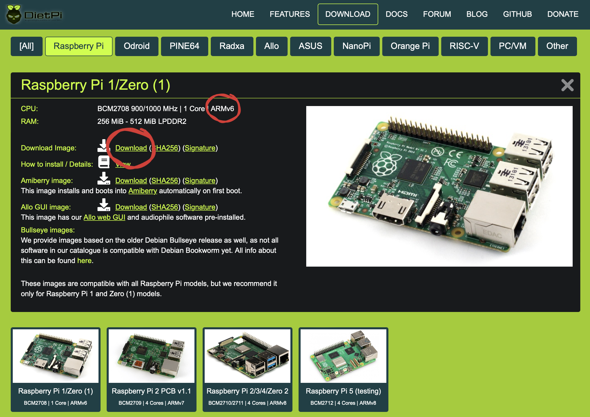
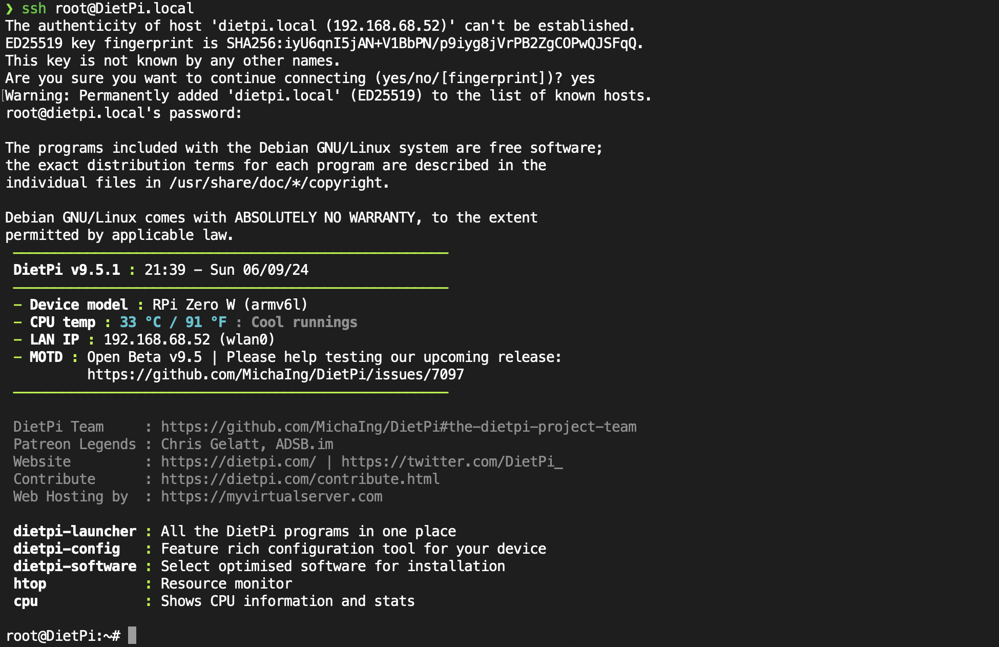

Esse artigo é um pouco diferente dos que eu costumo escrever aqui no site. Talvez seja mais útil para que eu mantenha um registro que como eu fiz a impressora funcionar de forma correta, mas pode ser útil para outras pessoas que tenham o mesmo modelo de impressora e estejam com problemas semelhantes ao meu.


Eu tenho em casa uma ótima impressora multifuncional Samsung SCX-3405W. Apesar de ser um modelo muito antigo, a minha tem como data de fabricação setembro de 2013, ela ainda imprime com uma qualidade muito boa e com rapidez. Toners compatíveis estão custando em torno de R$ 50,00 e consigo imprimir mais de 1200 páginas com um único toner. Ele geralmente dura mais de um ano, já que eu não tenho o hábito de imprimir muita coisa, prefiro utilizar a tela para leitura, mas as vezes precisamos ter algum documento ou um artigo impresso para levar à algum lugar.

## Problema

Como ela tem o recurso de impressão via Wifi, bastava ligar a impressora e pressionar o botão _WPS_ no painel e ativar o _WPS_ no roteador. Com a impressora conectada na rede, eu conseguia imprimir de qualquer dispositivo da casa que estivesse na mesma rede, mas os problemas de impressão descritos acima persistiam.

_WPS_ é uma forma de conectar dispositivos em uma rede sem a necessidade de senha. Basta que ambos os dispositivos tenham o recurso e que estejam próximos um do outro.

Como utilizo o Macbook Air, ela é reconhecida pelo sistema operacional de forma automática quando adiciono a uma nova impressora em ajustes graças ao protocolo _bonjour_, porém encontrava diversos problemas, como por exemplo, repetição de páginas, demora no intervalo entre uma página e outra, o job de impressão ficava pendente e não era impresso ou parava depois de 2 ou 3 páginas, entre outros problemas.

Os drivers oficiais da impressora já não suportam as novas versões do sistema operacional, somente até o macOS 10, o meu já está no 14.4. Precisava encontrar uma solução para que a impressora funcionasse de forma correta e qualquer dispositivo na rede pudesse imprimir sem problemas via Wifi.

## Solução

Com um Raspberry Pi Zero W que estava parado na gaveta, resolvi utilizá-lo para compartilhar a impressora na rede através do [_CUPS_](https://www.cups.org). Essa versão do Raspberry Pi é muito pequena e tem Wifi integrado, o que facilita a instalação e configuração. Já o _CUPS_ é um sistema de impressão que permite que um computador atue como um servidor de impressão.


### Preparação do Raspberry Pi

Para preparar o Raspberry Pi Zero W utilizei o sistema operacional _DietPi_. Ele é um _OS_ muito leve e otimizado para o uso na single board. A instalação é muito simples, basta baixar a imagem do sistema, gravar em um cartão microSD e ligar o Raspberry.

Para efeito de eu mesmo ler este post no futuro ou outra pessoa se interesse, vou descrever os passos que eu fiz para instalar o _DietPi_ e realizar a configuração inicial.



Primeiro fiz o download do _DietPi_ no site oficial. Acessei a página [https://dietpi.com/](https://dietpi.com/) e cliquei no botão _Download_. Agora é só escolher a versão do Raspberry Pi Zero W e baixar o arquivo correspondente, no meu caso o ARMv6.

Não vou descrever os passos de instalação no cartão SD, pois na página do _DietPi_ já tem um [tutorial de instalação](https://dietpi.com/docs/install/). Basta seguir o passo a passo que não tem erro.

Após a instalação do sistema operacional no cartão SD, vamos modificar dois arquivos presentes no cartão de memória para que o Raspberry Pi Zero W se conecte à rede Wifi automaticamente, desabilite o HDMI já que o _CUPS_ tem a interface web e não iremos utilizar um monitor, habilitaremos o auto update para nosso sistema se manter atualizado e instalaremos o _CUPS_ no primeiro boot. Abaixo exibirei apenas as chaves que eu modifiquei, o restante do arquivo permanece inalterado.

```properties
# dietpi-wifi.txt
aWIFI_SSID[0]='nome da rede wifi'
aWIFI_KEY[0]='sunha senha do wifi'
```

```properties
# dietpi.txt
# Timezone
AUTO_SETUP_TIMEZONE=America/Sao_Paulo
# Desabilitar Ethernet já que o Pi Zero W será conectado via Wifi
AUTO_SETUP_NET_ETHERNET_ENABLED=0
# Habilitar Wifi
AUTO_SETUP_NET_WIFI_ENABLED=1
# Habilitar modo sem tela
AUTO_SETUP_HEADLESS=1
# Habilitar configuracao inicial automática
AUTO_SETUP_AUTOMATED=1
# Instalar Cups por padrão, 187 é o ID do software
AUTO_SETUP_INSTALL_SOFTWARE_ID=187
# Checar atualizações do APT automaticamente
CONFIG_CHECK_APT_UPDATES=2
```

Agora vamos adicionar um arquivo chamado _Automation_Custom_Script.sh_. Ele será executado no primeiro boot do sistema operacional, logo após a conexão com a rede Wifi e a atualização do sistema. Neste arquivo vamos instalar o [pacote _printer-driver-splix_](https://github.com/OpenPrinting/splix) que contém um conjunto de drivers para impressoras Samsung. Também vamos configurar o arquivo _cupsd.conf_ para que o _CUPS_ aceite conexões de qualquer dispositivo na rede sem a necessidade de senha.

```shell
# Automation_Custom_Script.sh
apt-get update && apt-get install -y printer-driver-splix

cat << EOF > /etc/cups/cupsd.conf
AutoPurgeJobs Yes
LogLevel warn
Listen 0.0.0.0:631
Listen /run/cups/cups.sock
Browsing Yes
DefaultAuthType None
DefaultPaperSize A4
WebInterface Yes

<Location />
  Order allow,deny
  Allow @LOCAL
</Location>

<Policy default>
  <Limit All>
    Order allow,deny
    Allow @LOCAL
  </Limit>
</Policy>
EOF

systemctl restart cups
```


Após ligar o Raspberry pela primeira vez, ele irá se conectar à rede Wifi e atualizará o sistema e pacotes devido a configuração _AUTO_SETUP_AUTOMATED_, aguarde alguns minutos, pois essa configuração inicial pode demorar. Caso queira verificar o andamento da instalação, basta acessá-lo via SSH.

Caso você esteja utilizando Mac ou Linux basta abrir o terminal e digitar o comando abaixo.

```shell
ssh root@DietPi.local
```

Se estiver utilizando o Windows, você deve verificar o IP do Raspberry Pi Zero W no seu roteador e utilizá-lo no lugar de _DietPi.local_.



### Adicionando a impressora no CUPS

No navegador acesse o endereço `http://dietpi.local:631` e clique em _Administração_.


Agora clique em _Adicionar impressora_. Se sua impressora está conectada corretamente na sua rede Wifi, através do _WPS_, ela deve aparecer na lista de impressoras disponíveis. Selecione a impressora e clique em _Continuar_. Atenção, pois será exibido 3 impressoras, cada uma terá um protocolo diferente, _ipp_, _dnssd_ e _socket_. Eu escolhi a _socket_, as demais opções não funcionaram para mim. A opção de socket deve ser combinada com a reserva do endereço IP da impressora no roteador, para que o IP não mude e a impressora continue funcionando caso seja desconectada e reconectada na rede. Reserve o IP para o endereço MAC dela. Essa configuração varia de roteador para roteador, então consulte o manual do seu roteador para saber como fazer. Na próxima tela, você deve escolher o nome da impressora e não esquecer de marcar a opção _Compartilhar esta impressora_.


Agora devemos escolher o driver da impressora. Como a Samsung SCX-3405W não está na lista de drivers, vamos escolher o _Samsung SCX-4623fw, 2.0.0 (en)_. Essa dica foi postada no [fórum do Raspberry Pi](https://forums.raspberrypi.com/viewtopic.php?t=99474).


Depois de adicionar a impressora ela estará disponível na lista de impressoras e qualquer computador ou celular na rede poderá imprimir através do _Cups_.


### Imprimindo através do computador

A impressora agora está disponível para ser utilizada em qualquer computador na rede. No Mac, basta adicionar uma nova impressora em _Ajustes do Sistema_ > _Impressoras e Scanners_ e clicar no botão _Adicionar impressora, scanner ou fax_. Escolha a impressora com o final `@ DietPi` O Mac irá detectar a impressora e instalar automaticamente.


### Imprimindo através do celular

No celular a mesma coisa, quando colocar algo para ser impresso, basta selecionar a impressora _Samsung SCX-3400 Series_ e mandar imprimir. Caso você tenha escolhido outro nome para ela, o nome que você escolheu será exibido.

## Conclusão

Com esse procedimento, a impressora Samsung SCX-3405W voltou a funcionar de forma correta e qualquer dispositivo na rede pode imprimir sem problemas. O Raspberry Pi Zero W é uma ótima opção para compartilhar impressoras na rede, pois é muito pequeno, consome pouca energia e é barato. O _DietPi_ é um sistema operacional muito leve e otimizado para o Raspberry Pi, o que o torna uma excelente escolha para esse tipo de aplicação.

Apesar desse artigo ser diferente dos demais deste site, espero que ele tenha sido útil para você. A ideia central é abrir a mente para novas possibilidades e soluções para problemas do dia a dia.
