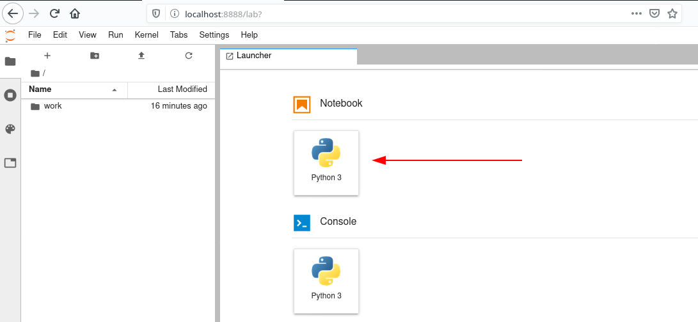
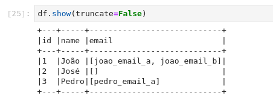
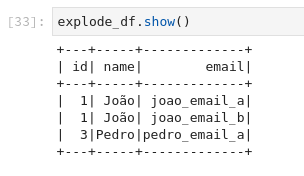
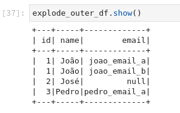

É comum em transformações de dados nos depararmos com estruturas de arrays de strings, inteiros ou algum outro tipo de arrays de objetos. Em alguns casos podemos querer transformar esses arrays em colunas. Usando o PySpark podemos usar as funções [explode](https://spark.apache.org/docs/3.3.0/api/python/reference/pyspark.sql/api/pyspark.sql.functions.explode.html) ou [explode_outer](https://broken.spark.apache.org/docs/3.3.0/api/python/reference/pyspark.sql/api/pyspark.sql.functions.explode_outer.html) para isso. Vamos entender a diferença entre essas duas funções.

## Preparação do ambiente

Para acompanhar o que vem a seguir sugiro que você tenha o docker instalado em sua máquina. No terminal executaremos uma imagem docker do jupyter contendo o PySpark já instalado. Com isso teremos acesso no navegador a interface de desenvolvimento do jupyter notebook.

```console
docker run -d -p 8888:8888 -e JUPYTER_ENABLE_LAB=yes jupyter/pyspark-notebook:e255f1aa00b2 start-notebook.sh --NotebookApp.token=''
```

No navegador acesse o endereço `localhost:8888` e crie um notebook.



## Bibliotecas necessárias

A primeira coisa que iremos fazer no novo notebook é importar as bibliotecas necessárias.

```python
from pyspark.sql import SparkSession
from pyspark.sql.types import *
from pyspark.sql.functions import explode, explode_outer
```

O primeiro import é o principal do PySpark, no [SparkSession](https://spark.apache.org/docs/3.3.0/api/python/reference/pyspark.sql/spark_session.html) iniciaremos a sessão do spark. O segundo é relacionando aos tipos usados para construímos nosso schema, como ```StringType()```, ```IntegerType()``` ou ```ArrayType()```. Já o terceiro é onde importaremos as funções explode e explode_outer, o principal ponto deste artigo.

## Criando a sessão do Spark

O meio que temos de acessarmos as APIs do Spark é através da SparkSession.

```python
spark = SparkSession.builder \
    .master('local') \
    .appName('explode vs. explode_outer') \
    .getOrCreate()
```

## Configurando o schema

No dataframe que iremos usar iremos ter três colunas, "id" do tipo inteiro, "name" do tipo string e "emails" do tipo array de strings. O objetivo é transformar a coluna "emails" em uma coluna do tipo `string` com as funções explode e explode_outer e analisarmos as diferenças entre elas.

```python
schema = StructType([
    StructField("id", IntegerType(), True),
    StructField("name", StringType(), True),
    StructField("emails", ArrayType(StringType(), True), True),
])
```

## Dataframe para teste

Vamos criar um dataframe mínimo para teste conforme o schema definido anteriormente.

```python
data = [
    (1, 'João', ['joao_email_a', 'joao_email_b']),
    (2, 'José', []),
    (3, 'Pedro', ['pedro_email_a']),
]
```

```python
df = spark.createDataFrame(data, schema=schema)
```

```python
df.show(truncate=False)
```



## Uso da função explode

Vamos criar uma coluna email com a função **explode** e em seguida excluímos a coluna "emails" original.

```python
explode_df = df.withColumn('email', explode('emails')).drop('emails')
```

```python
explode_df.show()
```



Observe que a função explode não manteve os dados do usuário de id = 2, que não possuía emails, ou seja, ela não manteve os registros que continham um array vazio na coluna "emails".

## Uso da função explode_outer

A função explode_outer assume um comportamento diferente como veremos a seguir.

```python
explode_outer_df = df.withColumn('email', explode_outer('emails')).drop('emails')
```

```python
explode_outer_df.show()
```



Aqui observamos que a função manteve os registros em que a coluna "emails" estava vazia, ou seja, ela manteve os registros com valores nulos, colocando null na coluna "email".

## Conclusão

Vimos que a principal diferença entre as funções explode e explode_outer, é que esta mantêm os registros caso o array seja vazio e aquela não mantêm, os registros são excluídos.

Quando trabalhamos com arrays é bom entendermos qual a necessidade do negócio, dependendo pode fazer sentido não considerar os registros em que o array está vazio, em outros casos pode fazer sentido manter.

O código completo pode ser encontrado neste [gist](https://gist.github.com/jhisse/9c7ef2115f9cb2a00a8c5d82a76507aa).
