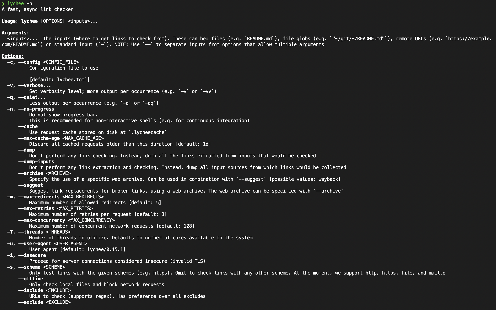
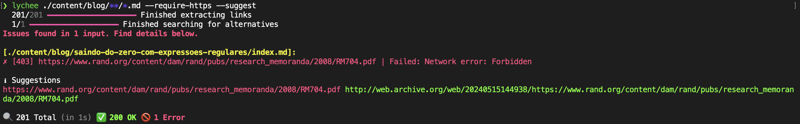
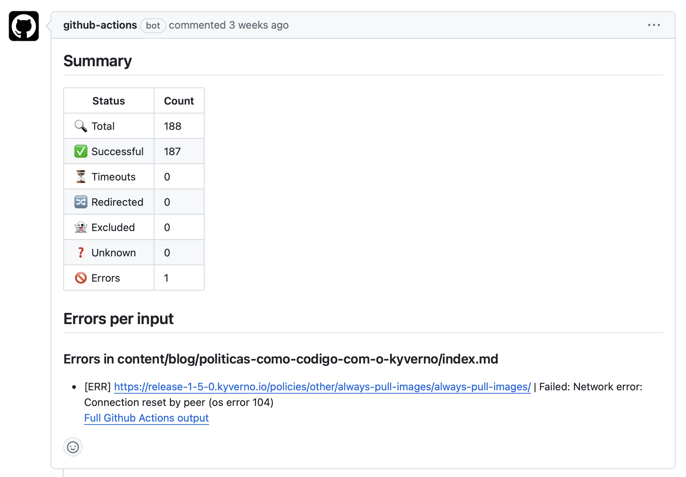

Manter um blog de tecnologia atualizado é uma tarefa desafiadora. Com a constante evolução das tecnologias, é essencial garantir que o conteúdo permaneça relevante e útil. Um dos desafios recorrentes é manter a integridade das URLs externas, que podem se tornar obsoletas à medida que sites são modificados, páginas são removidas ou domínios são alterados sem redirecionamento adequado. Isso resulta em links quebrados que prejudicam a experiência do leitor e a credibilidade do blog. Para evitar que links quebrados atrapalhem a experiência do leitor e prejudique o SEO do seu site, é possível utilizar ferramentas de checagem, como o [lychee](https://github.com/lycheeverse/lychee).

## O que é o lychee?

O lychee é uma CLI (Command Line Interface) que permite a validação de URLs em um conjunto de arquivos. Com ele podemos verificar se as URLs estão válidas, se possuem uma versão HTTPS e se estão acessíveis. Ele foi escrito em Rust, uma linguagem de programação conhecida por sua performance e seu código é aberto a comunidade.

## Instalação

Em seu repositório no GitHub, existe diversos métodos de instalação descritos no [README](https://github.com/lycheeverse/lychee/blob/v0.15.1/README.md). Como utilizo o MacOS, optei por instalar via Homebrew.

```bash
brew install lychee
```

Após a instalação podemos verificar se a ferramenta de linha de comando foi instalada corretamente.

```bash
lychee --help
```

Você deverá obter uma saída similar a essa :



No meu sistema, a versão instalada é 15.1, e você pode verificar a sua com o comando `lychee --version`.

## Utilizando o lychee

O primeiro passo é determinar quais tipos de arquivos serão verificados em busca de links. No meu caso, utilizo arquivos Markdown, então o comando que utilizo é o seguinte:

```bash
lychee ./content/blog/**/*.md --require-https
```

O comando acima irá verificar todos os arquivos Markdown dentro do diretório `content/blog` e seus subdiretórios. O parâmetro `--require-https` irá verificar se as URLs possuem o protocolo HTTPS, caso tenha uma URL com HTTP e que tenha sua correspondente em HTTPS, o lychee irá retornar um erro.

Alguns sites possuem proteção contra bots e podem bloquear a requisição, para evitar isso, podemos adicionar um `User-Agent` no cabeçalho da requisição. O parâmetro `--user-agent` permite que você adicione um cabeçalho personalizado para esta função.

## E se um link estiver quebrado?

Caso um link esteja quebrado, o lychee irá retornar um erro com a URL que está quebrada e o motivo. Com isso, podemos corrigir ou remover o link do texto.

Um link pode estar indisponível por diversos motivos, como a página ter sido removida, o domínio ter expirado, o servidor estar fora do ar ou até falta de permissão devido ao user-agent utilizado. Para esses casos o lychee tem a solução.

O parâmetro `--suggest` permite que o lychee sugira uma URL alternativa para a que está quebrada. O parâmetro `--suggest` irá verificar se a URL quebrada possui uma versão armazenada no [Wayback Machine](https://archive.org/web/), um serviço que armazena versões antigas de páginas web. Caso encontre, o lychee irá sugerir a URL alternativa.

Isso é muito útil, abaixo um exemplo de um link quebrado e a sugestão do lychee:



## Verificação periódica

Para manter o blog sempre atualizado, podemos adicionar no repository do GitHub um arquivo de configuração `.github/workflows/lychee.yml`. Na organização do lychee, existe um repositório com a action [lychee-action](https://github.com/lycheeverse/lychee-action) que permite a execução do lychee em um ambiente de CI/CD.

Em um workflow configuramos o lychee para rodar em um cronjob, por exemplo, a cada dia. Caso o workflow encontre um link quebrado, ele abrirá uma issue no repositório com o link quebrado e a sugestão do lychee.



Abaixo segue um exemplo de um arquivo de configuração para o workflow que uso em meu repositório:

```yaml
name: Check Links

on:
  repository_dispatch:
  workflow_dispatch:
  schedule:
    - cron: '00 12 * * *'

jobs:
  linkChecker:
    runs-on: ubuntu-latest
    steps:
      - uses: actions/checkout@v4

      - name: Link Checker
        id: lychee
        uses: lycheeverse/lychee-action@v1.9.0
        with:
          args: "--verbose --no-progress --require-https './content/blog/**/*.md'"

      - name: Create Issue From File
        if: env.lychee_exit_code != 0
        uses: peter-evans/create-issue-from-file@v5
        with:
          title: Link Checker Report
          content-filepath: ./lychee/out.md
          labels: report, automated issue
```

## Conclusão

Ferramentas como a lychee ajudam bastante no dia a dia de quem mantém um blog ou site. A validação de URLs é uma tarefa que pode ser automatizada e com isso, podemos manter o blog sempre atualizado e sem links quebrados.

Manter os links saudáveis não só demonstra seu comprometimento com seus leitores, mas também mantém os buscadores com uma boa impressão do seu site. Por fim, não podemos deixar de comentar que o SEO do seu site também é beneficiado com links saudáveis, evitando que buscadores penalizem seu site por links quebrados.
