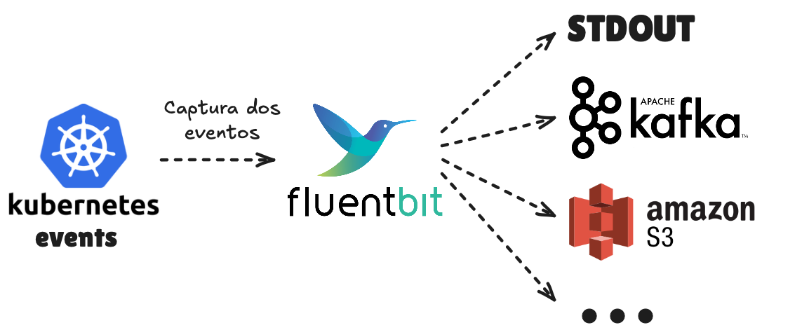

O [FluentBit](https://fluentbit.io/) é utilizado para coletar, filtrar e encaminhar logs, métricas e traces. Ele é super leve e tem suporte a várias fontes de dados e destinos. Neste post vamos ver como coletar eventos do Kubernetes e enviar para um destino de nossa escolha. É esperado que você tenha algum conhecimento sobre Kubernetes e observabilidade, para que você possa tirar o máximo proveito deste post.

## Criação do ambiente de testes

Para nosso ambiente de testes, vamos precisar de um cluster Kubernetes. Vamos continuar utilizando o [Kind](https://kind.sigs.k8s.io/) para criar um cluster local, assim como fizemos em diversos posts anteriores. Daremos o nome ao nosso cluster de `events-exporter-test`.

```bash
$ kind create cluster --name events-exporter-test
Creating cluster "events-exporter-test" ...
 ✓ Ensuring node image (kindest/node:v1.30.0)
 ✓ Preparing nodes
 ✓ Writing configuration
 ✓ Starting control-plane
 ✓ Installing CNI
 ✓ Installing StorageClass
Set kubectl context to "kind-events-exporter-test"
You can now use your cluster with:

kubectl cluster-info --context kind-events-exporter-test

Thanks for using kind!
```

Caso você não tenha o Kind instalado, você pode seguir as [instruções de instalação](https://kind.sigs.k8s.io/docs/user/quick-start/#installation) da documentação oficial.

## Eventos do Kubernetes

Com o cluster criado, devemos verificar os eventos do Kubernetes que foram emitidos nos primeiros segundos após a criação dos primeiros recursos. Vamos utilizar o `kubectl` para interagir com o cluster.

```bash
$ kubectl get events -A
NAMESPACE            LAST SEEN   TYPE      REASON                    OBJECT                                       MESSAGE
default              42s         Normal    Starting                  node/events-exporter-test-control-plane      Starting kubelet.
default              42s         Normal    NodeAllocatableEnforced   node/events-exporter-test-control-plane      Updated Node Allocatable limit across pods
default              42s         Normal    NodeHasSufficientMemory   node/events-exporter-test-control-plane      Node events-exporter-test-control-plane status is now: NodeHasSufficientMemory
default              42s         Normal    NodeHasNoDiskPressure     node/events-exporter-test-control-plane      Node events-exporter-test-control-plane status is now: NodeHasNoDiskPressure
default              42s         Normal    NodeHasSufficientPID      node/events-exporter-test-control-plane      Node events-exporter-test-control-plane status is now: NodeHasSufficientPID
default              29s         Normal    RegisteredNode            node/events-exporter-test-control-plane      Node events-exporter-test-control-plane event: Registered Node events-exporter-test-control-plane in Controller
default              26s         Normal    Starting                  node/events-exporter-test-control-plane
default              26s         Normal    NodeReady                 node/events-exporter-test-control-plane      Node events-exporter-test-control-plane status is now: NodeReady
kube-system          28s         Warning   FailedScheduling          pod/coredns-7db6d8ff4d-6qvz4                 0/1 nodes are available: 1 node(s) had untolerated taint {node.kubernetes.io/not-ready: }. preemption: 0/1 nodes are available: 1 Preemption is not helpful for scheduling.
kube-system          26s         Normal    Scheduled                 pod/coredns-7db6d8ff4d-6qvz4                 Successfully assigned kube-system/coredns-7db6d8ff4d-6qvz4 to events-exporter-test-control-plane
kube-system          25s         Normal    Pulled                    pod/coredns-7db6d8ff4d-6qvz4                 Container image "registry.k8s.io/coredns/coredns:v1.11.1" already present on machine
kube-system          25s         Normal    Created                   pod/coredns-7db6d8ff4d-6qvz4                 Created container coredns
kube-system          25s         Normal    Started                   pod/coredns-7db6d8ff4d-6qvz4                 Started container coredns
kube-system          28s         Warning   FailedScheduling          pod/coredns-7db6d8ff4d-v2hf6                 0/1 nodes are available: 1 node(s) had untolerated taint {node.kubernetes.io/not-ready: }. preemption: 0/1 nodes are available: 1 Preemption is not helpful for scheduling.
kube-system          26s         Normal    Scheduled                 pod/coredns-7db6d8ff4d-v2hf6                 Successfully assigned kube-system/coredns-7db6d8ff4d-v2hf6 to events-exporter-test-control-plane
kube-system          25s         Normal    Pulled                    pod/coredns-7db6d8ff4d-v2hf6                 Container image "registry.k8s.io/coredns/coredns:v1.11.1" already present on machine
kube-system          25s         Normal    Created                   pod/coredns-7db6d8ff4d-v2hf6                 Created container coredns
kube-system          25s         Normal    Started                   pod/coredns-7db6d8ff4d-v2hf6                 Started container coredns
kube-system          28s         Normal    SuccessfulCreate          replicaset/coredns-7db6d8ff4d                Created pod: coredns-7db6d8ff4d-6qvz4
kube-system          28s         Normal    SuccessfulCreate          replicaset/coredns-7db6d8ff4d                Created pod: coredns-7db6d8ff4d-v2hf6
kube-system          28s         Normal    ScalingReplicaSet         deployment/coredns                           Scaled up replica set coredns-7db6d8ff4d to 2
kube-system          28s         Normal    Scheduled                 pod/kindnet-vxt5c                            Successfully assigned kube-system/kindnet-vxt5c to events-exporter-test-control-plane
kube-system          28s         Warning   FailedMount               pod/kindnet-vxt5c                            MountVolume.SetUp failed for volume "kube-api-access-rr6wn" : configmap "kube-root-ca.crt" not found
kube-system          27s         Normal    Pulled                    pod/kindnet-vxt5c                            Container image "docker.io/kindest/kindnetd:v20240202-8f1494ea" already present on machine
kube-system          27s         Normal    Created                   pod/kindnet-vxt5c                            Created container kindnet-cni
kube-system          26s         Normal    Started                   pod/kindnet-vxt5c                            Started container kindnet-cni
kube-system          28s         Normal    SuccessfulCreate          daemonset/kindnet                            Created pod: kindnet-vxt5c
kube-system          42s         Normal    LeaderElection            lease/kube-controller-manager                events-exporter-test-control-plane_178c251c-63f7-4f3a-a122-012269467082 became leader
kube-system          28s         Normal    Scheduled                 pod/kube-proxy-dsvh4                         Successfully assigned kube-system/kube-proxy-dsvh4 to events-exporter-test-control-plane
kube-system          28s         Warning   FailedMount               pod/kube-proxy-dsvh4                         MountVolume.SetUp failed for volume "kube-api-access-lj5mj" : configmap "kube-root-ca.crt" not found
kube-system          27s         Normal    Pulled                    pod/kube-proxy-dsvh4                         Container image "registry.k8s.io/kube-proxy:v1.30.0" already present on machine
kube-system          27s         Normal    Created                   pod/kube-proxy-dsvh4                         Created container kube-proxy
kube-system          27s         Normal    Started                   pod/kube-proxy-dsvh4                         Started container kube-proxy
kube-system          28s         Normal    SuccessfulCreate          daemonset/kube-proxy                         Created pod: kube-proxy-dsvh4
kube-system          40s         Normal    LeaderElection            lease/kube-scheduler                         events-exporter-test-control-plane_678865bb-5f38-4006-bf0f-d60d92b7ac50 became leader
local-path-storage   28s         Warning   FailedScheduling          pod/local-path-provisioner-988d74bc-z9k54    0/1 nodes are available: 1 node(s) had untolerated taint {node.kubernetes.io/not-ready: }. preemption: 0/1 nodes are available: 1 Preemption is not helpful for scheduling.
local-path-storage   26s         Normal    Scheduled                 pod/local-path-provisioner-988d74bc-z9k54    Successfully assigned local-path-storage/local-path-provisioner-988d74bc-z9k54 to events-exporter-test-control-plane
local-path-storage   25s         Normal    Pulled                    pod/local-path-provisioner-988d74bc-z9k54    Container image "docker.io/kindest/local-path-provisioner:v20240202-8f1494ea" already present on machine
local-path-storage   25s         Normal    Created                   pod/local-path-provisioner-988d74bc-z9k54    Created container local-path-provisioner
local-path-storage   25s         Normal    Started                   pod/local-path-provisioner-988d74bc-z9k54    Started container local-path-provisioner
local-path-storage   28s         Normal    SuccessfulCreate          replicaset/local-path-provisioner-988d74bc   Created pod: local-path-provisioner-988d74bc-z9k54
local-path-storage   28s         Normal    ScalingReplicaSet         deployment/local-path-provisioner            Scaled up replica set local-path-provisioner-988d74bc to 1
```

Vemos que logo nos primeiros segundos após a criação do cluster, diversos eventos foram emitidos. Esses eventos são importantes para entender o que está acontecendo no cluster. Muitos problemas podem ser identificados através dos eventos emitidos pelo Kubernetes. Posso citar alguns mais comuns que vivencio no dia a dia:

- Erro de download de imagem: O Kubernetes tenta baixar uma imagem de um container e não consegue, emitindo um evento de erro.
- Múltiplos pods tentando acessar o mesmo volume: A menos que o volume seja do tipo `ReadWriteMany`, apenas um pod pode acessar o volume por vez. Se mais de um pod tentar acessar o volume, um evento de erro será emitido.
- Falta de recursos: Se um pod tentar ser criado com recursos acima do limite do nó, um evento de erro será emitido.

Além dos eventos de erro, temos os eventos de informação e de aviso. Como os que aparecem nos logs acima:

- `0/1 nodes are available: 1 node(s) had untolerated taint {node.kubernetes.io/not-ready: }. preemption: 0/1 nodes are available: 1 Preemption is not helpful for scheduling.`: Indica que não há nós disponíveis com os requisitos necessários para a execução do pod.
- `Container image "registry.k8s.io/coredns/coredns:v1.11.1" already present on machine`: Indica que a imagem do container já está presente na máquina.
- `MountVolume.SetUp failed for volume "kube-api-access-lj5mj" : configmap "kube-root-ca.crt" not found`: Indica que um configmap não foi encontrado. Geralmente esse erro é temporário, dado que o configmap ainda pode estar sendo criado.

Inúmeros outros problemas podem ser identificados através desta forma de análise, por isso é importante coletar e armazenar esses eventos para análise posterior ou até para alerta em tempo real.

## Diagrama da solução

Para ilustrar o que vamos fazer e termos uma ideia do fluxo geral, vamos criar um diagrama da solução.



Como podemos ver, a solução é bem simples. O FluentBit será executado no cluster Kubernetes e irá coletar os eventos que nosso cluster está emitindo.

Desde a versão 3.1.0, o FluentBit faz a coleta de eventos utilizando o watch do Kubernetes, o que significa que ele irá coletar os eventos conforme eles são emitidos, sem a necessidade de fazer polling. Com os eventos sendo coletados, podemos encaminhá-los para um destino de nossa escolha, seja a própria saída padrão, um tópico Kafka, um datalake no S3 ou qualquer outro destino que o FluentBit suporte e que seja útil para seu caso de uso.

Aqui é importante notar que o FluentBit não armazena os eventos, ele apenas os coleta e encaminha para um destino.

## Instalação do FluentBit

Iremos instalar o FluentBit através do Helm, que é um gerenciador de pacotes para Kubernetes. Caso você não tenha o Helm instalado, você pode seguir essas [instruções de instalação](https://helm.sh/docs/) da documentação oficial.

Após instalar o Helm, temos que adicionar o repositório de charts do FluentBit para que possamos instalar o chart correspondente. Os charts podem ser encontrados na [organização do Fluent no GitHub](https://github.com/fluent/helm-charts). Para adicionar o repositório, execute o seguinte comando:

```bash
helm repo add fluent https://fluent.github.io/helm-charts
```

Agora devemos atualizar o cache local de charts para que o Helm possa encontrar o chart do FluentBit.

```bash
helm repo update
```

Para instalar o chat do FluentBit, basta executar o seguinte comando:

```bash
helm install fluent-bit-k8s-events fluent/fluent-bit --version 0.47.5 ...
```

Como forma alternativa a apresentada acima, podemos indicar o repositório diretamente no comando de instalação do chart. Eliminando a necessidade de adicionar o repositório e atualizar o cache. O comando ficaria assim:

```bash
helm install fluent-bit-k8s-events fluent-bit --repo https://fluent.github.io/helm-charts --version 0.47.5 ...
```

Particularmente, prefiro a última opção, pois ela é mais direta que a primeira, embora ambas façam a mesma coisa.

Agora podemos avançar em nossa solução e instalar o chart do FluentBit. Para isso devemos criar uma arquivo de configuração chamado `values.yaml`. Ele irá carregar nossas configurações para que o FluentBit seja instalado da forma que desejamos.

```yaml
kind: Deployment

replicas: 1

rbac:
  eventsAccess: true

config:
  # https://docs.fluentbit.io/manual/pipeline/inputs/kubernetes-events
  inputs: | # Kubernetes Events input
    [INPUT]
        name  kubernetes_events
        tag   k-events
  filters: "" # No filters
  # https://docs.fluentbit.io/manual/pipeline/outputs/standard-output
  outputs: | # STDOUT output
    [OUTPUT]
        name  Stdout
        match k-events
```

Você sempre poderá consultar a documentação do FluentBit para entender melhor as configurações disponíveis no `values.yaml`. Ou poderá executar o comando `helm show values fluent-bit --repo https://fluent.github.io/helm-charts --version 0.47.5` para ver o `values` padrão do chart.

Vamos destacar que, em ambientes de produção, deveria haver um cuidado redobrado com a configuração apresentada acima. Sempre seguir as boas práticas em ambientes produtivos, como por exemplo, definir quantidades de cpu e memória, limites de acesso do pod e outras configurações importantes de segurança. Isso foge um pouco do objetivo deste post, por isso não vamos abordar esses tópicos aqui.

Vamos explicar com mais detalhes o que cada parte do arquivo de configuração que passamos para o comando de instalação faz:

- `kind`: Define o tipo de recurso que será criado. Podemos definir `Deployment` ou `DaemonSet`, sendo este o padrão do chart e aquele o que usaremos para o nosso exemplo. A diferença entre eles é que o `DaemonSet` cria um pod em cada nó do cluster, enquanto o `Deployment` cria a quantidade de replicas definida na chave `replicas` do values.yaml. Imagine que cada nó do nosso cluster receba um pod do FluentBit, em situações de coleta de logs faz total sentido usar o `DaemonSet` já que ele captura os logs dos container armazenados na pasta `/var/logs` do nó host. Para coleta de eventos do Kubernetes o `Deployment` é mais adequado, pois evita a duplicação de eventos, já que diversos pods do FluentBit coletariam os mesmos eventos.

- `replicas`: Define a quantidade de pods que serão criados. No nosso caso, queremos apenas 1 pod coletando os eventos do Kubernetes para evitar duplicação de eventos nos destinos. Ocasionalmente você pode aumentar a quantidade de réplicas para garantir a alta disponibilidade do FluentBit. Porém, algum controle posterior no processamento desses eventos deveria ser feito para evitar a duplicidade de eventos no destino final.

- `rbac.eventsAccess`: Permite que a role associada ao pod do FluentBit tenha acesso aos eventos do Kubernetes. Sem essa configuração, o FluentBit não conseguirá coletar os eventos, pois não terá permissão para isso. Lembrando que a permissão pode ser verificada da seguinte forma:

   ```bash
   $ kubectl auth can-i get events --as system:serviceaccount:k8s-events-exporter:fluent-bit-k8s-events
   yes
   $ kubectl auth can-i watch events --as system:serviceaccount:k8s-events-exporter:fluent-bit-k8s-events
   yes
   $ kubectl auth can-i list events --as system:serviceaccount:k8s-events-exporter:fluent-bit-k8s-events
   yes
   ```

   Caso você não defina essa configuração, você terá a seguinte saída:

   ```bash
   $ kubectl auth can-i watch events --as system:serviceaccount:k8s-events-exporter:fluent-bit-k8s-events
   no
   ```

- `config.inputs`: Configuração dos inputs, ou seja, as fontes de dados.

- `config.filters`: Configuração dos filtros. No nosso caso não utilizaremos filtros, mas mantemos a chave vazia para sobrescrever a configuração padrão do `values.yaml` do chart. Lembrando que podemos verificar a configuração padrão do chart com o comando:

   ```bash
   $ helm show values fluent-bit \
     --repo https://fluent.github.io/helm-charts \
     --version 0.47.5 --jsonpath '{.config.filters}'
   [FILTER]
       Name kubernetes
       Match kube.*
       Merge_Log On
       Keep_Log Off
       K8S-Logging.Parser On
       K8S-Logging.Exclude On
   ```

- `config.outputs`: Configuração dos outputs, ou seja, para onde os dados coletados serão enviados. No nosso primeiro exemplo vamos enviar para o stdout, pois assim poderemos ver os eventos sendo coletados. Mais adiante veremos como enviar para outros tipos de destino.

Para facilitar a instalação do chart no cluster, vamos colocar tudo em um único comando. O comando irá instalar o chart em um namespace chamado `k8s-events-exporter`. Fixamos a versão do chart para garantir que quando você executar o comando, a versão seja a mesma que estamos utilizando. Caso você queira utilizar uma versão mais recente, basta alterar o valor da versão no comando. Só tome cuidado para garantir que não haja quebra de compatibilidade entre as versões.

```bash
helm upgrade --install fluent-bit-k8s-events fluent-bit \
  --repo https://fluent.github.io/helm-charts \
  --version 0.47.5 \
  --namespace k8s-events-exporter --create-namespace \
  -f - << EOF
kind: Deployment
replicas: 1
rbac:
  eventsAccess: true
config:
  inputs: |
    [INPUT]
        name  kubernetes_events
        tag   k-events
  filters: ""
  outputs: |
    [OUTPUT]
        name  Stdout
        match k-events
EOF
```

Se tudo ocorrer como esperado, você verá uma saída semelhante a essa:

```text
Release "fluent-bit-k8s-events" does not exist. Installing it now.
NAME: fluent-bit-k8s-events
LAST DEPLOYED: Fri Aug  2 01:36:57 2024
NAMESPACE: k8s-events-exporter
STATUS: deployed
REVISION: 1
NOTES:
Get Fluent Bit build information by running these commands:

export POD_NAME=$(kubectl get pods --namespace k8s-events-exporter -l "app.kubernetes.io/name=fluent-bit,app.kubernetes.io/instance=fluent-bit-k8s-events" -o jsonpath="{.items[0].metadata.name}")
kubectl --namespace k8s-events-exporter port-forward $POD_NAME 2020:2020
curl http://127.0.0.1:2020
```

## Validando a instalação

Agora vamos verificar os logs do pod do FluentBit para ver se os eventos do Kubernetes estão sendo coletados e enviados para o stdout.

```bash
$ kubectl get pods -n k8s-events-exporter
NAME                                    READY   STATUS    RESTARTS   AGE
fluent-bit-k8s-events-b7f599f46-9lh6l   1/1     Running   0          16s

$ kubectl logs -n k8s-events-exporter fluent-bit-k8s-events-b7f599f46-9lh6l
Fluent Bit v3.1.4
* Copyright (C) 2015-2024 The Fluent Bit Authors
* Fluent Bit is a CNCF sub-project under the umbrella of Fluentd
* https://fluentbit.io

______ _                  _    ______ _ _           _____  __
|  ___| |                | |   | ___ (_) |         |____ |/  |
| |_  | |_   _  ___ _ __ | |_  | |_/ /_| |_  __   __   / /`| |
|  _| | | | | |/ _ \ '_ \| __| | ___ \ | __| \ \ / /   \ \ | |
| |   | | |_| |  __/ | | | |_  | |_/ / | |_   \ V /.___/ /_| |_
\_|   |_|\__,_|\___|_| |_|\__| \____/|_|\__|   \_/ \____(_)___/

[2024/08/02 04:37:09] [ info] [fluent bit] version=3.1.4, commit=c767acfe6c, pid=1
[2024/08/02 04:37:09] [ info] [storage] ver=1.5.2, type=memory, sync=normal, checksum=off, max_chunks_up=128
[2024/08/02 04:37:09] [ info] [cmetrics] version=0.9.1
[2024/08/02 04:37:09] [ info] [ctraces ] version=0.5.2
[2024/08/02 04:37:09] [ info] [input:kubernetes_events:kubernetes_events.0] initializing
[2024/08/02 04:37:09] [ info] [input:kubernetes_events:kubernetes_events.0] storage_strategy='memory' (memory only)
[2024/08/02 04:37:09] [ info] [input:kubernetes_events:kubernetes_events.0] API server: https://kubernetes.default.svc:443
[2024/08/02 04:37:09] [ info] [input:kubernetes_events:kubernetes_events.0] thread instance initialized
[2024/08/02 04:37:09] [ info] [output:stdout:stdout.0] worker #0 started
[2024/08/02 04:37:09] [ info] [http_server] listen iface=0.0.0.0 tcp_port=2020
[2024/08/02 04:37:09] [ info] [sp] stream processor started
[2024/08/02 04:37:09] [ info] [input:kubernetes_events:kubernetes_events.0] Requesting /api/v1/events?watch=1&resourceVersion=1071
[0] k-events: [[1722572945.000000000, {}], {"metadata"=>{"name"=>"events-exporter-test-control-plane.17e7cef7aa223ad9", "namespace"=>"default", "uid"=>"cb9806f2-5236-4e44-9565-61a6931c8f65", "resourceVersion"=>"220", "creationTimestamp"=>"2024-08-02T04:29:05Z", "managedFields"=>[{"manager"=>"kubelet", "operation"=>"Update", "apiVersion"=>"v1", "time"=>"2024-08-02T04:29:05Z", "fieldsType"=>"FieldsV1", "fieldsV1"=>{"f:count"=>{}, "f:firstTimestamp"=>{}, "f:involvedObject"=>{}, "f:lastTimestamp"=>{}, "f:message"=>{}, "f:reason"=>{}, "f:reportingComponent"=>{}, "f:reportingInstance"=>{}, "f:source"=>{"f:component"=>{}, "f:host"=>{}}, "f:type"=>{}}}]}, "involvedObject"=>{"kind"=>"Node", "name"=>"events-exporter-test-control-plane", "uid"=>"events-exporter-test-control-plane"}, "reason"=>"Starting", "message"=>"Starting kubelet.", "source"=>{"component"=>"kubelet", "host"=>"events-exporter-test-control-plane"}, "firstTimestamp"=>"2024-08-02T04:29:05Z", "lastTimestamp"=>"2024-08-02T04:29:05Z", "count"=>1, "type"=>"Normal", "eventTime"=>nil, "reportingComponent"=>"kubelet", "reportingInstance"=>"events-exporter-test-control-plane"}]
[1] k-events: [[1722572945.000000000, {}], {"metadata"=>{"name"=>"events-exporter-test-control-plane.17e7cef7ac3121bb", "namespace"=>"default", "uid"=>"bc3a5237-c247-4f37-8162-6497d6d4f52f", "resourceVersion"=>"222", "creationTimestamp"=>"2024-08-02T04:29:05Z", "managedFields"=>[{"manager"=>"kubelet", "operation"=>"Update", "apiVersion"=>"v1", "time"=>"2024-08-02T04:29:05Z", "fieldsType"=>"FieldsV1", "fieldsV1"=>{"f:count"=>{}, "f:firstTimestamp"=>{}, "f:involvedObject"=>{}, "f:lastTimestamp"=>{}, "f:message"=>{}, "f:reason"=>{}, "f:reportingComponent"=>{}, "f:reportingInstance"=>{}, "f:source"=>{"f:component"=>{}, "f:host"=>{}}, "f:type"=>{}}}]}, "involvedObject"=>{"kind"=>"Node", "name"=>"events-exporter-test-control-plane", "uid"=>"events-exporter-test-control-plane"}, "reason"=>"NodeAllocatableEnforced", "message"=>"Updated Node Allocatable limit across pods", "source"=>{"component"=>"kubelet", "host"=>"events-exporter-test-control-plane"}, "firstTimestamp"=>"2024-08-02T04:29:05Z", "lastTimestamp"=>"2024-08-02T04:29:05Z", "count"=>1, "type"=>"Normal", "eventTime"=>nil, "reportingComponent"=>"kubelet", "reportingInstance"=>"events-exporter-test-control-plane"}]
[2] k-events: [[1722572945.000000000, {}], {"metadata"=>{"name"=>"events-exporter-test-control-plane.17e7cef7b0508eb2", "namespace"=>"default", "uid"=>"07486806-1ab8-4fa0-b9b8-10bb813fbc66", "resourceVersion"=>"235", "creationTimestamp"=>"2024-08-02T04:29:05Z", "managedFields"=>[{"manager"=>"kubelet", "operation"=>"Update", "apiVersion"=>"v1", "time"=>"2024-08-02T04:29:05Z", "fieldsType"=>"FieldsV1", "fieldsV1"=>{"f:count"=>{}, "f:firstTimestamp"=>{}, "f:involvedObject"=>{}, "f:lastTimestamp"=>{}, "f:message"=>{}, "f:reason"=>{}, "f:reportingComponent"=>{}, "f:reportingInstance"=>{}, "f:source"=>{"f:component"=>{}, "f:host"=>{}}, "f:type"=>{}}}]}, "involvedObject"=>{"kind"=>"Node", "name"=>"events-exporter-test-control-plane", "uid"=>"events-exporter-test-control-plane"}, "reason"=>"NodeHasSufficientMemory", "message"=>"Node events-exporter-test-control-plane status is now: NodeHasSufficientMemory", "source"=>{"component"=>"kubelet", "host"=>"events-exporter-test-control-plane"}, "firstTimestamp"=>"2024-08-02T04:29:05Z", "lastTimestamp"=>"2024-08-02T04:29:05Z", "count"=>1, "type"=>"Normal", "eventTime"=>nil, "reportingComponent"=>"kubelet", "reportingInstance"=>"events-exporter-test-control-plane"}]
[3] k-events: [[1722572945.000000000, {}], {"metadata"=>{"name"=>"events-exporter-test-control-plane.17e7cef7b050b615", "namespace"=>"default", "uid"=>"93adfe12-0a06-4255-926b-ede9c89e388e", "resourceVersion"=>"236", "creationTimestamp"=>"2024-08-02T04:29:05Z", "managedFields"=>[{"manager"=>"kubelet", "operation"=>"Update", "apiVersion"=>"v1", "time"=>"2024-08-02T04:29:05Z", "fieldsType"=>"FieldsV1", "fieldsV1"=>{"f:count"=>{}, "f:firstTimestamp"=>{}, "f:involvedObject"=>{}, "f:lastTimestamp"=>{}, "f:message"=>{}, "f:reason"=>{}, "f:reportingComponent"=>{}, "f:reportingInstance"=>{}, "f:source"=>{"f:component"=>{}, "f:host"=>{}}, "f:type"=>{}}}]}, "involvedObject"=>{"kind"=>"Node", "name"=>"events-exporter-test-control-plane", "uid"=>"events-exporter-test-control-plane"}, "reason"=>"NodeHasNoDiskPressure", "message"=>"Node events-exporter-test-control-plane status is now: NodeHasNoDiskPressure", "source"=>{"component"=>"kubelet", "host"=>"events-exporter-test-control-plane"}, "firstTimestamp"=>"2024-08-02T04:29:05Z", "lastTimestamp"=>"2024-08-02T04:29:05Z", "count"=>1, "type"=>"Normal", "eventTime"=>nil, "reportingComponent"=>"kubelet", "reportingInstance"=>"events-exporter-test-control-plane"}]
[4] k-events: [[1722572945.000000000, {}], {"metadata"=>{"name"=>"events-exporter-test-control-plane.17e7cef7b050c24a", "namespace"=>"default", "uid"=>"b1bc8722-bb7d-4414-b94a-ca15b5cd86f8", "resourceVersion"=>"238", "creationTimestamp"=>"2024-08-02T04:29:05Z", "managedFields"=>[{"manager"=>"kubelet", "operation"=>"Update", "apiVersion"=>"v1", "time"=>"2024-08-02T04:29:05Z", "fieldsType"=>"FieldsV1", "fieldsV1"=>{"f:count"=>{}, "f:firstTimestamp"=>{}, "f:involvedObject"=>{}, "f:lastTimestamp"=>{}, "f:message"=>{}, "f:reason"=>{}, "f:reportingComponent"=>{}, "f:reportingInstance"=>{}, "f:source"=>{"f:component"=>{}, "f:host"=>{}}, "f:type"=>{}}}]}, "involvedObject"=>{"kind"=>"Node", "name"=>"events-exporter-test-control-plane", "uid"=>"events-exporter-test-control-plane"}, "reason"=>"NodeHasSufficientPID", "message"=>"Node events-exporter-test-control-plane status is now: NodeHasSufficientPID", "source"=>{"component"=>"kubelet", "host"=>"events-exporter-test-control-plane"}, "firstTimestamp"=>"2024-08-02T04:29:05Z", "lastTimestamp"=>"2024-08-02T04:29:05Z", "count"=>1, "type"=>"Normal", "eventTime"=>nil, "reportingComponent"=>"kubelet", "reportingInstance"=>"events-exporter-test-control-plane"}]
[5] k-events: [[1722572958.000000000, {}], {"metadata"=>{"name"=>"events-exporter-test-control-plane.17e7cefac6f1ccd2", "namespace"=>"default", "uid"=>"466470c8-e149-4a9d-93ef-50fba6ae380e", "resourceVersion"=>"322", "creationTimestamp"=>"2024-08-02T04:29:18Z", "managedFields"=>[{"manager"=>"kube-controller-manager", "operation"=>"Update", "apiVersion"=>"v1", "time"=>"2024-08-02T04:29:18Z", "fieldsType"=>"FieldsV1", "fieldsV1"=>{"f:count"=>{}, "f:firstTimestamp"=>{}, "f:involvedObject"=>{}, "f:lastTimestamp"=>{}, "f:message"=>{}, "f:reason"=>{}, "f:reportingComponent"=>{}, "f:source"=>{"f:component"=>{}}, "f:type"=>{}}}]}, "involvedObject"=>{"kind"=>"Node", "name"=>"events-exporter-test-control-plane", "uid"=>"932765a5-514e-426c-8ff7-f329ffa623fb", "apiVersion"=>"v1"}, "reason"=>"RegisteredNode", "message"=>"Node events-exporter-test-control-plane event: Registered Node events-exporter-test-control-plane in Controller", "source"=>{"component"=>"node-controller"}, "firstTimestamp"=>"2024-08-02T04:29:18Z", "lastTimestamp"=>"2024-08-02T04:29:18Z", "count"=>1, "type"=>"Normal", "eventTime"=>nil, "reportingComponent"=>"node-controller", "reportingInstance"=>""}]
[6] k-events: [[1722572960.000000000, {}], {"metadata"=>{"name"=>"events-exporter-test-control-plane.17e7cefb3030f53a", "namespace"=>"default", "uid"=>"9bcc5496-8f67-4008-a904-5471f4a4d06a", "resourceVersion"=>"391", "creationTimestamp"=>"2024-08-02T04:29:20Z", "managedFields"=>[{"manager"=>"kube-proxy", "operation"=>"Update", "apiVersion"=>"events.k8s.io/v1", "time"=>"2024-08-02T04:29:20Z", "fieldsType"=>"FieldsV1", "fieldsV1"=>{"f:action"=>{}, "f:eventTime"=>{}, "f:reason"=>{}, "f:regarding"=>{}, "f:reportingController"=>{}, "f:reportingInstance"=>{}, "f:type"=>{}}}]}, "involvedObject"=>{"kind"=>"Node", "name"=>"events-exporter-test-control-plane", "uid"=>"events-exporter-test-control-plane"}, "reason"=>"Starting", "source"=>{}, "firstTimestamp"=>nil, "lastTimestamp"=>nil, "type"=>"Normal", "eventTime"=>"2024-08-02T04:29:20.733131Z", "action"=>"StartKubeProxy", "reportingComponent"=>"kube-proxy", "reportingInstance"=>"kube-proxy-events-exporter-test-control-plane"}]
[7] k-events: [[1722572961.000000000, {}], {"metadata"=>{"name"=>"events-exporter-test-control-plane.17e7cefb68eed8ac", "namespace"=>"default", "uid"=>"f2a486eb-e3d8-4c97-b073-5726887babb8", "resourceVersion"=>"399", "creationTimestamp"=>"2024-08-02T04:29:21Z", "managedFields"=>[{"manager"=>"kubelet", "operation"=>"Update", "apiVersion"=>"v1", "time"=>"2024-08-02T04:29:21Z", "fieldsType"=>"FieldsV1", "fieldsV1"=>{"f:count"=>{}, "f:firstTimestamp"=>{}, "f:involvedObject"=>{}, "f:lastTimestamp"=>{}, "f:message"=>{}, "f:reason"=>{}, "f:reportingComponent"=>{}, "f:reportingInstance"=>{}, "f:source"=>{"f:component"=>{}, "f:host"=>{}}, "f:type"=>{}}}]}, "involvedObject"=>{"kind"=>"Node", "name"=>"events-exporter-test-control-plane", "uid"=>"events-exporter-test-control-plane"}, "reason"=>"NodeReady", "message"=>"Node events-exporter-test-control-plane status is now: NodeReady", "source"=>{"component"=>"kubelet", "host"=>"events-exporter-test-control-plane"}, "firstTimestamp"=>"2024-08-02T04:29:21Z", "lastTimestamp"=>"2024-08-02T04:29:21Z", "count"=>1, "type"=>"Normal", "eventTime"=>nil, "reportingComponent"=>"kubelet", "reportingInstance"=>"events-exporter-test-control-plane"}]
[8] k-events: [[1722573417.000000000, {}], {"metadata"=>{"name"=>"fluent-bit-k8s-events-b7f599f46-9lh6l.17e7cf6588e392a1", "namespace"=>"k8s-events-exporter", "uid"=>"5868e015-c86d-43c8-aae9-a6c6bdbede64", "resourceVersion"=>"1051", "creationTimestamp"=>"2024-08-02T04:36:57Z", "managedFields"=>[{"manager"=>"kube-scheduler", "operation"=>"Update", "apiVersion"=>"v1", "time"=>"2024-08-02T04:36:57Z", "fieldsType"=>"FieldsV1", "fieldsV1"=>{"f:count"=>{}, "f:firstTimestamp"=>{}, "f:involvedObject"=>{}, "f:lastTimestamp"=>{}, "f:message"=>{}, "f:reason"=>{}, "f:reportingComponent"=>{}, "f:source"=>{"f:component"=>{}}, "f:type"=>{}}}]}, "involvedObject"=>{"kind"=>"Pod", "namespace"=>"k8s-events-exporter", "name"=>"fluent-bit-k8s-events-b7f599f46-9lh6l", "uid"=>"cb009ef4-b4d5-4694-bb08-5a46e9c96f6c", "apiVersion"=>"v1", "resourceVersion"=>"1046"}, "reason"=>"Scheduled", "message"=>"Successfully assigned k8s-events-exporter/fluent-bit-k8s-events-b7f599f46-9lh6l to events-exporter-test-control-plane", "source"=>{"component"=>"default-scheduler"}, "firstTimestamp"=>"2024-08-02T04:36:57Z", "lastTimestamp"=>"2024-08-02T04:36:57Z", "count"=>1, "type"=>"Normal", "eventTime"=>nil, "reportingComponent"=>"default-scheduler", "reportingInstance"=>""}]
[9] k-events: [[1722573417.000000000, {}], {"metadata"=>{"name"=>"fluent-bit-k8s-events-b7f599f46-9lh6l.17e7cf65a2d9e4cd", "namespace"=>"k8s-events-exporter", "uid"=>"1598bad1-ddc0-480c-a965-3c495c725a58", "resourceVersion"=>"1055", "creationTimestamp"=>"2024-08-02T04:36:57Z", "managedFields"=>[{"manager"=>"kubelet", "operation"=>"Update", "apiVersion"=>"v1", "time"=>"2024-08-02T04:36:57Z", "fieldsType"=>"FieldsV1", "fieldsV1"=>{"f:count"=>{}, "f:firstTimestamp"=>{}, "f:involvedObject"=>{}, "f:lastTimestamp"=>{}, "f:message"=>{}, "f:reason"=>{}, "f:reportingComponent"=>{}, "f:reportingInstance"=>{}, "f:source"=>{"f:component"=>{}, "f:host"=>{}}, "f:type"=>{}}}]}, "involvedObject"=>{"kind"=>"Pod", "namespace"=>"k8s-events-exporter", "name"=>"fluent-bit-k8s-events-b7f599f46-9lh6l", "uid"=>"cb009ef4-b4d5-4694-bb08-5a46e9c96f6c", "apiVersion"=>"v1", "resourceVersion"=>"1050", "fieldPath"=>"spec.containers{fluent-bit}"}, "reason"=>"Pulling", "message"=>"Pulling image "cr.fluentbit.io/fluent/fluent-bit:3.1.4"", "source"=>{"component"=>"kubelet", "host"=>"events-exporter-test-control-plane"}, "firstTimestamp"=>"2024-08-02T04:36:57Z", "lastTimestamp"=>"2024-08-02T04:36:57Z", "count"=>1, "type"=>"Normal", "eventTime"=>nil, "reportingComponent"=>"kubelet", "reportingInstance"=>"events-exporter-test-control-plane"}]
[10] k-events: [[1722573428.000000000, {}], {"metadata"=>{"name"=>"fluent-bit-k8s-events-b7f599f46-9lh6l.17e7cf6835aaf954", "namespace"=>"k8s-events-exporter", "uid"=>"665b3a60-00e2-4951-b5d2-1ac233989401", "resourceVersion"=>"1069", "creationTimestamp"=>"2024-08-02T04:37:08Z", "managedFields"=>[{"manager"=>"kubelet", "operation"=>"Update", "apiVersion"=>"v1", "time"=>"2024-08-02T04:37:08Z", "fieldsType"=>"FieldsV1", "fieldsV1"=>{"f:count"=>{}, "f:firstTimestamp"=>{}, "f:involvedObject"=>{}, "f:lastTimestamp"=>{}, "f:message"=>{}, "f:reason"=>{}, "f:reportingComponent"=>{}, "f:reportingInstance"=>{}, "f:source"=>{"f:component"=>{}, "f:host"=>{}}, "f:type"=>{}}}]}, "involvedObject"=>{"kind"=>"Pod", "namespace"=>"k8s-events-exporter", "name"=>"fluent-bit-k8s-events-b7f599f46-9lh6l", "uid"=>"cb009ef4-b4d5-4694-bb08-5a46e9c96f6c", "apiVersion"=>"v1", "resourceVersion"=>"1050", "fieldPath"=>"spec.containers{fluent-bit}"}, "reason"=>"Pulled", "message"=>"Successfully pulled image "cr.fluentbit.io/fluent/fluent-bit:3.1.4" in 11.052s (11.052s including waiting). Image size: 37791205 bytes.", "source"=>{"component"=>"kubelet", "host"=>"events-exporter-test-control-plane"}, "firstTimestamp"=>"2024-08-02T04:37:08Z", "lastTimestamp"=>"2024-08-02T04:37:08Z", "count"=>1, "type"=>"Normal", "eventTime"=>nil, "reportingComponent"=>"kubelet", "reportingInstance"=>"events-exporter-test-control-plane"}]
[11] k-events: [[1722573428.000000000, {}], {"metadata"=>{"name"=>"fluent-bit-k8s-events-b7f599f46-9lh6l.17e7cf6836602dad", "namespace"=>"k8s-events-exporter", "uid"=>"03017d04-9330-4c2e-9531-920e060f6cde", "resourceVersion"=>"1070", "creationTimestamp"=>"2024-08-02T04:37:08Z", "managedFields"=>[{"manager"=>"kubelet", "operation"=>"Update", "apiVersion"=>"v1", "time"=>"2024-08-02T04:37:08Z", "fieldsType"=>"FieldsV1", "fieldsV1"=>{"f:count"=>{}, "f:firstTimestamp"=>{}, "f:involvedObject"=>{}, "f:lastTimestamp"=>{}, "f:message"=>{}, "f:reason"=>{}, "f:reportingComponent"=>{}, "f:reportingInstance"=>{}, "f:source"=>{"f:component"=>{}, "f:host"=>{}}, "f:type"=>{}}}]}, "involvedObject"=>{"kind"=>"Pod", "namespace"=>"k8s-events-exporter", "name"=>"fluent-bit-k8s-events-b7f599f46-9lh6l", "uid"=>"cb009ef4-b4d5-4694-bb08-5a46e9c96f6c", "apiVersion"=>"v1", "resourceVersion"=>"1050", "fieldPath"=>"spec.containers{fluent-bit}"}, "reason"=>"Created", "message"=>"Created container fluent-bit", "source"=>{"component"=>"kubelet", "host"=>"events-exporter-test-control-plane"}, "firstTimestamp"=>"2024-08-02T04:37:08Z", "lastTimestamp"=>"2024-08-02T04:37:08Z", "count"=>1, "type"=>"Normal", "eventTime"=>nil, "reportingComponent"=>"kubelet", "reportingInstance"=>"events-exporter-test-control-plane"}]
[12] k-events: [[1722573429.000000000, {}], {"metadata"=>{"name"=>"fluent-bit-k8s-events-b7f599f46-9lh6l.17e7cf683c061b3a", "namespace"=>"k8s-events-exporter", "uid"=>"4ec68af4-a2a4-4bfe-b167-7c7d5b61c91c", "resourceVersion"=>"1071", "creationTimestamp"=>"2024-08-02T04:37:09Z", "managedFields"=>[{"manager"=>"kubelet", "operation"=>"Update", "apiVersion"=>"v1", "time"=>"2024-08-02T04:37:09Z", "fieldsType"=>"FieldsV1", "fieldsV1"=>{"f:count"=>{}, "f:firstTimestamp"=>{}, "f:involvedObject"=>{}, "f:lastTimestamp"=>{}, "f:message"=>{}, "f:reason"=>{}, "f:reportingComponent"=>{}, "f:reportingInstance"=>{}, "f:source"=>{"f:component"=>{}, "f:host"=>{}}, "f:type"=>{}}}]}, "involvedObject"=>{"kind"=>"Pod", "namespace"=>"k8s-events-exporter", "name"=>"fluent-bit-k8s-events-b7f599f46-9lh6l", "uid"=>"cb009ef4-b4d5-4694-bb08-5a46e9c96f6c", "apiVersion"=>"v1", "resourceVersion"=>"1050", "fieldPath"=>"spec.containers{fluent-bit}"}, "reason"=>"Started", "message"=>"Started container fluent-bit", "source"=>{"component"=>"kubelet", "host"=>"events-exporter-test-control-plane"}, "firstTimestamp"=>"2024-08-02T04:37:09Z", "lastTimestamp"=>"2024-08-02T04:37:09Z", "count"=>1, "type"=>"Normal", "eventTime"=>nil, "reportingComponent"=>"kubelet", "reportingInstance"=>"events-exporter-test-control-plane"}]
[13] k-events: [[1722573417.000000000, {}], {"metadata"=>{"name"=>"fluent-bit-k8s-events-b7f599f46.17e7cf6587b6953e", "namespace"=>"k8s-events-exporter", "uid"=>"419c3bcd-3a9b-461d-a5ee-b338898564b1", "resourceVersion"=>"1047", "creationTimestamp"=>"2024-08-02T04:36:57Z", "managedFields"=>[{"manager"=>"kube-controller-manager", "operation"=>"Update", "apiVersion"=>"v1", "time"=>"2024-08-02T04:36:57Z", "fieldsType"=>"FieldsV1", "fieldsV1"=>{"f:count"=>{}, "f:firstTimestamp"=>{}, "f:involvedObject"=>{}, "f:lastTimestamp"=>{}, "f:message"=>{}, "f:reason"=>{}, "f:reportingComponent"=>{}, "f:source"=>{"f:component"=>{}}, "f:type"=>{}}}]}, "involvedObject"=>{"kind"=>"ReplicaSet", "namespace"=>"k8s-events-exporter", "name"=>"fluent-bit-k8s-events-b7f599f46", "uid"=>"c2fc17ea-4061-41c5-8bf7-ba5175300fa0", "apiVersion"=>"apps/v1", "resourceVersion"=>"1042"}, "reason"=>"SuccessfulCreate", "message"=>"Created pod: fluent-bit-k8s-events-b7f599f46-9lh6l", "source"=>{"component"=>"replicaset-controller"}, "firstTimestamp"=>"2024-08-02T04:36:57Z", "lastTimestamp"=>"2024-08-02T04:36:57Z", "count"=>1, "type"=>"Normal", "eventTime"=>nil, "reportingComponent"=>"replicaset-controller", "reportingInstance"=>""}]
[14] k-events: [[1722573417.000000000, {}], {"metadata"=>{"name"=>"fluent-bit-k8s-events.17e7cf65871f3792", "namespace"=>"k8s-events-exporter", "uid"=>"50837b36-1753-4836-a616-52c38dcaa2f1", "resourceVersion"=>"1044", "creationTimestamp"=>"2024-08-02T04:36:57Z", "managedFields"=>[{"manager"=>"kube-controller-manager", "operation"=>"Update", "apiVersion"=>"v1", "time"=>"2024-08-02T04:36:57Z", "fieldsType"=>"FieldsV1", "fieldsV1"=>{"f:count"=>{}, "f:firstTimestamp"=>{}, "f:involvedObject"=>{}, "f:lastTimestamp"=>{}, "f:message"=>{}, "f:reason"=>{}, "f:reportingComponent"=>{}, "f:source"=>{"f:component"=>{}}, "f:type"=>{}}}]}, "involvedObject"=>{"kind"=>"Deployment", "namespace"=>"k8s-events-exporter", "name"=>"fluent-bit-k8s-events", "uid"=>"cbe900ec-d60f-46c7-b4dd-b2027d71d7a9", "apiVersion"=>"apps/v1", "resourceVersion"=>"1041"}, "reason"=>"ScalingReplicaSet", "message"=>"Scaled up replica set fluent-bit-k8s-events-b7f599f46 to 1", "source"=>{"component"=>"deployment-controller"}, "firstTimestamp"=>"2024-08-02T04:36:57Z", "lastTimestamp"=>"2024-08-02T04:36:57Z", "count"=>1, "type"=>"Normal", "eventTime"=>nil, "reportingComponent"=>"deployment-controller", "reportingInstance"=>""}]
[15] k-events: [[1722572959.000000000, {}], {"metadata"=>{"name"=>"coredns-7db6d8ff4d-6qvz4.17e7cefb02983809", "namespace"=>"kube-system", "uid"=>"a3b6e8b9-69f6-475d-bf9a-a1f8417245ad", "resourceVersion"=>"373", "creationTimestamp"=>"2024-08-02T04:29:19Z", "managedFields"=>[{"manager"=>"kube-scheduler", "operation"=>"Update", "apiVersion"=>"v1", "time"=>"2024-08-02T04:29:19Z", "fieldsType"=>"FieldsV1", "fieldsV1"=>{"f:count"=>{}, "f:firstTimestamp"=>{}, "f:involvedObject"=>{}, "f:lastTimestamp"=>{}, "f:message"=>{}, "f:reason"=>{}, "f:reportingComponent"=>{}, "f:source"=>{"f:component"=>{}}, "f:type"=>{}}}]}, "involvedObject"=>{"kind"=>"Pod", "namespace"=>"kube-system", "name"=>"coredns-7db6d8ff4d-6qvz4", "uid"=>"fa5dec31-4d66-4faa-92b0-fe9ba295dc5f", "apiVersion"=>"v1", "resourceVersion"=>"369"}, "reason"=>"FailedScheduling", "message"=>"0/1 nodes are available: 1 node(s) had untolerated taint {node.kubernetes.io/not-ready: }. preemption: 0/1 nodes are available: 1 Preemption is not helpful for scheduling.", "source"=>{"component"=>"default-scheduler"}, "firstTimestamp"=>"2024-08-02T04:29:19Z", "lastTimestamp"=>"2024-08-02T04:29:19Z", "count"=>1, "type"=>"Warning", "eventTime"=>nil, "reportingComponent"=>"default-scheduler", "reportingInstance"=>""}]
[16] k-events: [[1722572961.000000000, {}], {"metadata"=>{"name"=>"coredns-7db6d8ff4d-6qvz4.17e7cefb69d451a0", "namespace"=>"kube-system", "uid"=>"31194340-3a03-4b9d-928e-d6e30674b492", "resourceVersion"=>"409", "creationTimestamp"=>"2024-08-02T04:29:21Z", "managedFields"=>[{"manager"=>"kube-scheduler", "operation"=>"Update", "apiVersion"=>"v1", "time"=>"2024-08-02T04:29:21Z", "fieldsType"=>"FieldsV1", "fieldsV1"=>{"f:count"=>{}, "f:firstTimestamp"=>{}, "f:involvedObject"=>{}, "f:lastTimestamp"=>{}, "f:message"=>{}, "f:reason"=>{}, "f:reportingComponent"=>{}, "f:source"=>{"f:component"=>{}}, "f:type"=>{}}}]}, "involvedObject"=>{"kind"=>"Pod", "namespace"=>"kube-system", "name"=>"coredns-7db6d8ff4d-6qvz4", "uid"=>"fa5dec31-4d66-4faa-92b0-fe9ba295dc5f", "apiVersion"=>"v1", "resourceVersion"=>"376"}, "reason"=>"Scheduled", "message"=>"Successfully assigned kube-system/coredns-7db6d8ff4d-6qvz4 to events-exporter-test-control-plane", "source"=>{"component"=>"default-scheduler"}, "firstTimestamp"=>"2024-08-02T04:29:21Z", "lastTimestamp"=>"2024-08-02T04:29:21Z", "count"=>1, "type"=>"Normal", "eventTime"=>nil, "reportingComponent"=>"default-scheduler", "reportingInstance"=>""}]
[17] k-events: [[1722572962.000000000, {}], {"metadata"=>{"name"=>"coredns-7db6d8ff4d-6qvz4.17e7cefb834ad9ee", "namespace"=>"kube-system", "uid"=>"1bce36ee-6334-4224-89bd-2db4da10a6f9", "resourceVersion"=>"413", "creationTimestamp"=>"2024-08-02T04:29:22Z", "managedFields"=>[{"manager"=>"kubelet", "operation"=>"Update", "apiVersion"=>"v1", "time"=>"2024-08-02T04:29:22Z", "fieldsType"=>"FieldsV1", "fieldsV1"=>{"f:count"=>{}, "f:firstTimestamp"=>{}, "f:involvedObject"=>{}, "f:lastTimestamp"=>{}, "f:message"=>{}, "f:reason"=>{}, "f:reportingComponent"=>{}, "f:reportingInstance"=>{}, "f:source"=>{"f:component"=>{}, "f:host"=>{}}, "f:type"=>{}}}]}, "involvedObject"=>{"kind"=>"Pod", "namespace"=>"kube-system", "name"=>"coredns-7db6d8ff4d-6qvz4", "uid"=>"fa5dec31-4d66-4faa-92b0-fe9ba295dc5f", "apiVersion"=>"v1", "resourceVersion"=>"403", "fieldPath"=>"spec.containers{coredns}"}, "reason"=>"Pulled", "message"=>"Container image "registry.k8s.io/coredns/coredns:v1.11.1" already present on machine", "source"=>{"component"=>"kubelet", "host"=>"events-exporter-test-control-plane"}, "firstTimestamp"=>"2024-08-02T04:29:22Z", "lastTimestamp"=>"2024-08-02T04:29:22Z", "count"=>1, "type"=>"Normal", "eventTime"=>nil, "reportingComponent"=>"kubelet", "reportingInstance"=>"events-exporter-test-control-plane"}]
[18] k-events: [[1722572962.000000000, {}], {"metadata"=>{"name"=>"coredns-7db6d8ff4d-6qvz4.17e7cefbab5d9d6c", "namespace"=>"kube-system", "uid"=>"83630cdb-6d70-4e96-acf6-a5424b5432d9", "resourceVersion"=>"420", "creationTimestamp"=>"2024-08-02T04:29:22Z", "managedFields"=>[{"manager"=>"kubelet", "operation"=>"Update", "apiVersion"=>"v1", "time"=>"2024-08-02T04:29:22Z", "fieldsType"=>"FieldsV1", "fieldsV1"=>{"f:count"=>{}, "f:firstTimestamp"=>{}, "f:involvedObject"=>{}, "f:lastTimestamp"=>{}, "f:message"=>{}, "f:reason"=>{}, "f:reportingComponent"=>{}, "f:reportingInstance"=>{}, "f:source"=>{"f:component"=>{}, "f:host"=>{}}, "f:type"=>{}}}]}, "involvedObject"=>{"kind"=>"Pod", "namespace"=>"kube-system", "name"=>"coredns-7db6d8ff4d-6qvz4", "uid"=>"fa5dec31-4d66-4faa-92b0-fe9ba295dc5f", "apiVersion"=>"v1", "resourceVersion"=>"403", "fieldPath"=>"spec.containers{coredns}"}, "reason"=>"Created", "message"=>"Created container coredns", "source"=>{"component"=>"kubelet", "host"=>"events-exporter-test-control-plane"}, "firstTimestamp"=>"2024-08-02T04:29:22Z", "lastTimestamp"=>"2024-08-02T04:29:22Z", "count"=>1, "type"=>"Normal", "eventTime"=>nil, "reportingComponent"=>"kubelet", "reportingInstance"=>"events-exporter-test-control-plane"}]
[19] k-events: [[1722572962.000000000, {}], {"metadata"=>{"name"=>"coredns-7db6d8ff4d-6qvz4.17e7cefbb090e89e", "namespace"=>"kube-system", "uid"=>"6eee075d-8338-43fa-9f10-7ca9e27bcb49", "resourceVersion"=>"422", "creationTimestamp"=>"2024-08-02T04:29:22Z", "managedFields"=>[{"manager"=>"kubelet", "operation"=>"Update", "apiVersion"=>"v1", "time"=>"2024-08-02T04:29:22Z", "fieldsType"=>"FieldsV1", "fieldsV1"=>{"f:count"=>{}, "f:firstTimestamp"=>{}, "f:involvedObject"=>{}, "f:lastTimestamp"=>{}, "f:message"=>{}, "f:reason"=>{}, "f:reportingComponent"=>{}, "f:reportingInstance"=>{}, "f:source"=>{"f:component"=>{}, "f:host"=>{}}, "f:type"=>{}}}]}, "involvedObject"=>{"kind"=>"Pod", "namespace"=>"kube-system", "name"=>"coredns-7db6d8ff4d-6qvz4", "uid"=>"fa5dec31-4d66-4faa-92b0-fe9ba295dc5f", "apiVersion"=>"v1", "resourceVersion"=>"403", "fieldPath"=>"spec.containers{coredns}"}, "reason"=>"Started", "message"=>"Started container coredns", "source"=>{"component"=>"kubelet", "host"=>"events-exporter-test-control-plane"}, "firstTimestamp"=>"2024-08-02T04:29:22Z", "lastTimestamp"=>"2024-08-02T04:29:22Z", "count"=>1, "type"=>"Normal", "eventTime"=>nil, "reportingComponent"=>"kubelet", "reportingInstance"=>"events-exporter-test-control-plane"}]
[20] k-events: [[1722572959.000000000, {}], {"metadata"=>{"name"=>"coredns-7db6d8ff4d-v2hf6.17e7cefb032e54e9", "namespace"=>"kube-system", "uid"=>"02bd5600-8986-4223-98e1-823c57801d16", "resourceVersion"=>"380", "creationTimestamp"=>"2024-08-02T04:29:19Z", "managedFields"=>[{"manager"=>"kube-scheduler", "operation"=>"Update", "apiVersion"=>"v1", "time"=>"2024-08-02T04:29:19Z", "fieldsType"=>"FieldsV1", "fieldsV1"=>{"f:count"=>{}, "f:firstTimestamp"=>{}, "f:involvedObject"=>{}, "f:lastTimestamp"=>{}, "f:message"=>{}, "f:reason"=>{}, "f:reportingComponent"=>{}, "f:source"=>{"f:component"=>{}}, "f:type"=>{}}}]}, "involvedObject"=>{"kind"=>"Pod", "namespace"=>"kube-system", "name"=>"coredns-7db6d8ff4d-v2hf6", "uid"=>"79d79ffb-1b9b-4848-b244-339f0aa3bd41", "apiVersion"=>"v1", "resourceVersion"=>"371"}, "reason"=>"FailedScheduling", "message"=>"0/1 nodes are available: 1 node(s) had untolerated taint {node.kubernetes.io/not-ready: }. preemption: 0/1 nodes are available: 1 Preemption is not helpful for scheduling.", "source"=>{"component"=>"default-scheduler"}, "firstTimestamp"=>"2024-08-02T04:29:19Z", "lastTimestamp"=>"2024-08-02T04:29:19Z", "count"=>1, "type"=>"Warning", "eventTime"=>nil, "reportingComponent"=>"default-scheduler", "reportingInstance"=>""}]
[21] k-events: [[1722572961.000000000, {}], {"metadata"=>{"name"=>"coredns-7db6d8ff4d-v2hf6.17e7cefb69cfdfc4", "namespace"=>"kube-system", "uid"=>"77f1c363-70c4-44e5-8d59-49512966816f", "resourceVersion"=>"407", "creationTimestamp"=>"2024-08-02T04:29:21Z", "managedFields"=>[{"manager"=>"kube-scheduler", "operation"=>"Update", "apiVersion"=>"v1", "time"=>"2024-08-02T04:29:21Z", "fieldsType"=>"FieldsV1", "fieldsV1"=>{"f:count"=>{}, "f:firstTimestamp"=>{}, "f:involvedObject"=>{}, "f:lastTimestamp"=>{}, "f:message"=>{}, "f:reason"=>{}, "f:reportingComponent"=>{}, "f:source"=>{"f:component"=>{}}, "f:type"=>{}}}]}, "involvedObject"=>{"kind"=>"Pod", "namespace"=>"kube-system", "name"=>"coredns-7db6d8ff4d-v2hf6", "uid"=>"79d79ffb-1b9b-4848-b244-339f0aa3bd41", "apiVersion"=>"v1", "resourceVersion"=>"383"}, "reason"=>"Scheduled", "message"=>"Successfully assigned kube-system/coredns-7db6d8ff4d-v2hf6 to events-exporter-test-control-plane", "source"=>{"component"=>"default-scheduler"}, "firstTimestamp"=>"2024-08-02T04:29:21Z", "lastTimestamp"=>"2024-08-02T04:29:21Z", "count"=>1, "type"=>"Normal", "eventTime"=>nil, "reportingComponent"=>"default-scheduler", "reportingInstance"=>""}]
[22] k-events: [[1722572962.000000000, {}], {"metadata"=>{"name"=>"coredns-7db6d8ff4d-v2hf6.17e7cefb834597bd", "namespace"=>"kube-system", "uid"=>"139ce4ba-d4c0-4770-8610-e784117a55f6", "resourceVersion"=>"412", "creationTimestamp"=>"2024-08-02T04:29:22Z", "managedFields"=>[{"manager"=>"kubelet", "operation"=>"Update", "apiVersion"=>"v1", "time"=>"2024-08-02T04:29:22Z", "fieldsType"=>"FieldsV1", "fieldsV1"=>{"f:count"=>{}, "f:firstTimestamp"=>{}, "f:involvedObject"=>{}, "f:lastTimestamp"=>{}, "f:message"=>{}, "f:reason"=>{}, "f:reportingComponent"=>{}, "f:reportingInstance"=>{}, "f:source"=>{"f:component"=>{}, "f:host"=>{}}, "f:type"=>{}}}]}, "involvedObject"=>{"kind"=>"Pod", "namespace"=>"kube-system", "name"=>"coredns-7db6d8ff4d-v2hf6", "uid"=>"79d79ffb-1b9b-4848-b244-339f0aa3bd41", "apiVersion"=>"v1", "resourceVersion"=>"404", "fieldPath"=>"spec.containers{coredns}"}, "reason"=>"Pulled", "message"=>"Container image "registry.k8s.io/coredns/coredns:v1.11.1" already present on machine", "source"=>{"component"=>"kubelet", "host"=>"events-exporter-test-control-plane"}, "firstTimestamp"=>"2024-08-02T04:29:22Z", "lastTimestamp"=>"2024-08-02T04:29:22Z", "count"=>1, "type"=>"Normal", "eventTime"=>nil, "reportingComponent"=>"kubelet", "reportingInstance"=>"events-exporter-test-control-plane"}]
[23] k-events: [[1722572962.000000000, {}], {"metadata"=>{"name"=>"coredns-7db6d8ff4d-v2hf6.17e7cefbabf20ad1", "namespace"=>"kube-system", "uid"=>"ab0d2124-dc86-4cc8-b206-e9f5b49efca5", "resourceVersion"=>"421", "creationTimestamp"=>"2024-08-02T04:29:22Z", "managedFields"=>[{"manager"=>"kubelet", "operation"=>"Update", "apiVersion"=>"v1", "time"=>"2024-08-02T04:29:22Z", "fieldsType"=>"FieldsV1", "fieldsV1"=>{"f:count"=>{}, "f:firstTimestamp"=>{}, "f:involvedObject"=>{}, "f:lastTimestamp"=>{}, "f:message"=>{}, "f:reason"=>{}, "f:reportingComponent"=>{}, "f:reportingInstance"=>{}, "f:source"=>{"f:component"=>{}, "f:host"=>{}}, "f:type"=>{}}}]}, "involvedObject"=>{"kind"=>"Pod", "namespace"=>"kube-system", "name"=>"coredns-7db6d8ff4d-v2hf6", "uid"=>"79d79ffb-1b9b-4848-b244-339f0aa3bd41", "apiVersion"=>"v1", "resourceVersion"=>"404", "fieldPath"=>"spec.containers{coredns}"}, "reason"=>"Created", "message"=>"Created container coredns", "source"=>{"component"=>"kubelet", "host"=>"events-exporter-test-control-plane"}, "firstTimestamp"=>"2024-08-02T04:29:22Z", "lastTimestamp"=>"2024-08-02T04:29:22Z", "count"=>1, "type"=>"Normal", "eventTime"=>nil, "reportingComponent"=>"kubelet", "reportingInstance"=>"events-exporter-test-control-plane"}]
[24] k-events: [[1722572962.000000000, {}], {"metadata"=>{"name"=>"coredns-7db6d8ff4d-v2hf6.17e7cefbb0b639d7", "namespace"=>"kube-system", "uid"=>"c5b67b73-f422-4e73-8164-a9754b281ebe", "resourceVersion"=>"423", "creationTimestamp"=>"2024-08-02T04:29:22Z", "managedFields"=>[{"manager"=>"kubelet", "operation"=>"Update", "apiVersion"=>"v1", "time"=>"2024-08-02T04:29:22Z", "fieldsType"=>"FieldsV1", "fieldsV1"=>{"f:count"=>{}, "f:firstTimestamp"=>{}, "f:involvedObject"=>{}, "f:lastTimestamp"=>{}, "f:message"=>{}, "f:reason"=>{}, "f:reportingComponent"=>{}, "f:reportingInstance"=>{}, "f:source"=>{"f:component"=>{}, "f:host"=>{}}, "f:type"=>{}}}]}, "involvedObject"=>{"kind"=>"Pod", "namespace"=>"kube-system", "name"=>"coredns-7db6d8ff4d-v2hf6", "uid"=>"79d79ffb-1b9b-4848-b244-339f0aa3bd41", "apiVersion"=>"v1", "resourceVersion"=>"404", "fieldPath"=>"spec.containers{coredns}"}, "reason"=>"Started", "message"=>"Started container coredns", "source"=>{"component"=>"kubelet", "host"=>"events-exporter-test-control-plane"}, "firstTimestamp"=>"2024-08-02T04:29:22Z", "lastTimestamp"=>"2024-08-02T04:29:22Z", "count"=>1, "type"=>"Normal", "eventTime"=>nil, "reportingComponent"=>"kubelet", "reportingInstance"=>"events-exporter-test-control-plane"}]
[25] k-events: [[1722572959.000000000, {}], {"metadata"=>{"name"=>"coredns-7db6d8ff4d.17e7cefb0294b258", "namespace"=>"kube-system", "uid"=>"65fe6094-9280-40f4-aad1-b5d9b6e4498a", "resourceVersion"=>"372", "creationTimestamp"=>"2024-08-02T04:29:19Z", "managedFields"=>[{"manager"=>"kube-controller-manager", "operation"=>"Update", "apiVersion"=>"v1", "time"=>"2024-08-02T04:29:19Z", "fieldsType"=>"FieldsV1", "fieldsV1"=>{"f:count"=>{}, "f:firstTimestamp"=>{}, "f:involvedObject"=>{}, "f:lastTimestamp"=>{}, "f:message"=>{}, "f:reason"=>{}, "f:reportingComponent"=>{}, "f:source"=>{"f:component"=>{}}, "f:type"=>{}}}]}, "involvedObject"=>{"kind"=>"ReplicaSet", "namespace"=>"kube-system", "name"=>"coredns-7db6d8ff4d", "uid"=>"491d94bd-5a89-4428-bdd0-32204d5b5458", "apiVersion"=>"apps/v1", "resourceVersion"=>"362"}, "reason"=>"SuccessfulCreate", "message"=>"Created pod: coredns-7db6d8ff4d-6qvz4", "source"=>{"component"=>"replicaset-controller"}, "firstTimestamp"=>"2024-08-02T04:29:19Z", "lastTimestamp"=>"2024-08-02T04:29:19Z", "count"=>1, "type"=>"Normal", "eventTime"=>nil, "reportingComponent"=>"replicaset-controller", "reportingInstance"=>""}]
[26] k-events: [[1722572959.000000000, {}], {"metadata"=>{"name"=>"coredns-7db6d8ff4d.17e7cefb02cab86c", "namespace"=>"kube-system", "uid"=>"49693858-1ad8-494b-a7a4-246929ac79e1", "resourceVersion"=>"378", "creationTimestamp"=>"2024-08-02T04:29:19Z", "managedFields"=>[{"manager"=>"kube-controller-manager", "operation"=>"Update", "apiVersion"=>"v1", "time"=>"2024-08-02T04:29:19Z", "fieldsType"=>"FieldsV1", "fieldsV1"=>{"f:count"=>{}, "f:firstTimestamp"=>{}, "f:involvedObject"=>{}, "f:lastTimestamp"=>{}, "f:message"=>{}, "f:reason"=>{}, "f:reportingComponent"=>{}, "f:source"=>{"f:component"=>{}}, "f:type"=>{}}}]}, "involvedObject"=>{"kind"=>"ReplicaSet", "namespace"=>"kube-system", "name"=>"coredns-7db6d8ff4d", "uid"=>"491d94bd-5a89-4428-bdd0-32204d5b5458", "apiVersion"=>"apps/v1", "resourceVersion"=>"362"}, "reason"=>"SuccessfulCreate", "message"=>"Created pod: coredns-7db6d8ff4d-v2hf6", "source"=>{"component"=>"replicaset-controller"}, "firstTimestamp"=>"2024-08-02T04:29:19Z", "lastTimestamp"=>"2024-08-02T04:29:19Z", "count"=>1, "type"=>"Normal", "eventTime"=>nil, "reportingComponent"=>"replicaset-controller", "reportingInstance"=>""}]
[27] k-events: [[1722572959.000000000, {}], {"metadata"=>{"name"=>"coredns.17e7cefafcb9321c", "namespace"=>"kube-system", "uid"=>"ee528c5f-b975-4893-9b6d-638702e662d2", "resourceVersion"=>"366", "creationTimestamp"=>"2024-08-02T04:29:19Z", "managedFields"=>[{"manager"=>"kube-controller-manager", "operation"=>"Update", "apiVersion"=>"v1", "time"=>"2024-08-02T04:29:19Z", "fieldsType"=>"FieldsV1", "fieldsV1"=>{"f:count"=>{}, "f:firstTimestamp"=>{}, "f:involvedObject"=>{}, "f:lastTimestamp"=>{}, "f:message"=>{}, "f:reason"=>{}, "f:reportingComponent"=>{}, "f:source"=>{"f:component"=>{}}, "f:type"=>{}}}]}, "involvedObject"=>{"kind"=>"Deployment", "namespace"=>"kube-system", "name"=>"coredns", "uid"=>"b83cfe95-84c8-4393-b67e-da319ea1a317", "apiVersion"=>"apps/v1", "resourceVersion"=>"246"}, "reason"=>"ScalingReplicaSet", "message"=>"Scaled up replica set coredns-7db6d8ff4d to 2", "source"=>{"component"=>"deployment-controller"}, "firstTimestamp"=>"2024-08-02T04:29:19Z", "lastTimestamp"=>"2024-08-02T04:29:19Z", "count"=>1, "type"=>"Normal", "eventTime"=>nil, "reportingComponent"=>"deployment-controller", "reportingInstance"=>""}]
[28] k-events: [[1722572959.000000000, {}], {"metadata"=>{"name"=>"kindnet-vxt5c.17e7cefad6da44e7", "namespace"=>"kube-system", "uid"=>"cfb0ab39-8135-4d21-81f1-7e9f5f63fb70", "resourceVersion"=>"335", "creationTimestamp"=>"2024-08-02T04:29:19Z", "managedFields"=>[{"manager"=>"kube-scheduler", "operation"=>"Update", "apiVersion"=>"v1", "time"=>"2024-08-02T04:29:19Z", "fieldsType"=>"FieldsV1", "fieldsV1"=>{"f:count"=>{}, "f:firstTimestamp"=>{}, "f:involvedObject"=>{}, "f:lastTimestamp"=>{}, "f:message"=>{}, "f:reason"=>{}, "f:reportingComponent"=>{}, "f:source"=>{"f:component"=>{}}, "f:type"=>{}}}]}, "involvedObject"=>{"kind"=>"Pod", "namespace"=>"kube-system", "name"=>"kindnet-vxt5c", "uid"=>"78462662-8128-4551-80ad-07e4a4df467f", "apiVersion"=>"v1", "resourceVersion"=>"327"}, "reason"=>"Scheduled", "message"=>"Successfully assigned kube-system/kindnet-vxt5c to events-exporter-test-control-plane", "source"=>{"component"=>"default-scheduler"}, "firstTimestamp"=>"2024-08-02T04:29:19Z", "lastTimestamp"=>"2024-08-02T04:29:19Z", "count"=>1, "type"=>"Normal", "eventTime"=>nil, "reportingComponent"=>"default-scheduler", "reportingInstance"=>""}]
[29] k-events: [[1722572959.000000000, {}], {"metadata"=>{"name"=>"kindnet-vxt5c.17e7cefadf8b941a", "namespace"=>"kube-system", "uid"=>"5656a5f5-ebeb-4baa-a565-d1ededd4839f", "resourceVersion"=>"339", "creationTimestamp"=>"2024-08-02T04:29:19Z", "managedFields"=>[{"manager"=>"kubelet", "operation"=>"Update", "apiVersion"=>"v1", "time"=>"2024-08-02T04:29:19Z", "fieldsType"=>"FieldsV1", "fieldsV1"=>{"f:count"=>{}, "f:firstTimestamp"=>{}, "f:involvedObject"=>{}, "f:lastTimestamp"=>{}, "f:message"=>{}, "f:reason"=>{}, "f:reportingComponent"=>{}, "f:reportingInstance"=>{}, "f:source"=>{"f:component"=>{}, "f:host"=>{}}, "f:type"=>{}}}]}, "involvedObject"=>{"kind"=>"Pod", "namespace"=>"kube-system", "name"=>"kindnet-vxt5c", "uid"=>"78462662-8128-4551-80ad-07e4a4df467f", "apiVersion"=>"v1", "resourceVersion"=>"331"}, "reason"=>"FailedMount", "message"=>"MountVolume.SetUp failed for volume "kube-api-access-rr6wn" : configmap "kube-root-ca.crt" not found", "source"=>{"component"=>"kubelet", "host"=>"events-exporter-test-control-plane"}, "firstTimestamp"=>"2024-08-02T04:29:19Z", "lastTimestamp"=>"2024-08-02T04:29:19Z", "count"=>1, "type"=>"Warning", "eventTime"=>nil, "reportingComponent"=>"kubelet", "reportingInstance"=>"events-exporter-test-control-plane"}]
[30] k-events: [[1722572960.000000000, {}], {"metadata"=>{"name"=>"kindnet-vxt5c.17e7cefb13835914", "namespace"=>"kube-system", "uid"=>"27f9cf5d-5258-44bb-90de-0f44e9af8f56", "resourceVersion"=>"388", "creationTimestamp"=>"2024-08-02T04:29:20Z", "managedFields"=>[{"manager"=>"kubelet", "operation"=>"Update", "apiVersion"=>"v1", "time"=>"2024-08-02T04:29:20Z", "fieldsType"=>"FieldsV1", "fieldsV1"=>{"f:count"=>{}, "f:firstTimestamp"=>{}, "f:involvedObject"=>{}, "f:lastTimestamp"=>{}, "f:message"=>{}, "f:reason"=>{}, "f:reportingComponent"=>{}, "f:reportingInstance"=>{}, "f:source"=>{"f:component"=>{}, "f:host"=>{}}, "f:type"=>{}}}]}, "involvedObject"=>{"kind"=>"Pod", "namespace"=>"kube-system", "name"=>"kindnet-vxt5c", "uid"=>"78462662-8128-4551-80ad-07e4a4df467f", "apiVersion"=>"v1", "resourceVersion"=>"331", "fieldPath"=>"spec.containers{kindnet-cni}"}, "reason"=>"Pulled", "message"=>"Container image "docker.io/kindest/kindnetd:v20240202-8f1494ea" already present on machine", "source"=>{"component"=>"kubelet", "host"=>"events-exporter-test-control-plane"}, "firstTimestamp"=>"2024-08-02T04:29:20Z", "lastTimestamp"=>"2024-08-02T04:29:20Z", "count"=>1, "type"=>"Normal", "eventTime"=>nil, "reportingComponent"=>"kubelet", "reportingInstance"=>"events-exporter-test-control-plane"}]
[31] k-events: [[1722572960.000000000, {}], {"metadata"=>{"name"=>"kindnet-vxt5c.17e7cefb31042ea2", "namespace"=>"kube-system", "uid"=>"d5785411-feec-4e74-a7a4-2b43864a6709", "resourceVersion"=>"392", "creationTimestamp"=>"2024-08-02T04:29:20Z", "managedFields"=>[{"manager"=>"kubelet", "operation"=>"Update", "apiVersion"=>"v1", "time"=>"2024-08-02T04:29:20Z", "fieldsType"=>"FieldsV1", "fieldsV1"=>{"f:count"=>{}, "f:firstTimestamp"=>{}, "f:involvedObject"=>{}, "f:lastTimestamp"=>{}, "f:message"=>{}, "f:reason"=>{}, "f:reportingComponent"=>{}, "f:reportingInstance"=>{}, "f:source"=>{"f:component"=>{}, "f:host"=>{}}, "f:type"=>{}}}]}, "involvedObject"=>{"kind"=>"Pod", "namespace"=>"kube-system", "name"=>"kindnet-vxt5c", "uid"=>"78462662-8128-4551-80ad-07e4a4df467f", "apiVersion"=>"v1", "resourceVersion"=>"331", "fieldPath"=>"spec.containers{kindnet-cni}"}, "reason"=>"Created", "message"=>"Created container kindnet-cni", "source"=>{"component"=>"kubelet", "host"=>"events-exporter-test-control-plane"}, "firstTimestamp"=>"2024-08-02T04:29:20Z", "lastTimestamp"=>"2024-08-02T04:29:20Z", "count"=>1, "type"=>"Normal", "eventTime"=>nil, "reportingComponent"=>"kubelet", "reportingInstance"=>"events-exporter-test-control-plane"}]
[32] k-events: [[1722572961.000000000, {}], {"metadata"=>{"name"=>"kindnet-vxt5c.17e7cefb4315ca65", "namespace"=>"kube-system", "uid"=>"db414dd7-dd9f-46c4-bcc0-4bc9671a4899", "resourceVersion"=>"393", "creationTimestamp"=>"2024-08-02T04:29:21Z", "managedFields"=>[{"manager"=>"kubelet", "operation"=>"Update", "apiVersion"=>"v1", "time"=>"2024-08-02T04:29:21Z", "fieldsType"=>"FieldsV1", "fieldsV1"=>{"f:count"=>{}, "f:firstTimestamp"=>{}, "f:involvedObject"=>{}, "f:lastTimestamp"=>{}, "f:message"=>{}, "f:reason"=>{}, "f:reportingComponent"=>{}, "f:reportingInstance"=>{}, "f:source"=>{"f:component"=>{}, "f:host"=>{}}, "f:type"=>{}}}]}, "involvedObject"=>{"kind"=>"Pod", "namespace"=>"kube-system", "name"=>"kindnet-vxt5c", "uid"=>"78462662-8128-4551-80ad-07e4a4df467f", "apiVersion"=>"v1", "resourceVersion"=>"331", "fieldPath"=>"spec.containers{kindnet-cni}"}, "reason"=>"Started", "message"=>"Started container kindnet-cni", "source"=>{"component"=>"kubelet", "host"=>"events-exporter-test-control-plane"}, "firstTimestamp"=>"2024-08-02T04:29:21Z", "lastTimestamp"=>"2024-08-02T04:29:21Z", "count"=>1, "type"=>"Normal", "eventTime"=>nil, "reportingComponent"=>"kubelet", "reportingInstance"=>"events-exporter-test-control-plane"}]
[33] k-events: [[1722572959.000000000, {}], {"metadata"=>{"name"=>"kindnet.17e7cefad68532bf", "namespace"=>"kube-system", "uid"=>"78e9e239-1b5e-4a3b-a945-275b31eefa25", "resourceVersion"=>"333", "creationTimestamp"=>"2024-08-02T04:29:19Z", "managedFields"=>[{"manager"=>"kube-controller-manager", "operation"=>"Update", "apiVersion"=>"v1", "time"=>"2024-08-02T04:29:19Z", "fieldsType"=>"FieldsV1", "fieldsV1"=>{"f:count"=>{}, "f:firstTimestamp"=>{}, "f:involvedObject"=>{}, "f:lastTimestamp"=>{}, "f:message"=>{}, "f:reason"=>{}, "f:reportingComponent"=>{}, "f:source"=>{"f:component"=>{}}, "f:type"=>{}}}]}, "involvedObject"=>{"kind"=>"DaemonSet", "namespace"=>"kube-system", "name"=>"kindnet", "uid"=>"bf24cc1b-3050-403a-a1de-b6c719391ce8", "apiVersion"=>"apps/v1", "resourceVersion"=>"266"}, "reason"=>"SuccessfulCreate", "message"=>"Created pod: kindnet-vxt5c", "source"=>{"component"=>"daemonset-controller"}, "firstTimestamp"=>"2024-08-02T04:29:19Z", "lastTimestamp"=>"2024-08-02T04:29:19Z", "count"=>1, "type"=>"Normal", "eventTime"=>nil, "reportingComponent"=>"daemonset-controller", "reportingInstance"=>""}]
[34] k-events: [[1722572945.000000000, {}], {"metadata"=>{"name"=>"kube-controller-manager.17e7cef7ad7f1ceb", "namespace"=>"kube-system", "uid"=>"3f058c66-bbf1-44ed-9a28-58a5de5c34f8", "resourceVersion"=>"225", "creationTimestamp"=>"2024-08-02T04:29:05Z", "managedFields"=>[{"manager"=>"kube-controller-manager", "operation"=>"Update", "apiVersion"=>"v1", "time"=>"2024-08-02T04:29:05Z", "fieldsType"=>"FieldsV1", "fieldsV1"=>{"f:count"=>{}, "f:firstTimestamp"=>{}, "f:involvedObject"=>{}, "f:lastTimestamp"=>{}, "f:message"=>{}, "f:reason"=>{}, "f:reportingComponent"=>{}, "f:source"=>{"f:component"=>{}}, "f:type"=>{}}}]}, "involvedObject"=>{"kind"=>"Lease", "namespace"=>"kube-system", "name"=>"kube-controller-manager", "uid"=>"ef618002-e95c-4992-8741-aeac2af4ca97", "apiVersion"=>"coordination.k8s.io/v1", "resourceVersion"=>"223"}, "reason"=>"LeaderElection", "message"=>"events-exporter-test-control-plane_178c251c-63f7-4f3a-a122-012269467082 became leader", "source"=>{"component"=>"kube-controller-manager"}, "firstTimestamp"=>"2024-08-02T04:29:05Z", "lastTimestamp"=>"2024-08-02T04:29:05Z", "count"=>1, "type"=>"Normal", "eventTime"=>nil, "reportingComponent"=>"kube-controller-manager", "reportingInstance"=>""}]
[35] k-events: [[1722572959.000000000, {}], {"metadata"=>{"name"=>"kube-proxy-dsvh4.17e7cefad69f8507", "namespace"=>"kube-system", "uid"=>"6f1f5075-d8cf-4f95-a143-f79727f01bda", "resourceVersion"=>"334", "creationTimestamp"=>"2024-08-02T04:29:19Z", "managedFields"=>[{"manager"=>"kube-scheduler", "operation"=>"Update", "apiVersion"=>"v1", "time"=>"2024-08-02T04:29:19Z", "fieldsType"=>"FieldsV1", "fieldsV1"=>{"f:count"=>{}, "f:firstTimestamp"=>{}, "f:involvedObject"=>{}, "f:lastTimestamp"=>{}, "f:message"=>{}, "f:reason"=>{}, "f:reportingComponent"=>{}, "f:source"=>{"f:component"=>{}}, "f:type"=>{}}}]}, "involvedObject"=>{"kind"=>"Pod", "namespace"=>"kube-system", "name"=>"kube-proxy-dsvh4", "uid"=>"837edf76-b3fc-40c0-88aa-c348bfed8e02", "apiVersion"=>"v1", "resourceVersion"=>"326"}, "reason"=>"Scheduled", "message"=>"Successfully assigned kube-system/kube-proxy-dsvh4 to events-exporter-test-control-plane", "source"=>{"component"=>"default-scheduler"}, "firstTimestamp"=>"2024-08-02T04:29:19Z", "lastTimestamp"=>"2024-08-02T04:29:19Z", "count"=>1, "type"=>"Normal", "eventTime"=>nil, "reportingComponent"=>"default-scheduler", "reportingInstance"=>""}]
[36] k-events: [[1722572959.000000000, {}], {"metadata"=>{"name"=>"kube-proxy-dsvh4.17e7cefadf879ca4", "namespace"=>"kube-system", "uid"=>"406c346e-3398-49cb-9928-d64bdeff3055", "resourceVersion"=>"338", "creationTimestamp"=>"2024-08-02T04:29:19Z", "managedFields"=>[{"manager"=>"kubelet", "operation"=>"Update", "apiVersion"=>"v1", "time"=>"2024-08-02T04:29:19Z", "fieldsType"=>"FieldsV1", "fieldsV1"=>{"f:count"=>{}, "f:firstTimestamp"=>{}, "f:involvedObject"=>{}, "f:lastTimestamp"=>{}, "f:message"=>{}, "f:reason"=>{}, "f:reportingComponent"=>{}, "f:reportingInstance"=>{}, "f:source"=>{"f:component"=>{}, "f:host"=>{}}, "f:type"=>{}}}]}, "involvedObject"=>{"kind"=>"Pod", "namespace"=>"kube-system", "name"=>"kube-proxy-dsvh4", "uid"=>"837edf76-b3fc-40c0-88aa-c348bfed8e02", "apiVersion"=>"v1", "resourceVersion"=>"329"}, "reason"=>"FailedMount", "message"=>"MountVolume.SetUp failed for volume "kube-api-access-lj5mj" : configmap "kube-root-ca.crt" not found", "source"=>{"component"=>"kubelet", "host"=>"events-exporter-test-control-plane"}, "firstTimestamp"=>"2024-08-02T04:29:19Z", "lastTimestamp"=>"2024-08-02T04:29:19Z", "count"=>1, "type"=>"Warning", "eventTime"=>nil, "reportingComponent"=>"kubelet", "reportingInstance"=>"events-exporter-test-control-plane"}]
[37] k-events: [[1722572960.000000000, {}], {"metadata"=>{"name"=>"kube-proxy-dsvh4.17e7cefb12511351", "namespace"=>"kube-system", "uid"=>"239872ff-366e-4492-a1b6-5bba6e54db6b", "resourceVersion"=>"387", "creationTimestamp"=>"2024-08-02T04:29:20Z", "managedFields"=>[{"manager"=>"kubelet", "operation"=>"Update", "apiVersion"=>"v1", "time"=>"2024-08-02T04:29:20Z", "fieldsType"=>"FieldsV1", "fieldsV1"=>{"f:count"=>{}, "f:firstTimestamp"=>{}, "f:involvedObject"=>{}, "f:lastTimestamp"=>{}, "f:message"=>{}, "f:reason"=>{}, "f:reportingComponent"=>{}, "f:reportingInstance"=>{}, "f:source"=>{"f:component"=>{}, "f:host"=>{}}, "f:type"=>{}}}]}, "involvedObject"=>{"kind"=>"Pod", "namespace"=>"kube-system", "name"=>"kube-proxy-dsvh4", "uid"=>"837edf76-b3fc-40c0-88aa-c348bfed8e02", "apiVersion"=>"v1", "resourceVersion"=>"329", "fieldPath"=>"spec.containers{kube-proxy}"}, "reason"=>"Pulled", "message"=>"Container image "registry.k8s.io/kube-proxy:v1.30.0" already present on machine", "source"=>{"component"=>"kubelet", "host"=>"events-exporter-test-control-plane"}, "firstTimestamp"=>"2024-08-02T04:29:20Z", "lastTimestamp"=>"2024-08-02T04:29:20Z", "count"=>1, "type"=>"Normal", "eventTime"=>nil, "reportingComponent"=>"kubelet", "reportingInstance"=>"events-exporter-test-control-plane"}]
[38] k-events: [[1722572960.000000000, {}], {"metadata"=>{"name"=>"kube-proxy-dsvh4.17e7cefb2724311b", "namespace"=>"kube-system", "uid"=>"45d81945-be13-4eb4-9b13-01a60a3ad935", "resourceVersion"=>"389", "creationTimestamp"=>"2024-08-02T04:29:20Z", "managedFields"=>[{"manager"=>"kubelet", "operation"=>"Update", "apiVersion"=>"v1", "time"=>"2024-08-02T04:29:20Z", "fieldsType"=>"FieldsV1", "fieldsV1"=>{"f:count"=>{}, "f:firstTimestamp"=>{}, "f:involvedObject"=>{}, "f:lastTimestamp"=>{}, "f:message"=>{}, "f:reason"=>{}, "f:reportingComponent"=>{}, "f:reportingInstance"=>{}, "f:source"=>{"f:component"=>{}, "f:host"=>{}}, "f:type"=>{}}}]}, "involvedObject"=>{"kind"=>"Pod", "namespace"=>"kube-system", "name"=>"kube-proxy-dsvh4", "uid"=>"837edf76-b3fc-40c0-88aa-c348bfed8e02", "apiVersion"=>"v1", "resourceVersion"=>"329", "fieldPath"=>"spec.containers{kube-proxy}"}, "reason"=>"Created", "message"=>"Created container kube-proxy", "source"=>{"component"=>"kubelet", "host"=>"events-exporter-test-control-plane"}, "firstTimestamp"=>"2024-08-02T04:29:20Z", "lastTimestamp"=>"2024-08-02T04:29:20Z", "count"=>1, "type"=>"Normal", "eventTime"=>nil, "reportingComponent"=>"kubelet", "reportingInstance"=>"events-exporter-test-control-plane"}]
[39] k-events: [[1722572960.000000000, {}], {"metadata"=>{"name"=>"kube-proxy-dsvh4.17e7cefb2c9f2120", "namespace"=>"kube-system", "uid"=>"bc7b5a86-60c9-44ab-b90e-30bea7766e32", "resourceVersion"=>"390", "creationTimestamp"=>"2024-08-02T04:29:20Z", "managedFields"=>[{"manager"=>"kubelet", "operation"=>"Update", "apiVersion"=>"v1", "time"=>"2024-08-02T04:29:20Z", "fieldsType"=>"FieldsV1", "fieldsV1"=>{"f:count"=>{}, "f:firstTimestamp"=>{}, "f:involvedObject"=>{}, "f:lastTimestamp"=>{}, "f:message"=>{}, "f:reason"=>{}, "f:reportingComponent"=>{}, "f:reportingInstance"=>{}, "f:source"=>{"f:component"=>{}, "f:host"=>{}}, "f:type"=>{}}}]}, "involvedObject"=>{"kind"=>"Pod", "namespace"=>"kube-system", "name"=>"kube-proxy-dsvh4", "uid"=>"837edf76-b3fc-40c0-88aa-c348bfed8e02", "apiVersion"=>"v1", "resourceVersion"=>"329", "fieldPath"=>"spec.containers{kube-proxy}"}, "reason"=>"Started", "message"=>"Started container kube-proxy", "source"=>{"component"=>"kubelet", "host"=>"events-exporter-test-control-plane"}, "firstTimestamp"=>"2024-08-02T04:29:20Z", "lastTimestamp"=>"2024-08-02T04:29:20Z", "count"=>1, "type"=>"Normal", "eventTime"=>nil, "reportingComponent"=>"kubelet", "reportingInstance"=>"events-exporter-test-control-plane"}]
[40] k-events: [[1722572959.000000000, {}], {"metadata"=>{"name"=>"kube-proxy.17e7cefad65d5cfe", "namespace"=>"kube-system", "uid"=>"03a7b2f7-35d5-4da7-9098-3c70fa8b6f5d", "resourceVersion"=>"328", "creationTimestamp"=>"2024-08-02T04:29:19Z", "managedFields"=>[{"manager"=>"kube-controller-manager", "operation"=>"Update", "apiVersion"=>"v1", "time"=>"2024-08-02T04:29:19Z", "fieldsType"=>"FieldsV1", "fieldsV1"=>{"f:count"=>{}, "f:firstTimestamp"=>{}, "f:involvedObject"=>{}, "f:lastTimestamp"=>{}, "f:message"=>{}, "f:reason"=>{}, "f:reportingComponent"=>{}, "f:source"=>{"f:component"=>{}}, "f:type"=>{}}}]}, "involvedObject"=>{"kind"=>"DaemonSet", "namespace"=>"kube-system", "name"=>"kube-proxy", "uid"=>"3bab590d-31be-4e1c-a86a-f947e5e59bca", "apiVersion"=>"apps/v1", "resourceVersion"=>"250"}, "reason"=>"SuccessfulCreate", "message"=>"Created pod: kube-proxy-dsvh4", "source"=>{"component"=>"daemonset-controller"}, "firstTimestamp"=>"2024-08-02T04:29:19Z", "lastTimestamp"=>"2024-08-02T04:29:19Z", "count"=>1, "type"=>"Normal", "eventTime"=>nil, "reportingComponent"=>"daemonset-controller", "reportingInstance"=>""}]
[41] k-events: [[1722572947.000000000, {}], {"metadata"=>{"name"=>"kube-scheduler.17e7cef822a5f86d", "namespace"=>"kube-system", "uid"=>"6d75f583-c84a-4a0e-a22a-f723cafa47d4", "resourceVersion"=>"276", "creationTimestamp"=>"2024-08-02T04:29:07Z", "managedFields"=>[{"manager"=>"kube-scheduler", "operation"=>"Update", "apiVersion"=>"v1", "time"=>"2024-08-02T04:29:07Z", "fieldsType"=>"FieldsV1", "fieldsV1"=>{"f:count"=>{}, "f:firstTimestamp"=>{}, "f:involvedObject"=>{}, "f:lastTimestamp"=>{}, "f:message"=>{}, "f:reason"=>{}, "f:reportingComponent"=>{}, "f:source"=>{"f:component"=>{}}, "f:type"=>{}}}]}, "involvedObject"=>{"kind"=>"Lease", "namespace"=>"kube-system", "name"=>"kube-scheduler", "uid"=>"57288d89-31a8-43d0-9e80-3c6233c97129", "apiVersion"=>"coordination.k8s.io/v1", "resourceVersion"=>"274"}, "reason"=>"LeaderElection", "message"=>"events-exporter-test-control-plane_678865bb-5f38-4006-bf0f-d60d92b7ac50 became leader", "source"=>{"component"=>"default-scheduler"}, "firstTimestamp"=>"2024-08-02T04:29:07Z", "lastTimestamp"=>"2024-08-02T04:29:07Z", "count"=>1, "type"=>"Normal", "eventTime"=>nil, "reportingComponent"=>"default-scheduler", "reportingInstance"=>""}]
[42] k-events: [[1722572959.000000000, {}], {"metadata"=>{"name"=>"local-path-provisioner-988d74bc-z9k54.17e7cefb03e2ea67", "namespace"=>"local-path-storage", "uid"=>"a23354ec-12a0-4d06-9135-97ec7565a4c5", "resourceVersion"=>"385", "creationTimestamp"=>"2024-08-02T04:29:19Z", "managedFields"=>[{"manager"=>"kube-scheduler", "operation"=>"Update", "apiVersion"=>"v1", "time"=>"2024-08-02T04:29:19Z", "fieldsType"=>"FieldsV1", "fieldsV1"=>{"f:count"=>{}, "f:firstTimestamp"=>{}, "f:involvedObject"=>{}, "f:lastTimestamp"=>{}, "f:message"=>{}, "f:reason"=>{}, "f:reportingComponent"=>{}, "f:source"=>{"f:component"=>{}}, "f:type"=>{}}}]}, "involvedObject"=>{"kind"=>"Pod", "namespace"=>"local-path-storage", "name"=>"local-path-provisioner-988d74bc-z9k54", "uid"=>"11b540eb-68a9-4c1b-ad81-e018f0436843", "apiVersion"=>"v1", "resourceVersion"=>"370"}, "reason"=>"FailedScheduling", "message"=>"0/1 nodes are available: 1 node(s) had untolerated taint {node.kubernetes.io/not-ready: }. preemption: 0/1 nodes are available: 1 Preemption is not helpful for scheduling.", "source"=>{"component"=>"default-scheduler"}, "firstTimestamp"=>"2024-08-02T04:29:19Z", "lastTimestamp"=>"2024-08-02T04:29:19Z", "count"=>1, "type"=>"Warning", "eventTime"=>nil, "reportingComponent"=>"default-scheduler", "reportingInstance"=>""}]
[43] k-events: [[1722572961.000000000, {}], {"metadata"=>{"name"=>"local-path-provisioner-988d74bc-z9k54.17e7cefb69bdf16f", "namespace"=>"local-path-storage", "uid"=>"f50717ad-7cf0-40e7-aa87-65b382772960", "resourceVersion"=>"405", "creationTimestamp"=>"2024-08-02T04:29:21Z", "managedFields"=>[{"manager"=>"kube-scheduler", "operation"=>"Update", "apiVersion"=>"v1", "time"=>"2024-08-02T04:29:21Z", "fieldsType"=>"FieldsV1", "fieldsV1"=>{"f:count"=>{}, "f:firstTimestamp"=>{}, "f:involvedObject"=>{}, "f:lastTimestamp"=>{}, "f:message"=>{}, "f:reason"=>{}, "f:reportingComponent"=>{}, "f:source"=>{"f:component"=>{}}, "f:type"=>{}}}]}, "involvedObject"=>{"kind"=>"Pod", "namespace"=>"local-path-storage", "name"=>"local-path-provisioner-988d74bc-z9k54", "uid"=>"11b540eb-68a9-4c1b-ad81-e018f0436843", "apiVersion"=>"v1", "resourceVersion"=>"386"}, "reason"=>"Scheduled", "message"=>"Successfully assigned local-path-storage/local-path-provisioner-988d74bc-z9k54 to events-exporter-test-control-plane", "source"=>{"component"=>"default-scheduler"}, "firstTimestamp"=>"2024-08-02T04:29:21Z", "lastTimestamp"=>"2024-08-02T04:29:21Z", "count"=>1, "type"=>"Normal", "eventTime"=>nil, "reportingComponent"=>"default-scheduler", "reportingInstance"=>""}]
[44] k-events: [[1722572962.000000000, {}], {"metadata"=>{"name"=>"local-path-provisioner-988d74bc-z9k54.17e7cefb834f2178", "namespace"=>"local-path-storage", "uid"=>"d4a15580-1cad-4c59-9c62-f27fb4969ebc", "resourceVersion"=>"414", "creationTimestamp"=>"2024-08-02T04:29:22Z", "managedFields"=>[{"manager"=>"kubelet", "operation"=>"Update", "apiVersion"=>"v1", "time"=>"2024-08-02T04:29:22Z", "fieldsType"=>"FieldsV1", "fieldsV1"=>{"f:count"=>{}, "f:firstTimestamp"=>{}, "f:involvedObject"=>{}, "f:lastTimestamp"=>{}, "f:message"=>{}, "f:reason"=>{}, "f:reportingComponent"=>{}, "f:reportingInstance"=>{}, "f:source"=>{"f:component"=>{}, "f:host"=>{}}, "f:type"=>{}}}]}, "involvedObject"=>{"kind"=>"Pod", "namespace"=>"local-path-storage", "name"=>"local-path-provisioner-988d74bc-z9k54", "uid"=>"11b540eb-68a9-4c1b-ad81-e018f0436843", "apiVersion"=>"v1", "resourceVersion"=>"402", "fieldPath"=>"spec.containers{local-path-provisioner}"}, "reason"=>"Pulled", "message"=>"Container image "docker.io/kindest/local-path-provisioner:v20240202-8f1494ea" already present on machine", "source"=>{"component"=>"kubelet", "host"=>"events-exporter-test-control-plane"}, "firstTimestamp"=>"2024-08-02T04:29:22Z", "lastTimestamp"=>"2024-08-02T04:29:22Z", "count"=>1, "type"=>"Normal", "eventTime"=>nil, "reportingComponent"=>"kubelet", "reportingInstance"=>"events-exporter-test-control-plane"}]
[45] k-events: [[1722572962.000000000, {}], {"metadata"=>{"name"=>"local-path-provisioner-988d74bc-z9k54.17e7cefb9d29f9a0", "namespace"=>"local-path-storage", "uid"=>"11fcacbf-9796-48f0-8d6c-3db22b8ebc58", "resourceVersion"=>"415", "creationTimestamp"=>"2024-08-02T04:29:22Z", "managedFields"=>[{"manager"=>"kubelet", "operation"=>"Update", "apiVersion"=>"v1", "time"=>"2024-08-02T04:29:22Z", "fieldsType"=>"FieldsV1", "fieldsV1"=>{"f:count"=>{}, "f:firstTimestamp"=>{}, "f:involvedObject"=>{}, "f:lastTimestamp"=>{}, "f:message"=>{}, "f:reason"=>{}, "f:reportingComponent"=>{}, "f:reportingInstance"=>{}, "f:source"=>{"f:component"=>{}, "f:host"=>{}}, "f:type"=>{}}}]}, "involvedObject"=>{"kind"=>"Pod", "namespace"=>"local-path-storage", "name"=>"local-path-provisioner-988d74bc-z9k54", "uid"=>"11b540eb-68a9-4c1b-ad81-e018f0436843", "apiVersion"=>"v1", "resourceVersion"=>"402", "fieldPath"=>"spec.containers{local-path-provisioner}"}, "reason"=>"Created", "message"=>"Created container local-path-provisioner", "source"=>{"component"=>"kubelet", "host"=>"events-exporter-test-control-plane"}, "firstTimestamp"=>"2024-08-02T04:29:22Z", "lastTimestamp"=>"2024-08-02T04:29:22Z", "count"=>1, "type"=>"Normal", "eventTime"=>nil, "reportingComponent"=>"kubelet", "reportingInstance"=>"events-exporter-test-control-plane"}]
[46] k-events: [[1722572962.000000000, {}], {"metadata"=>{"name"=>"local-path-provisioner-988d74bc-z9k54.17e7cefba33554ff", "namespace"=>"local-path-storage", "uid"=>"eca3d3f0-3718-4392-8207-c368d632176e", "resourceVersion"=>"416", "creationTimestamp"=>"2024-08-02T04:29:22Z", "managedFields"=>[{"manager"=>"kubelet", "operation"=>"Update", "apiVersion"=>"v1", "time"=>"2024-08-02T04:29:22Z", "fieldsType"=>"FieldsV1", "fieldsV1"=>{"f:count"=>{}, "f:firstTimestamp"=>{}, "f:involvedObject"=>{}, "f:lastTimestamp"=>{}, "f:message"=>{}, "f:reason"=>{}, "f:reportingComponent"=>{}, "f:reportingInstance"=>{}, "f:source"=>{"f:component"=>{}, "f:host"=>{}}, "f:type"=>{}}}]}, "involvedObject"=>{"kind"=>"Pod", "namespace"=>"local-path-storage", "name"=>"local-path-provisioner-988d74bc-z9k54", "uid"=>"11b540eb-68a9-4c1b-ad81-e018f0436843", "apiVersion"=>"v1", "resourceVersion"=>"402", "fieldPath"=>"spec.containers{local-path-provisioner}"}, "reason"=>"Started", "message"=>"Started container local-path-provisioner", "source"=>{"component"=>"kubelet", "host"=>"events-exporter-test-control-plane"}, "firstTimestamp"=>"2024-08-02T04:29:22Z", "lastTimestamp"=>"2024-08-02T04:29:22Z", "count"=>1, "type"=>"Normal", "eventTime"=>nil, "reportingComponent"=>"kubelet", "reportingInstance"=>"events-exporter-test-control-plane"}]
[47] k-events: [[1722572959.000000000, {}], {"metadata"=>{"name"=>"local-path-provisioner-988d74bc.17e7cefb02b85c10", "namespace"=>"local-path-storage", "uid"=>"22881f22-958f-4200-80cd-533f2b2eb7bf", "resourceVersion"=>"375", "creationTimestamp"=>"2024-08-02T04:29:19Z", "managedFields"=>[{"manager"=>"kube-controller-manager", "operation"=>"Update", "apiVersion"=>"v1", "time"=>"2024-08-02T04:29:19Z", "fieldsType"=>"FieldsV1", "fieldsV1"=>{"f:count"=>{}, "f:firstTimestamp"=>{}, "f:involvedObject"=>{}, "f:lastTimestamp"=>{}, "f:message"=>{}, "f:reason"=>{}, "f:reportingComponent"=>{}, "f:source"=>{"f:component"=>{}}, "f:type"=>{}}}]}, "involvedObject"=>{"kind"=>"ReplicaSet", "namespace"=>"local-path-storage", "name"=>"local-path-provisioner-988d74bc", "uid"=>"b57f9ebc-025b-4288-a191-9affe6cf19bf", "apiVersion"=>"apps/v1", "resourceVersion"=>"361"}, "reason"=>"SuccessfulCreate", "message"=>"Created pod: local-path-provisioner-988d74bc-z9k54", "source"=>{"component"=>"replicaset-controller"}, "firstTimestamp"=>"2024-08-02T04:29:19Z", "lastTimestamp"=>"2024-08-02T04:29:19Z", "count"=>1, "type"=>"Normal", "eventTime"=>nil, "reportingComponent"=>"replicaset-controller", "reportingInstance"=>""}]
[48] k-events: [[1722572959.000000000, {}], {"metadata"=>{"name"=>"local-path-provisioner.17e7cefafcaa66ad", "namespace"=>"local-path-storage", "uid"=>"de9efb37-8e38-4789-b854-7f908919cb72", "resourceVersion"=>"363", "creationTimestamp"=>"2024-08-02T04:29:19Z", "managedFields"=>[{"manager"=>"kube-controller-manager", "operation"=>"Update", "apiVersion"=>"v1", "time"=>"2024-08-02T04:29:19Z", "fieldsType"=>"FieldsV1", "fieldsV1"=>{"f:count"=>{}, "f:firstTimestamp"=>{}, "f:involvedObject"=>{}, "f:lastTimestamp"=>{}, "f:message"=>{}, "f:reason"=>{}, "f:reportingComponent"=>{}, "f:source"=>{"f:component"=>{}}, "f:type"=>{}}}]}, "involvedObject"=>{"kind"=>"Deployment", "namespace"=>"local-path-storage", "name"=>"local-path-provisioner", "uid"=>"909d714c-f437-4532-a757-d1ca4be7b7eb", "apiVersion"=>"apps/v1", "resourceVersion"=>"271"}, "reason"=>"ScalingReplicaSet", "message"=>"Scaled up replica set local-path-provisioner-988d74bc to 1", "source"=>{"component"=>"deployment-controller"}, "firstTimestamp"=>"2024-08-02T04:29:19Z", "lastTimestamp"=>"2024-08-02T04:29:19Z", "count"=>1, "type"=>"Normal", "eventTime"=>nil, "reportingComponent"=>"deployment-controller", "reportingInstance"=>""}]
```

Podemos perceber que tudo funcionou conforme esperado. O Fluent Bit coletou os eventos do Kubernetes e está emitindo no stdout do container. Isso validou nossa solução, embora que de maneira bastante simples e sem a persistência dos dados.

## Envio para o Datalake

Agora vamos avançar alguns passos na nossa solução. Vamos enviar nossos eventos para um datalake, no caso um storage compatível com o protocolo S3. Para isso, vamos utilizar o plugin `s3` do Fluent Bit e o MinIO como storage.

O MinIO é um storage compatível com o protocolo S3 e pode ser executado em containers. Ele é bastante utilizado para testes locais e desenvolvimento, pela facilidade de uso, pela leveza da aplicação e a facilidade de replicar um ambiente de produção que necessite de um bucket no S3.


### Instalando o MinIO

Vamos seguir a [documentação oficial do MinIO](https://min.io/docs/minio/kubernetes/upstream/index.html) para instalá-lo no nosso cluster. Primeiro vamos aplicar o seguinte yaml que define um novo namespace chamado minio-dev e um deployment do MinIO. O que vamos aplicar em seguida é uma variação do [yaml indicado](https://github.com/minio/docs/blob/main/source/extra/examples/minio-dev.yaml) na documentação. Observe que iremos criar um serviço para o MinIO, para que possamos acessá-lo através de um dns interno no cluster.

```bash
kubectl apply -f - << EOF
apiVersion: v1
kind: Namespace
metadata:
  name: minio-dev
  labels:
    name: minio-dev
---
apiVersion: v1
kind: Pod
metadata:
  labels:
    app: minio
  name: minio
  namespace: minio-dev
spec:
  containers:
  - name: minio
    image: quay.io/minio/minio:latest
    command:
    - /bin/bash
    - -c
    args:
    - minio server /data --console-address :9001
    volumeMounts:
    - mountPath: /data
      name: localvolume
  volumes:
  - name: localvolume
    hostPath:
      path: /mnt/disk1/data
      type: DirectoryOrCreate
---
apiVersion: v1
kind: Service
metadata:
  labels:
    app: minio
  name: minio
  namespace: minio-dev
spec:
  ports:
  - name: minio
    port: 9000
    targetPort: 9000
  - name: console
    port: 9001
    targetPort: 9001
  selector:
    app: minio
EOF
```

A saída deverá ser parecida com essa:

```text
namespace/minio-dev created
pod/minio created
service/minio created
```

Vamos acessar o console do MinIO e criar um bucket para armazenar nossos eventos. Para isso, vamos encaminhar a porta 9001 do MinIO para nossa máquina local.

```bash
$ kubectl port-forward -n minio-dev pod/minio 9001:9001
Forwarding from 127.0.0.1:9001 -> 9001
Forwarding from [::1]:9001 -> 9001
Handling connection for 9001
```

Acesse o endereço `http://localhost:9001` e você será redirecionado para uma tela de login. As credenciais padrão são `minioadmin` para o usuário e `minioadmin` para a senha. Após o login, você será redirecionado para o console do MinIO.


No menu lateral, clique em `Buckets` e depois em `Create bucket`.


Crie um bucket chamado `kubernetes-events` e mantenha as demais configurações padrão.


Voltando na página de `Buckets`, você verá o bucket recém criado.


Agora que já temos o nosso bucket, este que receberá os arquivos contendo os eventos do Kubernetes, vamos configurar o Fluent Bit para enviar os eventos para ele. Devemos então configurar o `OUTPUT` para o envio no `S3`. Lembrando mais uma vez que o MinIO é compatível com o protocolo do S3. Em produção recomendo você utilizar o próprio S3 da AWS, ou Google Cloud Storage, ou Azure Blob Storage, ou qualquer outro storage compatível com o protocolo S3.

Nosso `values.yaml` ficará assim:

```yaml
kind: Deployment
replicas: 1
rbac:
  eventsAccess: true
env:
  - name: AWS_ACCESS_KEY_ID
    value: "minioadmin"
  - name: AWS_SECRET_ACCESS_KEY
    value: "minioadmin"
config:
  inputs: |
    [INPUT]
        name  kubernetes_events
        tag   k-events
  filters: ""
  outputs: |
    [OUTPUT]
        name           s3
        match          k-events
        bucket         kubernetes-events
        endpoint       http://minio.minio-dev.svc:9000
        upload_timeout 10s
        s3_key_format  /%Y-%m-%d/%H:%M:%S-$UUID.json
        content_type   application/json
```

Observe que definimos cinco configurações no output para o S3: o `bucket`, o `endpoint`, o `upload_timeout`, o `s3_key_format` e o `content_type`.

- `bucket` é o nome do bucket que criamos no MinIO e o `endpoint` é o endereço do MinIO dentro do Kubernetes.
- No `endpoint`, o endereço `http://minio.minio-dev.svc:9000` é composto do nome do serviço, o namespace que ele está localizado, o sufixo `svc` indicando que o endereço é de um serviço e a porta `9000` que é a porta padrão do MinIO. Lembrando que a porta `9001` é a porta do console do MinIO.
- O `upload_timeout` é o tempo máximo que o Fluent Bit aguardará para enviar o arquivo para o MinIO. Como o default é 10 minutos, diminuímos esse tempo para 10 segundos para validarmos nossa solução mais rapidamente e não termos que esperar muito tempo para vermos os resultados.
- `s3_key_format` é o formato do nome do arquivo que será salvo no MinIO. Nesse caso, estamos salvando o arquivo com o formato `/%Y-%m-%d/%H:%M:%S-$UUID.json`, onde `%Y-%m-%d` é a data no formato ano-mês-dia, `%H:%M:%S` é a hora-minuto-segundo e `$UUID` é um identificador único gerado pelo Fluent Bit. O formato padrão que o Fluent Bit oferece tem demasiadas pastas, dificultando a visualização dos arquivos. Por isso, optamos por um formato mais simples.
- `content_type` é o tipo do conteúdo que será salvo no bucket, nesse caso, estamos salvando arquivos no formato JSON, então seu mime type é `application/json`.

Além da configuração do output, também definimos as variáveis de ambiente contendo as credenciais de acesso ao MinIO. Essas credenciais são as padrões do MinIO e devemos colocá-las como se  estivéssemos configurando a aplicação para acessar o S3 da AWS. Para isso colocamos o `AWS_ACCESS_KEY_ID` e o `AWS_SECRET_ACCESS_KEY` com os valores `minioadmin`, para que o SDK da AWS consiga se autenticar no MinIO.

Aplicando as novas configurações:

```bash
helm upgrade --install fluent-bit-k8s-events fluent-bit \
  --repo https://fluent.github.io/helm-charts \
  --version 0.47.5 \
  --namespace k8s-events-exporter --create-namespace \
  -f - << EOF
kind: Deployment
replicas: 1
rbac:
  eventsAccess: true
env:
  - name: AWS_ACCESS_KEY_ID
    value: "minioadmin"
  - name: AWS_SECRET_ACCESS_KEY
    value: "minioadmin"
config:
  inputs: |
    [INPUT]
        name  kubernetes_events
        tag   k-events
  filters: ""
  outputs: |
    [OUTPUT]
        name           s3
        match          k-events
        bucket         kubernetes-events
        endpoint       http://minio.minio-dev.svc:9000
        upload_timeout 10s
        s3_key_format  /%Y-%m-%d/%H:%M:%S-\$UUID.json
        content_type   application/json
EOF
```

O escape do `$UUID` é necessário para que o nosso shell não interprete a variável `$UUID` como uma variável do shell.

A saída deverá ser parecida com essa:

```text
Release "fluent-bit-k8s-events" has been upgraded. Happy Helming!
NAME: fluent-bit-k8s-events
LAST DEPLOYED: Fri Aug  2 01:46:51 2024
NAMESPACE: k8s-events-exporter
STATUS: deployed
REVISION: 2
NOTES:
Get Fluent Bit build information by running these commands:

export POD_NAME=$(kubectl get pods --namespace k8s-events-exporter -l "app.kubernetes.io/name=fluent-bit,app.kubernetes.io/instance=fluent-bit-k8s-events" -o jsonpath="{.items[0].metadata.name}")
kubectl --namespace k8s-events-exporter port-forward $POD_NAME 2020:2020
curl http://127.0.0.1:2020
```

Devemos verificar se os eventos estão sendo salvos de maneira adequada no MinIO. Para isso, vamos acessar o console do MinIO e verificar se os arquivos estão sendo salvos no bucket `kubernetes-events`.

```bash
$ kubectl port-forward -n minio-dev pod/minio 9001:9001
Forwarding from 127.0.0.1:9001 -> 9001
Forwarding from [::1]:9001 -> 9001
Handling connection for 9001
```

Espere cerca de 1 minuto para que o Fluent Bit salve alguns arquivos em nosso bucket. Após isso, acesse o console do MinIO e verifique se os arquivos estão sendo salvos no bucket `kubernetes-events`.


Clique na pasta com a data e você verá os arquivos salvos no bucket.


Após fazer o download de um arquivo que foi enviado para nosso bucket, vamos pegar as 10 primeiras linhas para vermos o conteúdo:

```json
{"date":"2024-08-02T04:29:05.000000Z","metadata":{"name":"events-exporter-test-control-plane.17e7cef7aa223ad9","namespace":"default","uid":"cb9806f2-5236-4e44-9565-61a6931c8f65","resourceVersion":"220","creationTimestamp":"2024-08-02T04:29:05Z","managedFields":[{"manager":"kubelet","operation":"Update","apiVersion":"v1","time":"2024-08-02T04:29:05Z","fieldsType":"FieldsV1","fieldsV1":{"f:count":{},"f:firstTimestamp":{},"f:involvedObject":{},"f:lastTimestamp":{},"f:message":{},"f:reason":{},"f:reportingComponent":{},"f:reportingInstance":{},"f:source":{"f:component":{},"f:host":{}},"f:type":{}}}]},"involvedObject":{"kind":"Node","name":"events-exporter-test-control-plane","uid":"events-exporter-test-control-plane"},"reason":"Starting","message":"Starting kubelet.","source":{"component":"kubelet","host":"events-exporter-test-control-plane"},"firstTimestamp":"2024-08-02T04:29:05Z","lastTimestamp":"2024-08-02T04:29:05Z","count":1,"type":"Normal","eventTime":null,"reportingComponent":"kubelet","reportingInstance":"events-exporter-test-control-plane"}
{"date":"2024-08-02T04:29:05.000000Z","metadata":{"name":"events-exporter-test-control-plane.17e7cef7ac3121bb","namespace":"default","uid":"bc3a5237-c247-4f37-8162-6497d6d4f52f","resourceVersion":"222","creationTimestamp":"2024-08-02T04:29:05Z","managedFields":[{"manager":"kubelet","operation":"Update","apiVersion":"v1","time":"2024-08-02T04:29:05Z","fieldsType":"FieldsV1","fieldsV1":{"f:count":{},"f:firstTimestamp":{},"f:involvedObject":{},"f:lastTimestamp":{},"f:message":{},"f:reason":{},"f:reportingComponent":{},"f:reportingInstance":{},"f:source":{"f:component":{},"f:host":{}},"f:type":{}}}]},"involvedObject":{"kind":"Node","name":"events-exporter-test-control-plane","uid":"events-exporter-test-control-plane"},"reason":"NodeAllocatableEnforced","message":"Updated Node Allocatable limit across pods","source":{"component":"kubelet","host":"events-exporter-test-control-plane"},"firstTimestamp":"2024-08-02T04:29:05Z","lastTimestamp":"2024-08-02T04:29:05Z","count":1,"type":"Normal","eventTime":null,"reportingComponent":"kubelet","reportingInstance":"events-exporter-test-control-plane"}
{"date":"2024-08-02T04:29:05.000000Z","metadata":{"name":"events-exporter-test-control-plane.17e7cef7b0508eb2","namespace":"default","uid":"07486806-1ab8-4fa0-b9b8-10bb813fbc66","resourceVersion":"235","creationTimestamp":"2024-08-02T04:29:05Z","managedFields":[{"manager":"kubelet","operation":"Update","apiVersion":"v1","time":"2024-08-02T04:29:05Z","fieldsType":"FieldsV1","fieldsV1":{"f:count":{},"f:firstTimestamp":{},"f:involvedObject":{},"f:lastTimestamp":{},"f:message":{},"f:reason":{},"f:reportingComponent":{},"f:reportingInstance":{},"f:source":{"f:component":{},"f:host":{}},"f:type":{}}}]},"involvedObject":{"kind":"Node","name":"events-exporter-test-control-plane","uid":"events-exporter-test-control-plane"},"reason":"NodeHasSufficientMemory","message":"Node events-exporter-test-control-plane status is now: NodeHasSufficientMemory","source":{"component":"kubelet","host":"events-exporter-test-control-plane"},"firstTimestamp":"2024-08-02T04:29:05Z","lastTimestamp":"2024-08-02T04:29:05Z","count":1,"type":"Normal","eventTime":null,"reportingComponent":"kubelet","reportingInstance":"events-exporter-test-control-plane"}
{"date":"2024-08-02T04:29:05.000000Z","metadata":{"name":"events-exporter-test-control-plane.17e7cef7b050b615","namespace":"default","uid":"93adfe12-0a06-4255-926b-ede9c89e388e","resourceVersion":"236","creationTimestamp":"2024-08-02T04:29:05Z","managedFields":[{"manager":"kubelet","operation":"Update","apiVersion":"v1","time":"2024-08-02T04:29:05Z","fieldsType":"FieldsV1","fieldsV1":{"f:count":{},"f:firstTimestamp":{},"f:involvedObject":{},"f:lastTimestamp":{},"f:message":{},"f:reason":{},"f:reportingComponent":{},"f:reportingInstance":{},"f:source":{"f:component":{},"f:host":{}},"f:type":{}}}]},"involvedObject":{"kind":"Node","name":"events-exporter-test-control-plane","uid":"events-exporter-test-control-plane"},"reason":"NodeHasNoDiskPressure","message":"Node events-exporter-test-control-plane status is now: NodeHasNoDiskPressure","source":{"component":"kubelet","host":"events-exporter-test-control-plane"},"firstTimestamp":"2024-08-02T04:29:05Z","lastTimestamp":"2024-08-02T04:29:05Z","count":1,"type":"Normal","eventTime":null,"reportingComponent":"kubelet","reportingInstance":"events-exporter-test-control-plane"}
{"date":"2024-08-02T04:29:05.000000Z","metadata":{"name":"events-exporter-test-control-plane.17e7cef7b050c24a","namespace":"default","uid":"b1bc8722-bb7d-4414-b94a-ca15b5cd86f8","resourceVersion":"238","creationTimestamp":"2024-08-02T04:29:05Z","managedFields":[{"manager":"kubelet","operation":"Update","apiVersion":"v1","time":"2024-08-02T04:29:05Z","fieldsType":"FieldsV1","fieldsV1":{"f:count":{},"f:firstTimestamp":{},"f:involvedObject":{},"f:lastTimestamp":{},"f:message":{},"f:reason":{},"f:reportingComponent":{},"f:reportingInstance":{},"f:source":{"f:component":{},"f:host":{}},"f:type":{}}}]},"involvedObject":{"kind":"Node","name":"events-exporter-test-control-plane","uid":"events-exporter-test-control-plane"},"reason":"NodeHasSufficientPID","message":"Node events-exporter-test-control-plane status is now: NodeHasSufficientPID","source":{"component":"kubelet","host":"events-exporter-test-control-plane"},"firstTimestamp":"2024-08-02T04:29:05Z","lastTimestamp":"2024-08-02T04:29:05Z","count":1,"type":"Normal","eventTime":null,"reportingComponent":"kubelet","reportingInstance":"events-exporter-test-control-plane"}
{"date":"2024-08-02T04:29:18.000000Z","metadata":{"name":"events-exporter-test-control-plane.17e7cefac6f1ccd2","namespace":"default","uid":"466470c8-e149-4a9d-93ef-50fba6ae380e","resourceVersion":"322","creationTimestamp":"2024-08-02T04:29:18Z","managedFields":[{"manager":"kube-controller-manager","operation":"Update","apiVersion":"v1","time":"2024-08-02T04:29:18Z","fieldsType":"FieldsV1","fieldsV1":{"f:count":{},"f:firstTimestamp":{},"f:involvedObject":{},"f:lastTimestamp":{},"f:message":{},"f:reason":{},"f:reportingComponent":{},"f:source":{"f:component":{}},"f:type":{}}}]},"involvedObject":{"kind":"Node","name":"events-exporter-test-control-plane","uid":"932765a5-514e-426c-8ff7-f329ffa623fb","apiVersion":"v1"},"reason":"RegisteredNode","message":"Node events-exporter-test-control-plane event: Registered Node events-exporter-test-control-plane in Controller","source":{"component":"node-controller"},"firstTimestamp":"2024-08-02T04:29:18Z","lastTimestamp":"2024-08-02T04:29:18Z","count":1,"type":"Normal","eventTime":null,"reportingComponent":"node-controller","reportingInstance":""}
{"date":"2024-08-02T04:29:20.000000Z","metadata":{"name":"events-exporter-test-control-plane.17e7cefb3030f53a","namespace":"default","uid":"9bcc5496-8f67-4008-a904-5471f4a4d06a","resourceVersion":"391","creationTimestamp":"2024-08-02T04:29:20Z","managedFields":[{"manager":"kube-proxy","operation":"Update","apiVersion":"events.k8s.io/v1","time":"2024-08-02T04:29:20Z","fieldsType":"FieldsV1","fieldsV1":{"f:action":{},"f:eventTime":{},"f:reason":{},"f:regarding":{},"f:reportingController":{},"f:reportingInstance":{},"f:type":{}}}]},"involvedObject":{"kind":"Node","name":"events-exporter-test-control-plane","uid":"events-exporter-test-control-plane"},"reason":"Starting","source":{},"firstTimestamp":null,"lastTimestamp":null,"type":"Normal","eventTime":"2024-08-02T04:29:20.733131Z","action":"StartKubeProxy","reportingComponent":"kube-proxy","reportingInstance":"kube-proxy-events-exporter-test-control-plane"}
{"date":"2024-08-02T04:29:21.000000Z","metadata":{"name":"events-exporter-test-control-plane.17e7cefb68eed8ac","namespace":"default","uid":"f2a486eb-e3d8-4c97-b073-5726887babb8","resourceVersion":"399","creationTimestamp":"2024-08-02T04:29:21Z","managedFields":[{"manager":"kubelet","operation":"Update","apiVersion":"v1","time":"2024-08-02T04:29:21Z","fieldsType":"FieldsV1","fieldsV1":{"f:count":{},"f:firstTimestamp":{},"f:involvedObject":{},"f:lastTimestamp":{},"f:message":{},"f:reason":{},"f:reportingComponent":{},"f:reportingInstance":{},"f:source":{"f:component":{},"f:host":{}},"f:type":{}}}]},"involvedObject":{"kind":"Node","name":"events-exporter-test-control-plane","uid":"events-exporter-test-control-plane"},"reason":"NodeReady","message":"Node events-exporter-test-control-plane status is now: NodeReady","source":{"component":"kubelet","host":"events-exporter-test-control-plane"},"firstTimestamp":"2024-08-02T04:29:21Z","lastTimestamp":"2024-08-02T04:29:21Z","count":1,"type":"Normal","eventTime":null,"reportingComponent":"kubelet","reportingInstance":"events-exporter-test-control-plane"}
{"date":"2024-08-02T04:46:51.000000Z","metadata":{"name":"fluent-bit-k8s-events-7bb67bf4c-l5rff.17e7cfefdf1a29b0","namespace":"k8s-events-exporter","uid":"26b52e9b-a9f9-4741-8913-2d97ac7eb3dc","resourceVersion":"1868","creationTimestamp":"2024-08-02T04:46:51Z","managedFields":[{"manager":"kube-scheduler","operation":"Update","apiVersion":"v1","time":"2024-08-02T04:46:51Z","fieldsType":"FieldsV1","fieldsV1":{"f:count":{},"f:firstTimestamp":{},"f:involvedObject":{},"f:lastTimestamp":{},"f:message":{},"f:reason":{},"f:reportingComponent":{},"f:source":{"f:component":{}},"f:type":{}}}]},"involvedObject":{"kind":"Pod","namespace":"k8s-events-exporter","name":"fluent-bit-k8s-events-7bb67bf4c-l5rff","uid":"2320545e-ce4f-489a-b97b-7eda791f186e","apiVersion":"v1","resourceVersion":"1862"},"reason":"Scheduled","message":"Successfully assigned k8s-events-exporter/fluent-bit-k8s-events-7bb67bf4c-l5rff to events-exporter-test-control-plane","source":{"component":"default-scheduler"},"firstTimestamp":"2024-08-02T04:46:51Z","lastTimestamp":"2024-08-02T04:46:51Z","count":1,"type":"Normal","eventTime":null,"reportingComponent":"default-scheduler","reportingInstance":""}
{"date":"2024-08-02T04:46:52.000000Z","metadata":{"name":"fluent-bit-k8s-events-7bb67bf4c-l5rff.17e7cfeff8e05f9d","namespace":"k8s-events-exporter","uid":"b4b1e3ac-b33c-43f9-8b89-17fa2d7ddb5c","resourceVersion":"1874","creationTimestamp":"2024-08-02T04:46:52Z","managedFields":[{"manager":"kubelet","operation":"Update","apiVersion":"v1","time":"2024-08-02T04:46:52Z","fieldsType":"FieldsV1","fieldsV1":{"f:count":{},"f:firstTimestamp":{},"f:involvedObject":{},"f:lastTimestamp":{},"f:message":{},"f:reason":{},"f:reportingComponent":{},"f:reportingInstance":{},"f:source":{"f:component":{},"f:host":{}},"f:type":{}}}]},"involvedObject":{"kind":"Pod","namespace":"k8s-events-exporter","name":"fluent-bit-k8s-events-7bb67bf4c-l5rff","uid":"2320545e-ce4f-489a-b97b-7eda791f186e","apiVersion":"v1","resourceVersion":"1865","fieldPath":"spec.containers{fluent-bit}"},"reason":"Pulled","message":"Container image \"cr.fluentbit.io/fluent/fluent-bit:3.1.4\" already present on machine","source":{"component":"kubelet","host":"events-exporter-test-control-plane"},"firstTimestamp":"2024-08-02T04:46:52Z","lastTimestamp":"2024-08-02T04:46:52Z","count":1,"type":"Normal","eventTime":null,"reportingComponent":"kubelet","reportingInstance":"events-exporter-test-control-plane"}
```

Podemos perceber que os eventos estão sendo salvos de maneira adequada em nosso bucket. Isso valida nossa solução de envio dos eventos do Kubernetes para um datalake. Esse arquivo no futuro poderá ser lido pelo Apache Spark, Pandas, Trino, Athena, ou qualquer outra ferramenta de análise de dados que você desejar.

Por fim, não esqueça de deletar o cluster Kind:

```bash
kind delete cluster --name events-exporter-test
```

## Conclusão

Quando estamos lidando com o FluentBit temos diversos destinos para nossos dados. Nesse post precisei escolher um destino que achei mais interessante, mas você pode escolher qualquer outro destino que o FluentBit oferece. O exemplo de envio para uma fila Kafka também seria interessantíssimo e poderia ser utilizado para processamento em tempo real dos eventos do Kubernetes. Quem sabe em um post futuro não estendemos essa solução?

Vimos que os eventos do Kubernetes precisam ser coletados e armazenados de maneira eficiente para que possamos analisá-los e nos monirmos de informações em um cenário de resolução de problemas. Armazenar esses eventos em um datalake é uma maneira eficiente de garantir que esses dados estejam disponíveis em um momento futuro para que seja possível analisar o passado do seu cluster Kubernetes.

Espero que esse post tenha sido útil para você e que tenha agregado valor ao seu conhecimento.
