O Kubernetes tem se tornado uma plataforma de orquestração de contêineres cada vez mais essencial para equipes de desenvolvimento ao redor do mundo. Apesar das facilidades que a plataforma oferece para a execução de aplicações, gerenciar clusters Kubernetes pode revelar-se uma tarefa complexa. Desafios como depurar aplicações, monitorar recursos e logs exigem ferramentas adequadas e conhecimento aprofundado para serem superados com eficiência.

Este post visa compartilhar, com base em minha experiência, ferramentas não necessariamente populares, mas essenciais para o cotidiano de quem trabalha com Kubernetes. A seleção que apresentarei é fruto da experiência que adquiri no decorrer dos anos, durante os quais busquei otimizar meu tempo e aumentar a eficiência no gerenciamento de clusters Kubernetes.

Nas próximas linhas, descreverei cada uma dessas ferramentas essenciais e como elas podem ser úteis no dia a dia. Além disso, compartilharei um pouco sobre como utilizo cada uma delas. Para ilustrar suas aplicações, utilizarei dois clusters locais gerenciados pelo Kind, denominados cluster1 e cluster2, servindo como exemplos práticos de suas funcionalidades e benefícios.

---

TL;DR: As ferramentas que considero essenciais para Kubernetes são:

1. [kind](https://kind.sigs.k8s.io)
2. [kubectx e kubens](https://github.com/ahmetb/kubectx)
3. [stern](https://github.com/stern/stern)
4. [kube-score](https://github.com/zegl/kube-score)
5. [kube-capacity](https://github.com/robscott/kube-capacity)
6. [kube-no-trouble](https://github.com/doitintl/kube-no-trouble)

---

## kind - Cluster Kubernetes para testes

Versão utilizada: 0.20.0

Por diversas vezes, tenho a necessidade de testar novas aplicações ou simular os impactos que determinada atualização pode causar em um cluster Kubernetes. O Kind possibilita a criação de clusters locais em questão de minutos, facilitando o teste e validação de cenários de forma rápida e eficiente.

Veja o exemplo abaixo onde crio um cluster chamado cluster1 e outro chamado cluster2:

```bash
kind create cluster --name cluster1 --config - << EOF
kind: Cluster
apiVersion: kind.x-k8s.io/v1alpha4
nodes:
- role: control-plane
  image: kindest/node:v1.25.16@sha256:e8b50f8e06b44bb65a93678a65a26248fae585b3d3c2a669e5ca6c90c69dc519
EOF

kind create cluster --name cluster2 --config - << EOF
kind: Cluster
apiVersion: kind.x-k8s.io/v1alpha4
nodes:
- role: control-plane
  image: kindest/node:v1.25.16@sha256:e8b50f8e06b44bb65a93678a65a26248fae585b3d3c2a669e5ca6c90c69dc519
EOF

kind get clusters
```

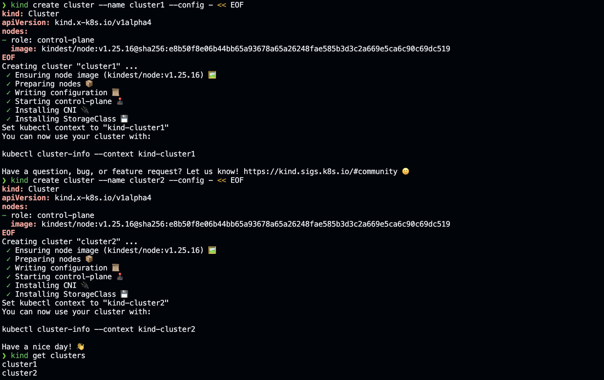

O Kind cria clusters locais usando contêineres Docker como nós, o que torna a criação e destruição de clusters extremamente rápidas. Além disso, podemos carregar imagens locais para os clusters, basta executar o comando `kind load docker-image <image-name> --name cluster1` para carregar a imagem no cluster1.

## kubectx e kubens - Mudança de contexto e namespace

Versão utilizada: 0.9.5

Mudar de contexto muitas vezes pode ser uma tarefa tediosa, principalmente quando estamos lidando com múltiplos clusters como é o caso acima. Imagine toda vez que quiser mudar de contexto você precisar executar o comando `kubectl config use-context kind-cluster1` para começar a trabalhar no cluster1 ou `kubectl config use-context kind-cluster2` para alterarmos o contexto para o cluster2. E se não lembrarmos os nomes dos clusters? Devemos executar o comando `kubectl config get-contexts` para listar todos os contextos disponíveis e depois escolher o contexto desejado.

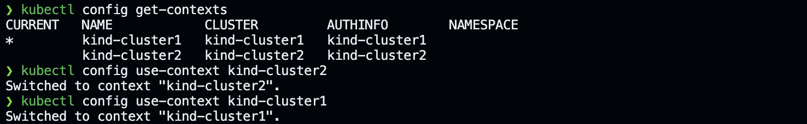

É neste ponto que o kubectx se destaca, permitindo listar todos os contextos disponíveis e mudar de contexto rapidamente e com eficiência. Veja, com o comando `kubectx` podemos listar todos os contextos disponíveis e com o comando `kubectx kind-cluster1` podemos mudar para o contexto do cluster1, assim como `kubectx kind-cluster2` para mudar para o contexto do cluster2. Muito mais fácil de lembrar e executar, não?

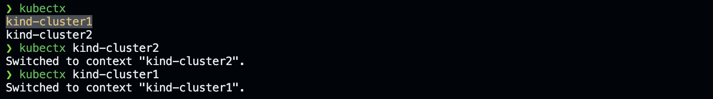

E que tal listar os namespaces do cluster1? Para isso usaremos o comando `kubectl get namespaces`. Verificamos com o comando `kubectl config view --minify --output 'jsonpath={..namespace}'` que estamos no namespace default, ou seja, a saída será em branco. Vamos alterar nosso namespace de trabalho para o namespace kube-system com o comando `kubectl config set-context --current --namespace=kube-system`. Verificando com o comando `kubectl config view --minify --output 'jsonpath={..namespace}'` que agora estamos no namespace kube-system e em seguida listamos os pods do namespace kube-system com o comando `kubectl get pods`, para confirmar que estamos no namespace correto.

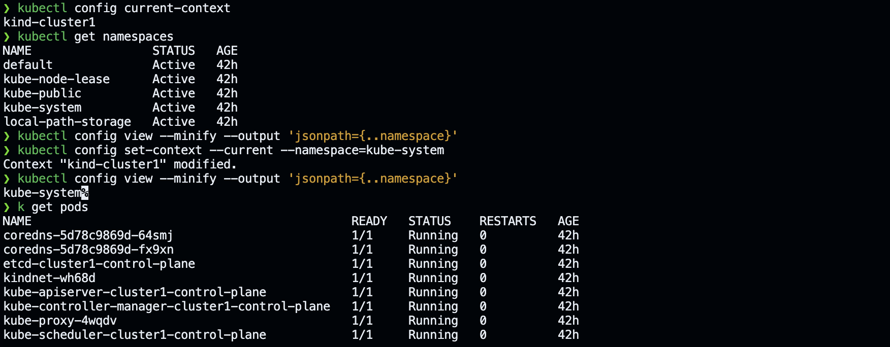

O kubens funciona da mesma maneira que o kubectx, mas ao invés de mudar de contexto, ele muda de namespace. Com o comando `kubens` podemos listar todos os namespaces disponíveis e com o comando `kubens kube-system` podemos mudar para o namespace kube-system, assim como `kubens default` para mudar para o namespace default.

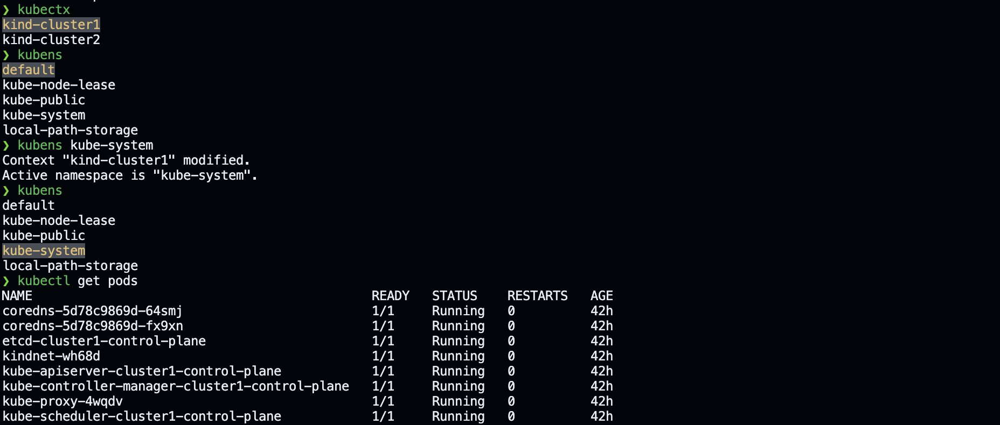

## stern - Visualização de logs

Versão utilizada: 1.25.0

Podemos facilmente obter os logs de um pod especifico com o comando `kubectl logs <pod-name>`, mas se precisarmos obter os logs de vários pods em simultâneo? Ou mesmo de múltiplos containers no mesmo pod? Este comando não nos atenderá nesse caso. O Stern é uma ferramenta que nos permite obter os logs de vários pods ou containers em simultâneo, o que é extremamente útil quando precisamos depurar múltiplas aplicações.

Vamos fazer um pequeno experimento com um pod que contêm dois containers. Ambos os containers gerarão logs diferentes. Desta forma poderemos visualizar a limitação que temos ao usar o comando `kubectl logs <pod-name>`. Antes de mais nada, não esqueça de criar um namespace para nossas aplicações com o comando `kubectl create namespace applications`. Em seguida, vamos criar um pod com dois containers, um chamado ubuntu-logger-one e outro chamado ubuntu-logger-two.

```yaml
apiVersion: v1
kind: Pod
metadata:
  name: ubuntu-dual-logging-pod
  namespace: applications
spec:
  containers:
    - name: ubuntu-logger-one
      image: ubuntu
      command: ["/bin/sh"]
      args:
        [
          "-c",
          'while true; do echo "$(date) - Logger One: Gerando logs para teste..."; sleep 10; done',
        ]
    - name: ubuntu-logger-two
      image: ubuntu
      command: ["/bin/sh"]
      args:
        [
          "-c",
          'while true; do echo "$(date) - Logger Two: Gerando logs para teste de outro contêiner..."; sleep 15; done',
        ]
```

Podemos ver os logs de cada container com os comandos `kubectl logs ubuntu-dual-logging-pod` e `kubectl logs ubuntu-dual-logging-pod -c ubuntu-logger-two`, ou seja, não é possível ver ambos os logs ao mesmo tempo, a não ser que um novo terminal seja aberto.

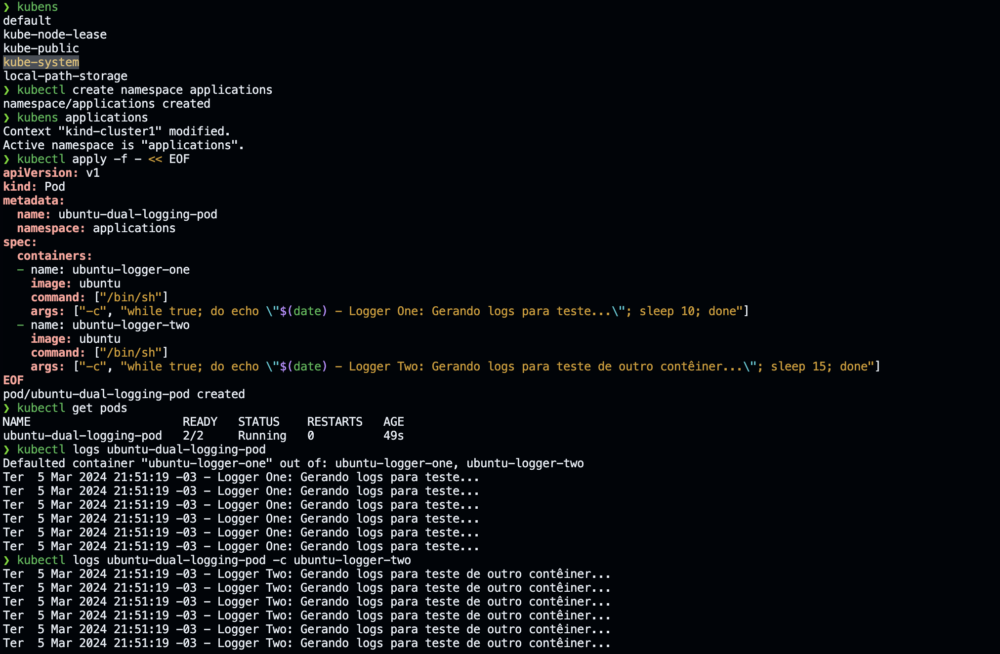

Com o Stern, podemos obter os logs de ambos os containers em simultâneo com o comando `stern ubuntu-dual-logging-pod`. Além disso, podemos filtrar os logs por container com o comando `stern ubuntu-dual-logging-pod --container ubuntu-logger-one` e `stern ubuntu-dual-logging-pod --container ubuntu-logger-two`, da mesma maneira que faríamos com o comando `kubectl logs ubuntu-dual-logging-pod -c ubuntu-logger-one` e `kubectl logs ubuntu-dual-logging-pod -c ubuntu-logger-two`.

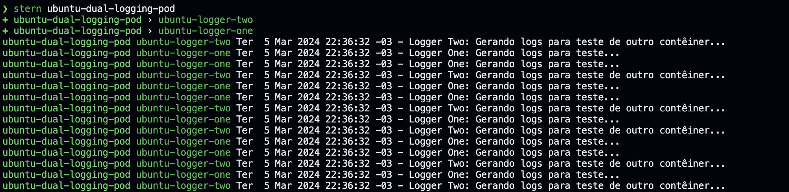

## kube-score - Melhores práticas em definições de recursos

Versão utilizada: 1.18.0

Podemos perceber que a definição do pod que demos como exemplo acima não é a mais segura e não segue as melhores práticas. O kube-score é uma ferramenta que nos ajuda a avaliar as melhores práticas das definições de nossos recursos Kubernetes. Ele verifica se nossos recursos seguem as melhores práticas de segurança e resiliência e nos fornece sugestões de como podemos melhorar a segurança de nossos recursos.

Vamos verificar a definição do pod que criamos anteriormente com o kube-score. Primeiro, vamos salvar a definição do pod em um arquivo chamado _pod.yaml_ e em seguida executamos o comando `kube-score score pod.yaml`.

```yaml
apiVersion: v1
kind: Pod
metadata:
  name: ubuntu-dual-logging-pod
  namespace: applications
spec:
  containers:
    - name: ubuntu-logger-one
      image: ubuntu
      command: ["/bin/sh"]
      args:
        [
          "-c",
          'while true; do echo "$(date) - Logger One: Gerando logs para teste..."; sleep 10; done',
        ]
    - name: ubuntu-logger-two
      image: ubuntu
      command: ["/bin/sh"]
      args:
        [
          "-c",
          'while true; do echo "$(date) - Logger Two: Gerando logs para teste de outro contêiner..."; sleep 15; done',
        ]
```

Executamos o comando `kube-score score pod.yaml` e obtemos a seguinte saída:

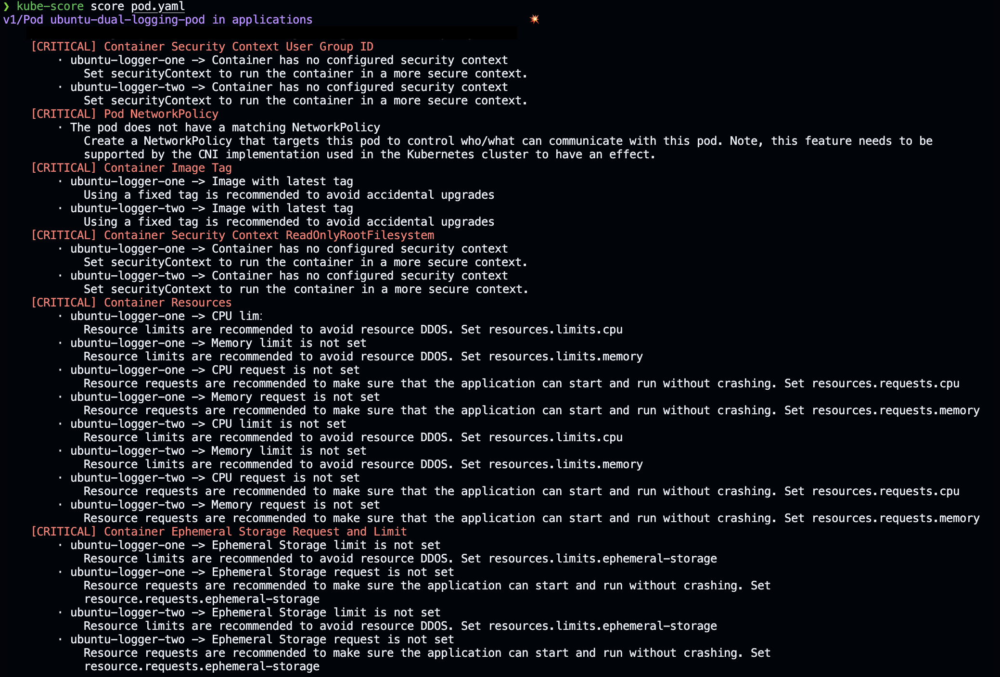

O primeiro aviso que vemos é que o pod em questão não tem um Security Context Group ID definido. Vamos corrigir isso adicionando um Security Context Group ID ao pod. A definição do pod ficará da seguinte maneira:

```yaml
apiVersion: v1
kind: Pod
metadata:
  name: ubuntu-dual-logging-pod
  namespace: applications
spec:
  containers:
    - name: ubuntu-logger-one
      image: ubuntu
      command: ["/bin/sh"]
      args:
        [
          "-c",
          'while true; do echo "$(date) - Logger One: Gerando logs para teste..."; sleep 10; done',
        ]
      securityContext:
        runAsGroup: 10001
        runAsUser: 10001
    - name: ubuntu-logger-two
      image: ubuntu
      command: ["/bin/sh"]
      args:
        [
          "-c",
          'while true; do echo "$(date) - Logger Two: Gerando logs para teste de outro contêiner..."; sleep 15; done',
        ]
      securityContext:
        runAsGroup: 10001
        runAsUser: 10001
```

O segundo aviso se refere ao network policy, que não foi definido. Vamos corrigir isso adicionando um network policy para pod, mas para isso precisamos adicionar uma label ao pod para poder dar match com a network policy. Como nosso pod não precisa se comunicar com nenhum outro pod em nosso cluster, vamos bloquear tanto o tráfego de entrada quanto o de saída. A definição do pod e da network policy ficará da seguinte maneira:

```yaml
apiVersion: v1
kind: Pod
metadata:
  name: ubuntu-dual-logging-pod
  namespace: applications
  labels:
    app: ubuntu-logging-app
spec:
  containers:
    - name: ubuntu-logger-one
      image: ubuntu
      command: ["/bin/sh"]
      args:
        [
          "-c",
          'while true; do echo "$(date) - Logger One: Gerando logs para teste..."; sleep 10; done',
        ]
      securityContext:
        runAsGroup: 10001
        runAsUser: 10001
    - name: ubuntu-logger-two
      image: ubuntu
      command: ["/bin/sh"]
      args:
        [
          "-c",
          'while true; do echo "$(date) - Logger Two: Gerando logs para teste de outro contêiner..."; sleep 15; done',
        ]
      securityContext:
        runAsGroup: 10001
        runAsUser: 10001
---
apiVersion: networking.k8s.io/v1
kind: NetworkPolicy
metadata:
  name: block-all-traffic
  namespace: applications
spec:
  podSelector:
    matchLabels:
      app: ubuntu-logging-app
  policyTypes:
    - Ingress
    - Egress
```

Agora vamos ajustar o terceiro ponto que o kube-score nos alertou, o uso da tag latest, já que não definimos tag na imagem, o padrão é a latest. Vamos fixar a imagem do ubuntu para a versão 22.04. Portanto, agora teremos:

```yaml
apiVersion: v1
kind: Pod
metadata:
  name: ubuntu-dual-logging-pod
  namespace: applications
  labels:
    app: ubuntu-logging-app
spec:
  containers:
    - name: ubuntu-logger-one
      image: ubuntu:22.04
      command: ["/bin/sh"]
      args:
        [
          "-c",
          'while true; do echo "$(date) - Logger One: Gerando logs para teste..."; sleep 10; done',
        ]
      securityContext:
        runAsGroup: 10001
        runAsUser: 10001
    - name: ubuntu-logger-two
      image: ubuntu:22.04
      command: ["/bin/sh"]
      args:
        [
          "-c",
          'while true; do echo "$(date) - Logger Two: Gerando logs para teste de outro contêiner..."; sleep 15; done',
        ]
      securityContext:
        runAsGroup: 10001
        runAsUser: 10001
---
apiVersion: networking.k8s.io/v1
kind: NetworkPolicy
metadata:
  name: block-all-traffic
  namespace: applications
spec:
  podSelector:
    matchLabels:
      app: ubuntu-logging-app
  policyTypes:
    - Ingress
    - Egress
```

No terceiro ponto precisamos definir apenas no SecurityContext o readOnlyRootFilesystem como true. O readOnlyRootFilesystem é uma medida de segurança que impede que um container modifique o sistema de arquivos raiz. A definição do pod ficará da seguinte maneira:

```yaml
apiVersion: v1
kind: Pod
metadata:
  name: ubuntu-dual-logging-pod
  namespace: applications
  labels:
    app: ubuntu-logging-app
spec:
  containers:
    - name: ubuntu-logger-one
      image: ubuntu:22.04
      command: ["/bin/sh"]
      args:
        [
          "-c",
          'while true; do echo "$(date) - Logger One: Gerando logs para teste..."; sleep 10; done',
        ]
      securityContext:
        runAsGroup: 10001
        runAsUser: 10001
        readOnlyRootFilesystem: true
    - name: ubuntu-logger-two
      image: ubuntu:22.04
      command: ["/bin/sh"]
      args:
        [
          "-c",
          'while true; do echo "$(date) - Logger Two: Gerando logs para teste de outro contêiner..."; sleep 15; done',
        ]
      securityContext:
        runAsGroup: 10001
        runAsUser: 10001
        readOnlyRootFilesystem: true
---
apiVersion: networking.k8s.io/v1
kind: NetworkPolicy
metadata:
  name: block-all-traffic
  namespace: applications
spec:
  podSelector:
    matchLabels:
      app: ubuntu-logging-app
  policyTypes:
    - Ingress
    - Egress
```

Quase terminamos nossos ajustes, falta definir agora os recursos reservados para os containers. Os dois últimos alertas tratam sobre recursos, tanto memória e cpu quanto de ephemeral storage. Vamos definir que cada container terá 100m de CPU, 128Mi de memória e 50Mi de ephemeral storage como recursos reservados, 200m de CPU, 256Mi de memória e 100Mi de ephemeral storage como recursos limitados. Teremos então:

```yaml
apiVersion: v1
kind: Pod
metadata:
  name: ubuntu-dual-logging-pod
  namespace: applications
  labels:
    app: ubuntu-logging-app
spec:
  containers:
    - name: ubuntu-logger-one
      image: ubuntu:22.04
      command: ["/bin/sh"]
      args:
        [
          "-c",
          'while true; do echo "$(date) - Logger One: Gerando logs para teste..."; sleep 10; done',
        ]
      securityContext:
        runAsGroup: 10001
        runAsUser: 10001
        readOnlyRootFilesystem: true
      resources:
        requests:
          memory: "128Mi"
          cpu: "100m"
          ephemeral-storage: "50Mi"
        limits:
          memory: "256Mi"
          cpu: "200m"
          ephemeral-storage: "100Mi"
    - name: ubuntu-logger-two
      image: ubuntu:22.04
      command: ["/bin/sh"]
      args:
        [
          "-c",
          'while true; do echo "$(date) - Logger Two: Gerando logs para teste de outro contêiner..."; sleep 15; done',
        ]
      securityContext:
        runAsGroup: 10001
        runAsUser: 10001
        readOnlyRootFilesystem: true
      resources:
        requests:
          memory: "128Mi"
          cpu: "100m"
          ephemeral-storage: "50Mi"
        limits:
          memory: "256Mi"
          cpu: "200m"
          ephemeral-storage: "100Mi"
---
apiVersion: networking.k8s.io/v1
kind: NetworkPolicy
metadata:
  name: block-all-traffic
  namespace: applications
spec:
  podSelector:
    matchLabels:
      app: ubuntu-logging-app
  policyTypes:
    - Ingress
    - Egress
```

Vamos executar mais uma vez e ver se todas as pendências foram resolvidas. Executamos o comando `kube-score score pod.yaml` e obtemos a seguinte saída:

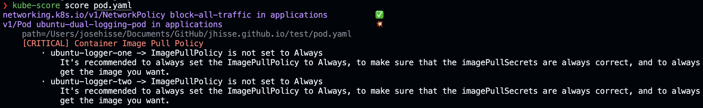

Vemos que um novo alerta surgiu. O kube-score nos alertou a falta da imagePullPolicy. Antes este não foi reportado, pois, com a tag latest, o padrão da imagePullPolicy é Always. Quando fixamos a tag da imagem para a 22.04, o imagePullPolicy passou a ser IfNotPresent por padrão e não mais Always, como é o padrão para a tag latest. Vamos corrigir isso adicionando a imagePullPolicy para o pod.

```yaml
apiVersion: v1
kind: Pod
metadata:
  name: ubuntu-dual-logging-pod
  namespace: applications
  labels:
    app: ubuntu-logging-app
spec:
  containers:
    - name: ubuntu-logger-one
      image: ubuntu:22.04
      imagePullPolicy: Always
      command: ["/bin/sh"]
      args:
        [
          "-c",
          'while true; do echo "$(date) - Logger One: Gerando logs para teste..."; sleep 10; done',
        ]
      securityContext:
        runAsGroup: 10001
        runAsUser: 10001
        readOnlyRootFilesystem: true
      resources:
        requests:
          memory: "128Mi"
          cpu: "100m"
          ephemeral-storage: "50Mi"
        limits:
          memory: "256Mi"
          cpu: "200m"
          ephemeral-storage: "100Mi"
    - name: ubuntu-logger-two
      image: ubuntu:22.04
      imagePullPolicy: Always
      command: ["/bin/sh"]
      args:
        [
          "-c",
          'while true; do echo "$(date) - Logger Two: Gerando logs para teste de outro contêiner..."; sleep 15; done',
        ]
      securityContext:
        runAsGroup: 10001
        runAsUser: 10001
        readOnlyRootFilesystem: true
      resources:
        requests:
          memory: "128Mi"
          cpu: "100m"
          ephemeral-storage: "50Mi"
        limits:
          memory: "256Mi"
          cpu: "200m"
          ephemeral-storage: "100Mi"
---
apiVersion: networking.k8s.io/v1
kind: NetworkPolicy
metadata:
  name: block-all-traffic
  namespace: applications
spec:
  podSelector:
    matchLabels:
      app: ubuntu-logging-app
  policyTypes:
    - Ingress
    - Egress
```

Por fim verificamos se todas as pendências foram resolvidas executando o comando `kube-score score pod.yaml` novamente.


Vemos que tudo foi corrigido e todas as recomendações estão seguindo as melhores práticas. Nesse exemplo vemos a importância desta ferramenta.

## kube-capacity - Verificação de consumo de recursos

Versão utilizada: 0.7.4

Ao definir, na etapa anterior, os requests e limits de recursos para os containers, baseamos nossas estimativas em conhecimento e experiência prévios. No entanto, frequentemente, essas estimativas são imprecisas devido à falta de dados suficientes para avaliar de maneira eficaz os recursos necessários para nossas aplicações.

Podemos verificar o quanto um pod está consumindo de memória e cpu utilizando o comando `kubectl top pod ubuntu-dual-logging-pod`. Se precisarmos verificar o consumo de recursos de todos os containers deste pod podemos executar o comando `kubectl top pod ubuntu-dual-logging-pod --containers`. No entanto, não conseguimos ver simultaneamente o consumo de cpu e memória e os request e limits definidos para os containers. Desta forma o kube-capacity preenche essa lacuna, nos fornecendo informações sobre o consumo de recursos de nossos pods e como eles se comparam com os recursos reservados.

Lembre-se que as métricas de consumo de recursos são coletadas pelo metrics-server, sendo um componente do Kubernetes utilizado para coletar métricas de consumo de recursos. Portanto, para que o kube-capacity funcione corretamente, o metrics-server deve estar instalado e funcionando corretamente em seu cluster.

Vamos verificar o consumo de recursos do pod que criamos anteriormente com o kube-capacity além do request e limit definido para cada container. Após instalar o kube-capacity, executamos o comando `kube-capacity -n applications --util --containers` e obtemos a seguinte saída:

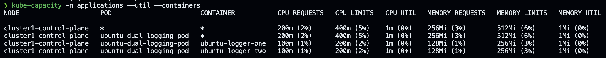

## kube-no-trouble - Alertas de recursos deprecados

Versão utilizada: 0.7.1

Vamos introduzir um novo componente, o Horizontal Pod Autoscaler (HPA), um recurso do Kubernetes que nos permite escalar automaticamente o número de pods em um deployment ou statefulset com base em algumas métricas de pods, ou containers. Observe que no início de nosso artigo, criamos os clusters na versão 1.25.

Para nosso teste agora, vamos criar um deployment aproveitando a mesma especificação do pod que criamos anteriormente, enquanto criamos um HPA para este deployment. O HPA poderá escalar ao número de pods do deployment com base na utilização de CPU. Vamos criar o deployment e o HPA com o seguinte arquivo de manifesto:

```yaml
apiVersion: apps/v1
kind: Deployment
metadata:
  name: ubuntu-dual-logging-pod
  namespace: applications
spec:
  selector:
    matchLabels:
      app: ubuntu-logging-app
  template:
    metadata:
      labels:
        app: ubuntu-logging-app
    spec:
      containers:
      - name: ubuntu-logger-one
        image: ubuntu:22.04
        imagePullPolicy: Always
        command: ["/bin/sh"]
        args: ["-c", "while true; do echo \"$(date) - Logger One: Gerando logs para teste...\"; sleep 10; done"]
        securityContext:
          runAsGroup: 10001
          runAsUser: 10001
          readOnlyRootFilesystem: true
        resources:
          requests:
            memory: "128Mi"
            cpu: "100m"
            ephemeral-storage: "50Mi"
          limits:
            memory: "256Mi"
            cpu: "200m"
            ephemeral-storage: "100Mi"
      - name: ubuntu-logger-two
        image: ubuntu:22.04
        imagePullPolicy: Always
        command: ["/bin/sh"]
        args: ["-c", "while true; do echo \"$(date) - Logger Two: Gerando logs para teste de outro contêiner...\"; sleep 15; done"]
        securityContext:
          runAsGroup: 10001
          runAsUser: 10001
          readOnlyRootFilesystem: true
        resources:
          requests:
            memory: "128Mi"
            cpu: "100m"
            ephemeral-storage: "50Mi"
          limits:
            memory: "256Mi"
            cpu: "200m"
            ephemeral-storage: "100Mi"
---
apiVersion: networking.k8s.io/v1
kind: NetworkPolicy
metadata:
  name: block-all-traffic
  namespace: applications
spec:
  podSelector:
    matchLabels:
      app: ubuntu-logging-app
  policyTypes:
    - Ingress
    - Egress
---
apiVersion: autoscaling/v2beta2
kind: HorizontalPodAutoscaler
metadata:
  name: ubuntu-logging-app-autoscaler
  namespace: applications
spec:
  scaleTargetRef:
    apiVersion: apps/v1
    kind: Deployment
    name: ubuntu-dual-logging-pod
  minReplicas: 1
  maxReplicas: 2
  metrics:
  - type: Resource
    resource:
      name: cpu
      target:
        type: Utilization
        averageUtilization: 80
```

Criamos um Horizontal Pod Autoscaler com a apiVersion v2beta2. Esta versão da API é deprecada na versão 1.26 do Kubernetes, ou seja, o Kubernetes não suportará mais a v2beta2 do HPA a partir do 1.26. O kube-no-trouble, ou kubent, nos alerta sobre isso, nos fornecendo informações sobre os recursos que serão deprecados em versões mais novas do Kubernetes. Desta forma podemos nos preparar para atualizações de cluster.

No caso acima o kubent nos alerta que a versão v2beta2 do HPA será deprecada na versão 1.26 do Kubernetes e devemos atualizar para a v2. Vamos verificar essa informação executando o comando `kubent`:

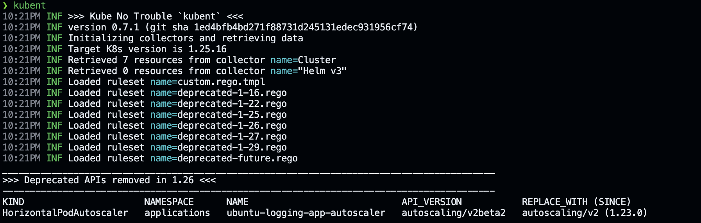

Vamos atualizar a apiVersion do HPA para v2 e verificar se o kubent nos alerta sobre alguma outra coisa. A definição do HPA ficará da seguinte maneira:

```yaml
apiVersion: autoscaling/v2
kind: HorizontalPodAutoscaler
metadata:
  name: ubuntu-logging-app-autoscaler
  namespace: applications
spec:
  scaleTargetRef:
    apiVersion: apps/v1
    kind: Deployment
    name: ubuntu-dual-logging-pod
  minReplicas: 1
  maxReplicas: 2
  metrics:
  - type: Resource
    resource:
      name: cpu
      target:
        type: Utilization
        averageUtilization: 80
```

Após aplicarmos esta definição do HPA, executamos o comando `kubent` novamente e obtemos a seguinte saída:

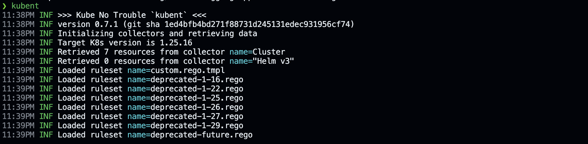

Com isso verificamos não haver mais api deprecadas precisando de atualização e podemos prosseguir com uma possível atualização do cluster.

## Conclusão

O Kubernetes é conhecido por sua complexidade e os desafios que traz. Pode parecer que as ferramentas que mencionei são desnecessárias porque o `kubectl` faz praticamente tudo. Mas, na verdade, elas tornam nosso trabalho diário mais fácil e rápido. Escolhi essas ferramentas por serem, na minha experiência, essenciais para gerenciar clusters Kubernetes de forma eficiente. Elas nos ajudam a economizar tempo e esforço, simplificando tarefas complicadas.
