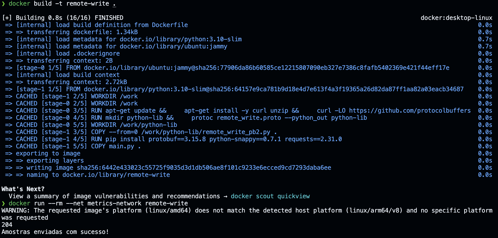

O Prometheus é uma das ferramentas mais utilizadas para coletar e armazenar métricas. Durante minha busca por uma maneira de demonstrar o comportamento de certas funções do Prometheus com uma amostra de dados, encontrei um desafio: como gerar essas amostras com timestamps precisos? Minha intenção não era lidar com variações de alguns milissegundos em torno de um ponto de coleta de métricas, mas sim ter um controle mais rigoroso sobre esses timestamps.

Procurando por soluções, descobri uma abordagem que pareceu promissora: usar o Remote Write do Prometheus para enviar as métricas ao servidor. Assim, eu poderia gerar amostras para meus exemplos e enviá-las ao Prometheus com timestamps exatos.

O processo para enviar as amostras via Remote Write envolve codificar o payload em formato protobuf e comprimi-lo com snappy para enviar via HTTP. Este post detalha como realizar essa tarefa.

## O que é Remote Write?

O Remote Write do Prometheus é um método para enviar métricas a um servidor, com o objetivo de armazená-las em um servidor de destino. Esse envio é realizado utilizando o protocolo HTTP, com os dados formatados em protobuf e o payload comprimido em snappy.

## O que é protobuf?

Protobuf, desenvolvido pelo Google, é um formato de serialização de dados projetado para ser mais rápido e eficiente do que outros formatos como o JSON.

Temos um arquivo com a extensão `.proto` que descreve a estrutura dos dados a serem enviados. A partir desse arquivo, podemos gerar código em várias linguagens de programação, como Python, Java, C++, entre outras, utilizando o compilador `protoc`. O código gerado facilita a manipulação dos dados na linguagem escolhida.

## O que é compressão snappy?

Para quem trabalha com engenharia de dados, como eu, o algoritmo de compressão snappy pode ser familiar. Ele é frequentemente utilizado para comprimir arquivos nos formatos Parquet ou Avro. A compressão dos arquivos resulta em uma economia significativa de espaço de armazenamento e banda de transmissão, pois os arquivos comprimidos são muito menores do que suas versões sem compressão.

Aplicar compressão snappy ao payload do request HTTP que será enviado é uma estratégia para otimizar a transferência desses dados, reduzindo seu tamanho e acelerando o processo de transmissão.

Para comprimir o payload em snappy, podemos utilizar a biblioteca `python-snappy`.

## Compilando o arquivo .proto

Optei por usar Python para escrever o script necessário neste processo. Portanto, precisamos compilar o arquivo `.proto` para podermos usar o código gerado. De acordo com a [documentação do Prometheus sobre o Remote Write](https://prometheus.io/docs/concepts/remote_write_spec/#protocol), o arquivo `.proto` necessário está descrito na documentação oficial.

```proto
syntax = "proto3";

message WriteRequest {
  repeated TimeSeries timeseries = 1;
  // Cortex uses this field to determine the source of the write request.
  // We reserve it to avoid any compatibility issues.
  reserved  2;

  // Prometheus uses this field to send metadata, but this is
  // omitted from v1 of the spec as it is experimental.
  reserved  3;
}

message TimeSeries {
  repeated Label labels   = 1;
  repeated Sample samples = 2;
}

message Label {
  string name  = 1;
  string value = 2;
}

message Sample {
  double value    = 1;
  int64 timestamp = 2;
}
```

Para facilitar a compilação do arquivo `.proto` sem a necessidade de instalar ferramentas adicionais em nossa máquina, criei um pequeno Dockerfile. Esse Dockerfile configura um ambiente isolado onde todas as dependências necessárias estão presentes, permitindo compilar o arquivo de maneira eficiente e segura utilizando o `protoc`.

```Dockerfile
# Usando como imagem base o Ubuntu 22.04 (Jammy)
FROM --platform=linux/amd64 ubuntu:jammy

# Definindo o diretório de trabalho dentro do container
WORKDIR /work

# Instalando as dependências necessárias para compilar o arquivo .proto
RUN apt-get update && \
    apt-get install -y curl unzip && \
    curl -LO https://github.com/protocolbuffers/protobuf/releases/download/v3.15.8/protoc-3.15.8-linux-x86_64.zip && \
    unzip protoc-3.15.8-linux-x86_64.zip -d /usr/local && \
    rm protoc-3.15.8-linux-x86_64.zip

# Criando o arquivo .proto com a estrutura necessária para o Remote Write
# https://prometheus.io/docs/concepts/remote_write_spec/#protocol
RUN echo 'syntax = "proto3"; \n\
    message WriteRequest { \n\
      repeated TimeSeries timeseries = 1; \n\
      reserved  2; \n\
      reserved  3; \n\
    } \n\
    message TimeSeries { \n\
      repeated Label labels   = 1; \n\
      repeated Sample samples = 2; \n\
    } \n\
    message Label { \n\
      string name  = 1; \n\
      string value = 2; \n\
    } \n\
    message Sample { \n\
      double value    = 1; \n\
      int64 timestamp = 2; \n\
    }\n' > remote_write.proto

# Definindo o diretório de trabalho para armazenar o arquivo gerado
WORKDIR /work/python-lib

# Compilando o arquivo .proto para Python e gerando as classes necessárias
RUN protoc --proto_path .. remote_write.proto --python_out .

# Definindo o entrypoint para visualizar o arquivo gerado
ENTRYPOINT ["bash", "-c", "tail -n +1 -v *.py"]
```

## Gerando a Imagem Docker e Executando o Container

Para compilar o arquivo `.proto` utilizando o Docker, primeiro precisamos construir a imagem Docker e, em seguida, executar o container. Abaixo estão os comandos para realizar essas etapas:

```bash
docker build -t remote-write .
docker run --rm remote-write
```


Após a execução do container, o código Python gerado, denominado remote_write_pb2.py, estará visível em nosso terminal.

```python
# -*- coding: utf-8 -*-
# Generated by the protocol buffer compiler.  DO NOT EDIT!
# source: remote_write.proto
"""Generated protocol buffer code."""
from google.protobuf import descriptor as _descriptor
from google.protobuf import message as _message
from google.protobuf import reflection as _reflection
from google.protobuf import symbol_database as _symbol_database
# @@protoc_insertion_point(imports)

_sym_db = _symbol_database.Default()


DESCRIPTOR = _descriptor.FileDescriptor(
  name='remote_write.proto',
  package='',
  syntax='proto3',
  serialized_options=None,
  create_key=_descriptor._internal_create_key,
  serialized_pb=b'\n\x12remote_write.proto\";\n\x0cWriteRequest\x12\x1f\n\ntimeseries\x18\x01 \x03(\x0b\x32\x0b.TimeSeriesJ\x04\x08\x02\x10\x03J\x04\x08\x03\x10\x04\">\n\nTimeSeries\x12\x16\n\x06labels\x18\x01 \x03(\x0b\x32\x06.Label\x12\x18\n\x07samples\x18\x02 \x03(\x0b\x32\x07.Sample\"$\n\x05Label\x12\x0c\n\x04name\x18\x01 \x01(\t\x12\r\n\x05value\x18\x02 \x01(\t\"*\n\x06Sample\x12\r\n\x05value\x18\x01 \x01(\x01\x12\x11\n\ttimestamp\x18\x02 \x01(\x03\x62\x06proto3'
)


_WRITEREQUEST = _descriptor.Descriptor(
  name='WriteRequest',
  full_name='WriteRequest',
  filename=None,
  file=DESCRIPTOR,
  containing_type=None,
  create_key=_descriptor._internal_create_key,
  fields=[
    _descriptor.FieldDescriptor(
      name='timeseries', full_name='WriteRequest.timeseries', index=0,
      number=1, type=11, cpp_type=10, label=3,
      has_default_value=False, default_value=[],
      message_type=None, enum_type=None, containing_type=None,
      is_extension=False, extension_scope=None,
      serialized_options=None, file=DESCRIPTOR,  create_key=_descriptor._internal_create_key),
  ],
  extensions=[
  ],
  nested_types=[],
  enum_types=[
  ],
  serialized_options=None,
  is_extendable=False,
  syntax='proto3',
  extension_ranges=[],
  oneofs=[
  ],
  serialized_start=22,
  serialized_end=81,
)


_TIMESERIES = _descriptor.Descriptor(
  name='TimeSeries',
  full_name='TimeSeries',
  filename=None,
  file=DESCRIPTOR,
  containing_type=None,
  create_key=_descriptor._internal_create_key,
  fields=[
    _descriptor.FieldDescriptor(
      name='labels', full_name='TimeSeries.labels', index=0,
      number=1, type=11, cpp_type=10, label=3,
      has_default_value=False, default_value=[],
      message_type=None, enum_type=None, containing_type=None,
      is_extension=False, extension_scope=None,
      serialized_options=None, file=DESCRIPTOR,  create_key=_descriptor._internal_create_key),
    _descriptor.FieldDescriptor(
      name='samples', full_name='TimeSeries.samples', index=1,
      number=2, type=11, cpp_type=10, label=3,
      has_default_value=False, default_value=[],
      message_type=None, enum_type=None, containing_type=None,
      is_extension=False, extension_scope=None,
      serialized_options=None, file=DESCRIPTOR,  create_key=_descriptor._internal_create_key),
  ],
  extensions=[
  ],
  nested_types=[],
  enum_types=[
  ],
  serialized_options=None,
  is_extendable=False,
  syntax='proto3',
  extension_ranges=[],
  oneofs=[
  ],
  serialized_start=83,
  serialized_end=145,
)


_LABEL = _descriptor.Descriptor(
  name='Label',
  full_name='Label',
  filename=None,
  file=DESCRIPTOR,
  containing_type=None,
  create_key=_descriptor._internal_create_key,
  fields=[
    _descriptor.FieldDescriptor(
      name='name', full_name='Label.name', index=0,
      number=1, type=9, cpp_type=9, label=1,
      has_default_value=False, default_value=b"".decode('utf-8'),
      message_type=None, enum_type=None, containing_type=None,
      is_extension=False, extension_scope=None,
      serialized_options=None, file=DESCRIPTOR,  create_key=_descriptor._internal_create_key),
    _descriptor.FieldDescriptor(
      name='value', full_name='Label.value', index=1,
      number=2, type=9, cpp_type=9, label=1,
      has_default_value=False, default_value=b"".decode('utf-8'),
      message_type=None, enum_type=None, containing_type=None,
      is_extension=False, extension_scope=None,
      serialized_options=None, file=DESCRIPTOR,  create_key=_descriptor._internal_create_key),
  ],
  extensions=[
  ],
  nested_types=[],
  enum_types=[
  ],
  serialized_options=None,
  is_extendable=False,
  syntax='proto3',
  extension_ranges=[],
  oneofs=[
  ],
  serialized_start=147,
  serialized_end=183,
)


_SAMPLE = _descriptor.Descriptor(
  name='Sample',
  full_name='Sample',
  filename=None,
  file=DESCRIPTOR,
  containing_type=None,
  create_key=_descriptor._internal_create_key,
  fields=[
    _descriptor.FieldDescriptor(
      name='value', full_name='Sample.value', index=0,
      number=1, type=1, cpp_type=5, label=1,
      has_default_value=False, default_value=float(0),
      message_type=None, enum_type=None, containing_type=None,
      is_extension=False, extension_scope=None,
      serialized_options=None, file=DESCRIPTOR,  create_key=_descriptor._internal_create_key),
    _descriptor.FieldDescriptor(
      name='timestamp', full_name='Sample.timestamp', index=1,
      number=2, type=3, cpp_type=2, label=1,
      has_default_value=False, default_value=0,
      message_type=None, enum_type=None, containing_type=None,
      is_extension=False, extension_scope=None,
      serialized_options=None, file=DESCRIPTOR,  create_key=_descriptor._internal_create_key),
  ],
  extensions=[
  ],
  nested_types=[],
  enum_types=[
  ],
  serialized_options=None,
  is_extendable=False,
  syntax='proto3',
  extension_ranges=[],
  oneofs=[
  ],
  serialized_start=185,
  serialized_end=227,
)

_WRITEREQUEST.fields_by_name['timeseries'].message_type = _TIMESERIES
_TIMESERIES.fields_by_name['labels'].message_type = _LABEL
_TIMESERIES.fields_by_name['samples'].message_type = _SAMPLE
DESCRIPTOR.message_types_by_name['WriteRequest'] = _WRITEREQUEST
DESCRIPTOR.message_types_by_name['TimeSeries'] = _TIMESERIES
DESCRIPTOR.message_types_by_name['Label'] = _LABEL
DESCRIPTOR.message_types_by_name['Sample'] = _SAMPLE
_sym_db.RegisterFileDescriptor(DESCRIPTOR)

WriteRequest = _reflection.GeneratedProtocolMessageType('WriteRequest', (_message.Message,), {
  'DESCRIPTOR' : _WRITEREQUEST,
  '__module__' : 'remote_write_pb2'
  # @@protoc_insertion_point(class_scope:WriteRequest)
  })
_sym_db.RegisterMessage(WriteRequest)

TimeSeries = _reflection.GeneratedProtocolMessageType('TimeSeries', (_message.Message,), {
  'DESCRIPTOR' : _TIMESERIES,
  '__module__' : 'remote_write_pb2'
  # @@protoc_insertion_point(class_scope:TimeSeries)
  })
_sym_db.RegisterMessage(TimeSeries)

Label = _reflection.GeneratedProtocolMessageType('Label', (_message.Message,), {
  'DESCRIPTOR' : _LABEL,
  '__module__' : 'remote_write_pb2'
  # @@protoc_insertion_point(class_scope:Label)
  })
_sym_db.RegisterMessage(Label)

Sample = _reflection.GeneratedProtocolMessageType('Sample', (_message.Message,), {
  'DESCRIPTOR' : _SAMPLE,
  '__module__' : 'remote_write_pb2'
  # @@protoc_insertion_point(class_scope:Sample)
  })
_sym_db.RegisterMessage(Sample)


# @@protoc_insertion_point(module_scope)
```

É importante notar que o código Python gerado, `remote_write_pb2.py`, necessita da biblioteca `protobuf` para ser executado corretamente. Essa biblioteca é essencial para interpretar e manipular os dados serializados no formato Protobuf, conforme definido pelo arquivo `.proto`.

## Iniciando o Prometheus

Antes de iniciar o Prometheus, vamos criar uma rede para que ele e o script python possam se comunicar. Como ambos estarão na mesma rede, podemos utilizar o nome do container para estabelecer a comunicação.

```bash
docker network create metrics-network
```

Para iniciar uma instância do Prometheus em nosso ambiente de testes locais utilizando o Docker, siga o comando abaixo:

```bash
docker run --rm -d -p 9090:9090 -e TZ=UTC --net metrics-network \
  --name prometheus prom/prometheus:v2.51.1 \
  --config.file=/etc/prometheus/prometheus.yml \
  --web.enable-remote-write-receiver
```


A interface web do Prometheus estará disponível em `http://localhost:9090`.


A flag `--web.enable-remote-write-receiver` habilita o endpoint de Remote Write. Podemos verificar se o endpoint está ativado acessando a URL `http://localhost:9090/flags` e procurando pela chave `web.enable-remote-write-receiver`:


## Enviando Dados para o Prometheus

Agora que o ambiente está configurado, precisamos criar um script Python para enviar os dados de amostras ao Prometheus. Utilizaremos o código gerado pelo protobuf para montar o payload. O envio será realizado via HTTP utilizando a biblioteca `requests`.

O script executará os seguintes passos:

1. Importar o módulo gerado pelo protobuf (`remote_write_pb2.py`).
2. Criar e popular o objeto WriteRequest com os dados da amostra.
3. Serializar o objeto WriteRequest para string.
4. Comprimir o payload utilizando a compressão snappy.
5. Enviar os dados serializados e comprimidos ao Prometheus usando um método POST com a biblioteca `requests`.

Este processo garante que os dados sejam enviados de forma eficiente para o Prometheus.

```python main.py
import requests
import snappy
from datetime import datetime

from remote_write_pb2 import WriteRequest, Label, Sample, TimeSeries


def main():
    ts = int(datetime.now().replace(second=0, microsecond=0).timestamp())*1000

    write_request = WriteRequest()

    write_request.timeseries.append(
        TimeSeries(
            labels=[
                # Esta label __name__ deve conter o nome da métrica
                Label(name="__name__", value="gasolina_disponivel_litros"),
                # Demais labels para esta série
                Label(name="posto", value="Posto de Gasolina da Cidade X"),
                Label(name="tanque", value="3")
            ],
            samples=[
                # Amostras para "Hoje" para as próximas horas com intervalos de 15 minutos
                Sample(value=10000.0, timestamp=(ts+900000*1)),
                Sample(value=9750.0,  timestamp=(ts+900000*2)),
                Sample(value=9670.0,  timestamp=(ts+900000*3)),
                Sample(value=8790.0,  timestamp=(ts+900000*4)),
                Sample(value=8790.0,  timestamp=(ts+900000*5)),
                Sample(value=8500.0,  timestamp=(ts+900000*6)),
                Sample(value=8450.0,  timestamp=(ts+900000*7)),
                Sample(value=8100.0,  timestamp=(ts+900000*8)),
                Sample(value=8000.0,  timestamp=(ts+900000*9)),
                Sample(value=7900.0,  timestamp=(ts+900000*10)),
                Sample(value=7500.0,  timestamp=(ts+900000*11)),
                Sample(value=7200.0,  timestamp=(ts+900000*12)),
                Sample(value=6100.0,  timestamp=(ts+900000*13)),
            ]
        )
    )

    # Serializa o objeto write_request para representação em String
    payload = write_request.SerializeToString()

    # Comprime o payload para ser enviado com compressão snappy
    compressed_payload = snappy.compress(payload)

    # URL do prometheus
    url = "http://prometheus:9090/api/v1/write"

    # Cabeçalhos exigidos
    headers = {
        "Content-Encoding": "snappy",
        "Content-Type": "application/x-protobuf",
        "User-Agent": "test-metrics",
        "X-Prometheus-Remote-Write-Version": "0.1.0"
    }

    # Enviando a solicitação via método POST
    response = requests.post(url, headers=headers, data=compressed_payload)

    return response.status_code


if __name__ == "__main__":
    response_code = main()
    print(response_code)
    if response_code // 100 == 2:
        print("Amostras enviadas com sucesso!")
    else:
        print("Erro ao enviar amostras!")

```

Observe que o script acima colocamos uma métrica de exemplo com o nome de `gasolina_disponivel_litros`, que no nosso exemplo está representando a quantidade de gasolina em litros que está disponível em um posto de gasolina.

O script adiciona junto com a métrica, mais duas labels: `posto` e `tanque`. A label `posto` é o nome do posto de gasolina e a label `tanque` é o número do tanque que estamos monitorando. Lembre-se que isso é somente um exemplo, você pode adicionar quantas labels quiser.

Em seguida, adicionamos as amostras de dados. Cada amostra é composta por um timestamp e um valor. No nosso exemplo, estamos adicionando 13 amostras de dados com o intervalo de 15 minutos começando no minuto de agora + 15 minutos.

Nossa estrutura de diretório ficará da seguinte forma:

```
.
├── Dockerfile
├── main.py
```

Observe que o arquivo `remote_write_pb2.py` não precisa estar em nosso diretório, já que ele será copiado do container que compilamos anteriormente. Vamos utilizar para isso o multi-stage build do Docker. Precisamos incrementar nossa imagem para incluir nosso script acima e as libs necessárias para executá-lo:

```Dockerfile
# Usando como imagem base o Ubuntu 22.04 (Jammy)
FROM --platform=linux/amd64 ubuntu:jammy

# Definindo o diretório de trabalho dentro do container
WORKDIR /work

# Instalando as dependências necessárias para compilar o arquivo .proto
RUN apt-get update && \
    apt-get install -y curl unzip && \
    curl -LO https://github.com/protocolbuffers/protobuf/releases/download/v3.15.8/protoc-3.15.8-linux-x86_64.zip && \
    unzip protoc-3.15.8-linux-x86_64.zip -d /usr/local && \
    rm protoc-3.15.8-linux-x86_64.zip

# Criando o arquivo .proto com a estrutura necessária para o Remote Write
# https://prometheus.io/docs/concepts/remote_write_spec/#protocol
RUN echo 'syntax = "proto3"; \n\
    message WriteRequest { \n\
      repeated TimeSeries timeseries = 1; \n\
      reserved  2; \n\
      reserved  3; \n\
    } \n\
    message TimeSeries { \n\
      repeated Label labels   = 1; \n\
      repeated Sample samples = 2; \n\
    } \n\
    message Label { \n\
      string name  = 1; \n\
      string value = 2; \n\
    } \n\
    message Sample { \n\
      double value    = 1; \n\
      int64 timestamp = 2; \n\
    }\n' > remote_write.proto

# Definindo o diretório de trabalho para armazenar o arquivo gerado
WORKDIR /work/python-lib

# Compilando o arquivo .proto para Python e gerando as classes necessárias
RUN protoc --proto_path .. remote_write.proto --python_out .

# Utilizando o multi-stage build para criar a imagem final
FROM --platform=linux/amd64 python:3.10-slim

# Definindo o diretório de trabalho dentro do container
WORKDIR /work

# Copiando o arquivo gerado pelo protoc da etapa anterior para o diretório de trabalho
COPY --from=0 /work/python-lib/remote_write_pb2.py .

# Instalando as dependências necessárias para executar o script
RUN pip install protobuf==3.15.8 python-snappy==0.7.1 requests==2.31.0

# Copiando o script Python para o diretório de trabalho
COPY main.py .

# Definindo o entrypoint para executar o script
ENTRYPOINT ["python", "main.py"]
```

Devemos efetuar o build desta imagem e, em seguida, executar o container:

```bash
docker build -t remote-write .
docker run --rm --net metrics-network remote-write
```



Setamos o tempo do Prometheus para algumas horas para frente do tempo de execução do script e efetuamos a seguinte query em PromQL para verificar se nossos 13 pontos de dados foram enviados com sucesso:

```promql
gasolina_disponivel_litros[4h]
```


Os 13 pontos de dados foram enviados com sucesso e estão disponíveis para consulta. Da mesma forma, podemos verificar o gráfico de amostras com a query abaixo. Fique atento ao horário da consulta e ao intervalo de tempo que você está consultando:

```promql
gasolina_disponivel_litros{posto="Posto de Gasolina da Cidade X", tanque="3"}
```


## Conclusão

O objetivo deste artigo é servir como base para outros artigos sobre o Prometheus e suas funções. A ideia é que possamos gerar amostras de dados com timestamps exatos e enviá-los para o Prometheus via Remote Write. Com isso, podemos criar exemplos mais precisos e demonstrar como o Prometheus se comporta em determinadas situações.

Espero que este artigo seja útil para você e possa ser utilizado como base para seus estudos e projetos.
