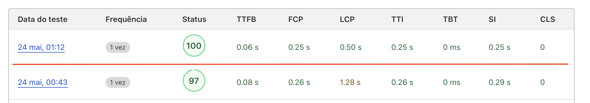
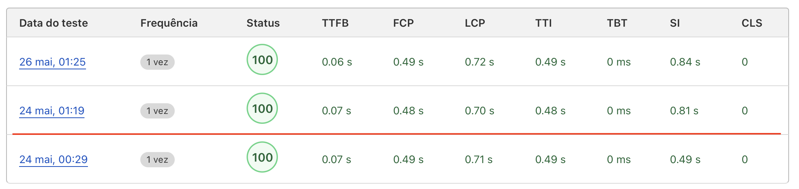
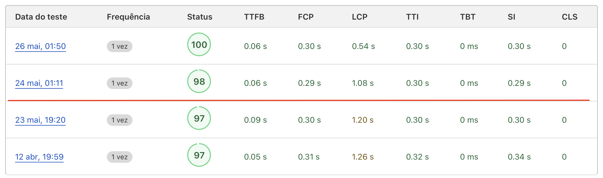

Alguns meses atrás decidi que iria migrar do Jekyll para o Hugo. Estava procurando um SSG (gerador de site estático) mais rápido e flexível, que tivesse features mais avançadas. Ainda não escrevi nenhum artigo sobre essa migração, mas pretendo falar um pouco sobre isso em outro post.

Hoje, utilizo o Hugo como gerador de site estático, e ele tem oferecido boas features para o blog. Uma dessas funcionalidades é o suporte ao processamento de imagens no tempo do build. Ao processar as imagens, posso aplicar transformações, como conversão e redimensionamento, permitindo que otimizações sejam feitas antes de entregar essas imagens aos leitores.

Novos formatos de imagens otimizados para web se destacaram nos últimos anos, entre eles o WebP. Um formato de imagem que oferece boas taxas de compressão, tanto com perda de qualidade quanto sem perda de qualidade. A grande maioria dos navegadores tem suporte para este formato e é uma boa prática que os sites disponibilizem as imagens desta nova forma.

Já sabemos que este site é gerado pelo Hugo e que há formatos mais avançados de imagens disponíveis. Então vamos explorar como utilizo o Hugo para converter minhas imagens para WebP.

## O Formato de Imagem WebP

WebP é um formato de imagem desenvolvido em 2010 pelo Google, que oferece uma melhor compressão sem perda, lossless, quanto para com perda, lossy, em relação a outros formatos de imagens. Ele foi projetado para ser um substituto para JPEG, PNG e GIF, com maior qualidade de imagem com tamanhos de arquivo reduzidos.

A grande desvantagem do novo formato é a compatibilidade com navegadores. A maioria dos navegadores atuais tem suporte, porém versões mais antigas não suportam o WebP. Para contornar essa limitação, disponibilizamos um fallback para o navegador obter uma imagem em um formato popular como o JPEG. Então, para imagem, teremos duas versões, uma em WebP e outra em JPEG.

## Markdown para HTML

O princípio do Hugo é semelhante ao Jekyll, escrevemos o artigo do post em markdown e ele se encarrega de converter para HTML. Sendo o markdown uma linguagem de marcação muito mais simples que o HTML. É durante o processo de build que essa conversão ocorre.

O Hugo tem o que ele chama de `render hooks`. [Render hooks](https://gohugo.io/render-hooks/introduction/) são uma forma de sobrescrever os templates padrões do processo de conversão. Por exemplo, em markdown os links são escritos como `[Text](https://example.org "Title")`, o render hook para este template pode ser representado desta forma:

```go-html-template
<a href="{{ .Destination | safeURL }}" {{ with .Title }} title="{{ . }}"{{ end }} >
  {{- with .Text | safeHTML }}{{ . }}{{ end -}}
</a>
```

As imagens representadas como `` tem o template como o abaixo.

```go-html-template

```

Todos os render hooks do Hugo podem ser modificados para que você possa customizar essa conversão. Para imagens iremos fazer a mesma coisa, vamos ter um hook customizado para nosso objetivo.

## Render Hook para imagem

Temos alguns requisitos para que as imagens estejam otimizadas de uma forma eficiente.

1. Largura máxima para todas as imagens.
2. Tamanho reduzido das imagens sem perder a qualidade.
3. Lazy loading para otimizar o carregamento das páginas.
4. Imagens em JPEG para compatibilidade de browsers sem suporte a WebP.

Vamos analisar o nosso render hook para imagens, localizado no diretório `layouts/_default/_markup/render-image.html`. Ele garante que as imagens do blog sejam convertidas e otimizadas para o formato WebP, além de fornecer versões em JPEG para navegadores que ainda não suportam WebP.

```go-html-template
{{- $image := .Page.Resources.Get (.Destination | safeURL) }}

{{- if gt $image.Width 1400 }}
{{- $image = $image.Resize "1400x Lanczos" }}
{{- end }}

{{- $jpg := $image.Process "jpeg q100" | fingerprint }}
{{- $webp := $image.Process "webp q100" | fingerprint }}

<picture>
  <source srcset="{{ with $webp.RelPermalink }}{{.}}{{ end }}" type="image/webp">
  
</picture>
```

- Obter a imagem original:

  ```go-html-template
  {{- $image := .Page.Resources.Get (.Destination | safeURL) }}
  ```

  Carregamos a imagem na variável `image` com a função `resources.Get`. A função `resources.Get` retorna o recurso que coincide com o path passado para ela.

- Verificando se a imagem original tem mais de 1400 pixels de largura:

  ```go-html-template
  {{- if gt $image.Width 1400 }}
  ```

  Neste trecho verificamos se a largura da imagem é maior que 1400 pixels. Caso seja maior entramos na condição.

- Realizando o resize da imagem caso ela seja maior que 1400 pixels:

  ```go-html-template
  {{- $image = $image.Resize "1400x Lanczos" }}
  ```

  Somente iremos realizar um resize da imagem caso a condição acima tenha sido satisfeita. Observe um detalhe importante, a variável `image` já está definida no inicio do código com o operador `:=`, então não redefinimos ela, somente atribuímos um novo conteúdo a ela com o operador `=`.

  `1400x` indica que a imagem terá 1400 pixels de largura e sua altura será proporcional. Já `Lanczos` é o algoritmo utilizado para o resize. Ele tem como principal característica preservar ao máximo a qualidade original da imagem após o redimensionamento.

- Criando uma imagem em JPEG:

  ```go-html-template
  {{- $jpg := $image.Process "jpeg q100" | fingerprint }}
  ```

  Vamos converter nossa imagem para JPEG, tentando manter 100% a qualidade. Em seguida vamos aplicar a função fingerprint, que gera um hash único para a imagem. Isso é útil para controle de cache nos navegadores dos usuários.

- Criando a imagem em WebP:

  ```go-html-template
  {{- $webp := $image.Process "webp q100" | fingerprint }}
  ```

  Igual a conversão para JPEG, só que agora a conversão é para WebP e depois é aplicado o hash para controle de cache.

- Utilizando as imagens geradas:

  ```go-html-template
  <picture>
    <source srcset="{{ with $webp.RelPermalink }}{{.}}{{ end }}" type="image/webp">
    
  </picture>
  ```

  Para fornecer as diversas fontes de imagens, tanto a JPEG quanto a WebP, devemos usar a tag `picture` do HTML. A tag `source` oferece ao navegado a opção da imagem em WebP. Já a tag `img` funciona como um fallback para entregar a imagem JPEG para navegadores sem suporte ao WebP. `decoding="async"` permite que o navegador decodifique a imagem de forma assíncrona para melhorar o desempenho de carregamento da página e `loading="lazy"` ativa o carregamento "preguiçoso", onde a imagem só é carregada quando está próxima de entrar na viewport, otimizando o tempo de carregamento da página.

## Impactos nas métricas de performance

Vamos verificar como a mudança alterou as métricas de performance em três artigos de exemplo. O primeiro é o artigo [Guia ilustrado sobre Taint e Toleration no Kubernetes]().



A segunda análise é do artigo [Aumentando a disponibilidade no k8s com inter-pod anti-affinity]().



Por fim, o artigo [Gerando amostras de teste para o Prometheus via Remote Write]().



A alteração ocorreu próximo a 1 da manhã do dia 24 de maio de 2024, a linha vermelha na imagem separam os testes antes e depois da alteração. Podemos observar uma melhora na métrica LCP, largest contentful paint, que é o tempo que leva para o maior conteúdo visível ser renderizado na tela, como uma imagem, por exemplo.

## Conclusão

Neste artigo, vimos como é possível otimizar as imagens do blog com o Hugo. Utilizamos o render hook para imagens e criamos uma versão em WebP redimensionada para uma largura máxima utilizando o algoritmo `Lanczos` e outra em JPEG para compatibilidade com navegadores mais antigos. Além disso, aplicamos técnicas de lazy loading para melhorar a performance do site. Por fim, analisamos o impacto dessa mudança nas métricas de performance dos artigos. A ligeira melhora se justifica pelo fato do site já ser muito bem otimizado e com pouca complexidade. Em sites mais complexos, a melhora pode ser mais significativa.
