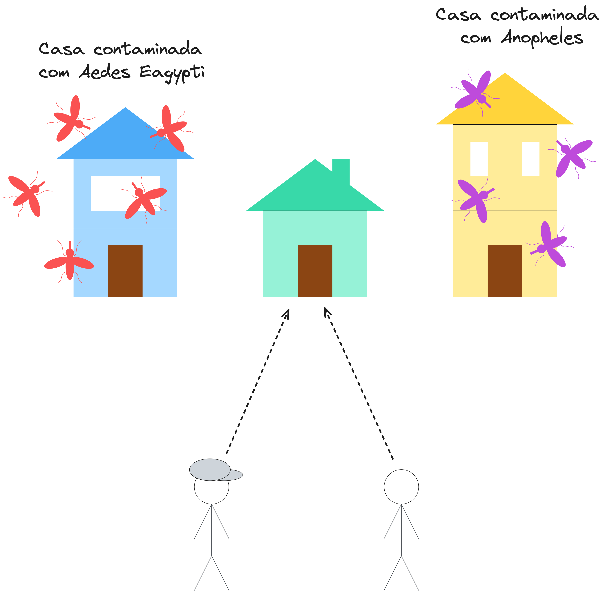
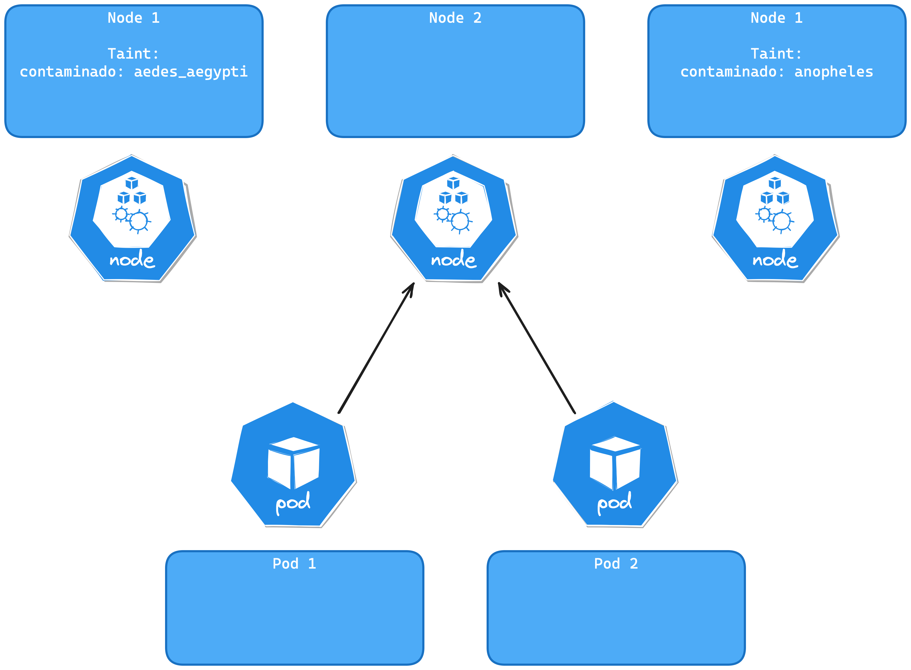
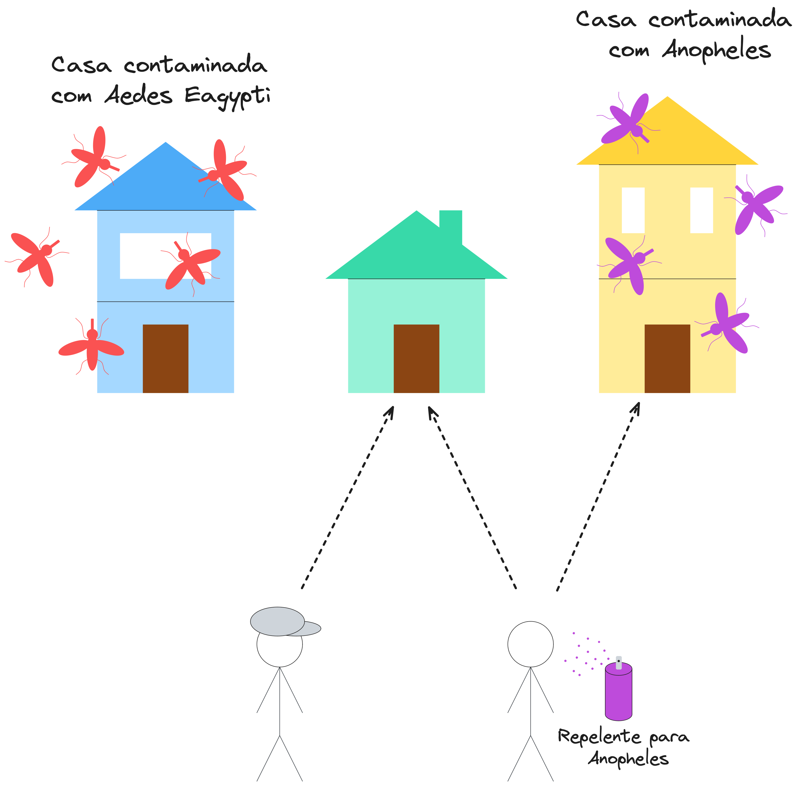
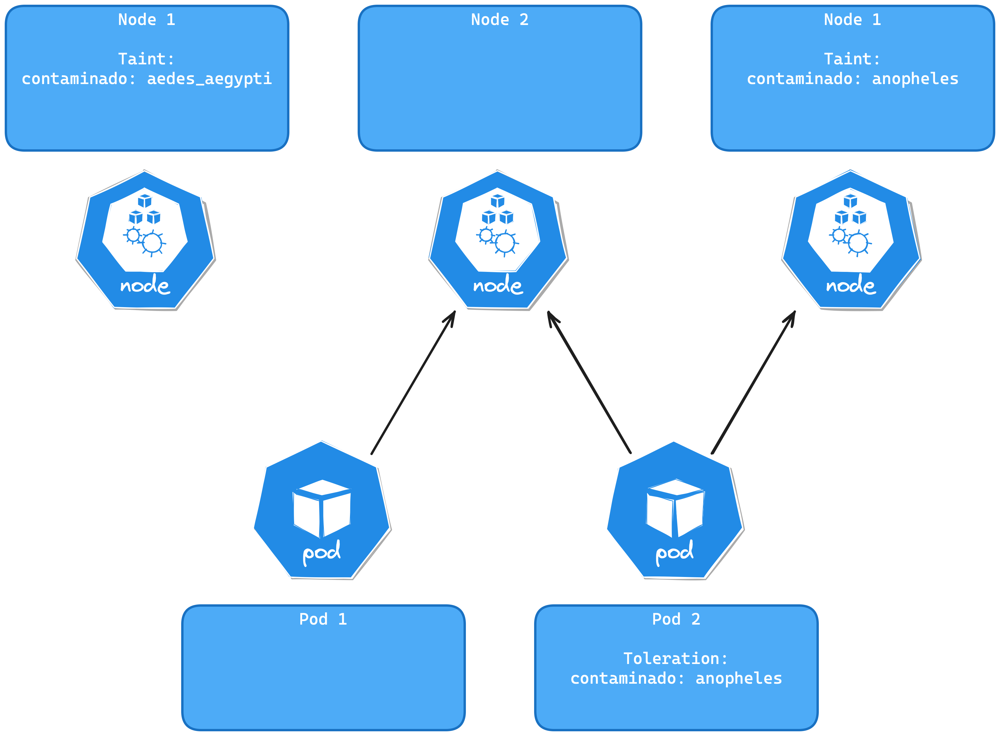
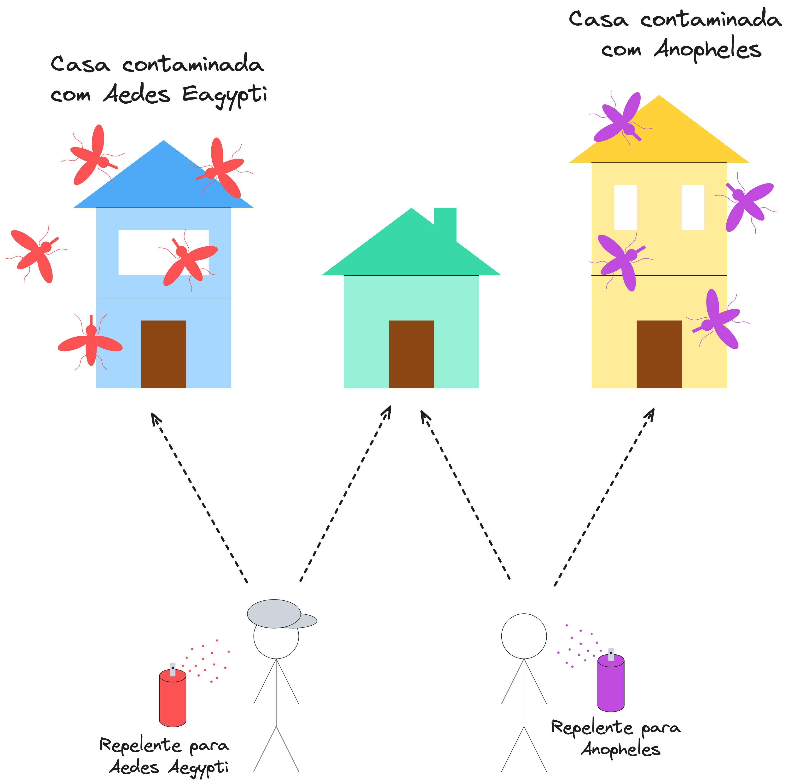
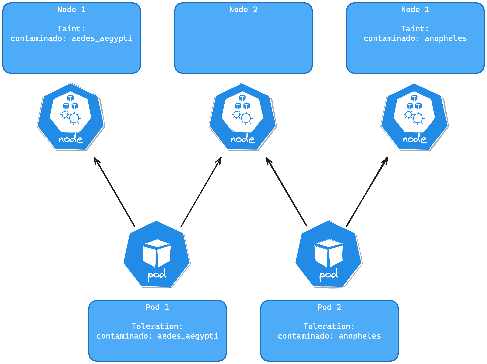
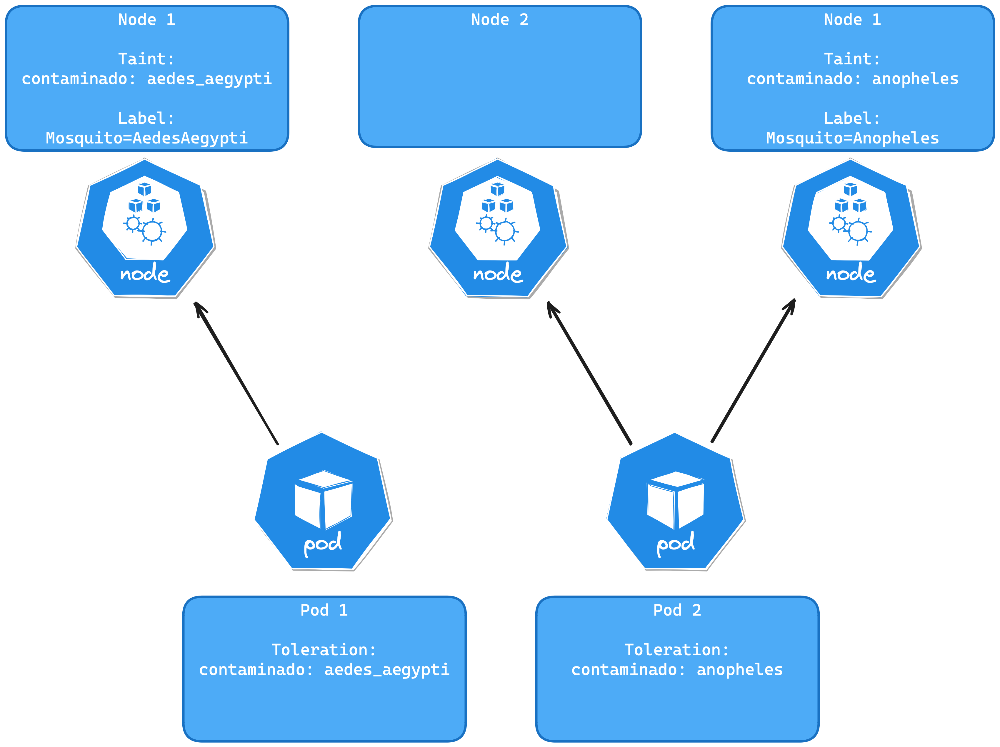
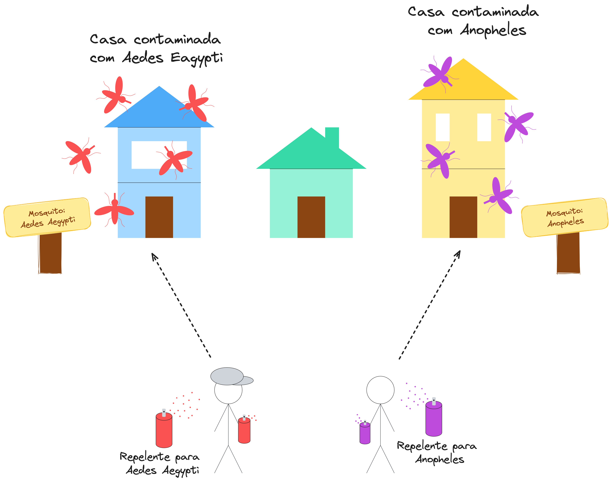
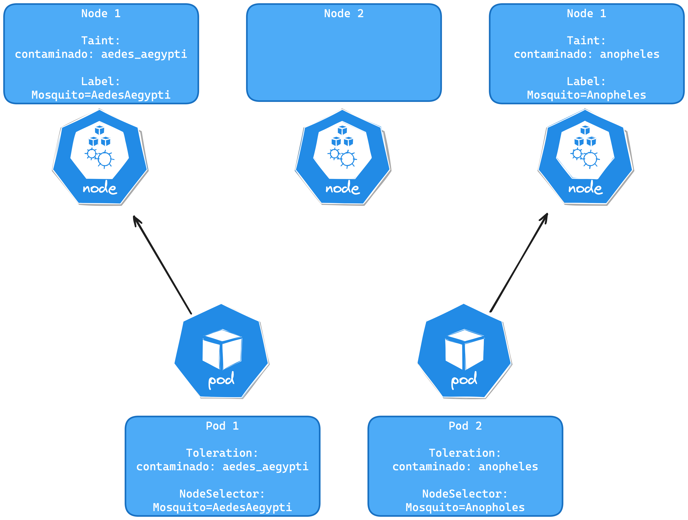

Nem sempre é trivial entender os conceitos de _Taint_ e _Toleration_ do Kubernetes. Neste guia, vamos explicar de forma didática e ilustrada o que são e como funcionam.

Com eles podemos garantir que determinados pods sejam executados em determinados nodes, isso é essencial para realizar tarefas específicas em determinados nodes, como por exemplo, garantir que um pod que consome muita CPU seja executado em um node com muita CPU disponível, ou que um treinamento de modelo de machine learning seja executado em um node com uma GPU disponível.

É importante deixar claro que o exemplo a seguir não teve sua analogia criada por mim, não me recordo se o ouvi em uma palestra ou li em algum lugar. Caso você saiba a fonte original, por favor, me avise para que eu possa dar os devidos créditos.

A seguir vamos explicar de forma sucinta o que são _taint_ e _toleration_ e como eles funcionam.

## Taint

Imagine que você pertence a um ministério do governo responsável pelo monitoramento de mosquitos em residências e tem como objetivo identificar e eliminar focos do mosquito Aedes aegypti e Anopheles. Caso você encontre um foco, você coloca uma placa na residência informando que ali existe um foco de mosquito e qual o tipo. Ou seja, você informa que determinada residência está contaminada e que só pessoas com determinadas proteções podem entrar. Isso é um _taint_.

## Toleration

Agora, é a hora de indicar aos agentes de saúde que eles podem entrar na residência contaminada. Para isso, você fornece a eles um repelente específico que os permite entrar na residência sem serem contaminados. Ou seja, você tolera a presença deles, já que você possui um mecanismo que o protege do mosquito. Isso é uma _toleration_.

## NodeSelector

Imagine agora que os agentes de saúde agora não podem mais entrar em qualquer residência, apenas em residências que possuem a identificação de foco de mosquito. O João só pode entrar em residências com foco de mosquito Aedes aegypti e o Paulo só pode entrar em residências com foco de mosquito Anopheles. Isso é um NodeSelector.

## Entendendo passo a passo

Seguindo o exemplo citado acima, vamos imaginar que temos três casas. A casa 1 está contaminada com o mosquito Aedes aegypti, a casa 2 está livre de contaminação e a casa 3 está contaminada com o mosquito Anopheles. Temos dois agentes de saúde querendo remover os focos de mosquito. O agente 1, de chapéu, se chama João e o agente 2, sem chapéu, se chama Paulo. Como ambos estão sem repelente, eles não podem entrar nas casas contaminadas, restando apenas a casa 2 para ser inspecionada.

---

---

Passada algumas horas Paulo recebeu um repelente que o protege do mosquito Anopheles. Agora, ele pode entrar na casa 3 e ajudar a remover o foco de mosquito transmissor da malária. Além disso, ele continua podendo entrar na casa 2, já que ela está livre de contaminação. Já João, continua sem proteção extra e só pode entrar na casa 2.

---

---

Mais algumas horas se passaram e João recebeu um repelente que o protege do mosquito Aedes aegypti. Agora, ele pode entrar na casa 1 e ajudar a remover o foco de mosquito transmissor da dengue. Além disso, ele continua podendo entrar na casa 2 e Paulo continua podendo entrar na casa 2 e 3.

---

---

Agora, as casas receberam novas placas informando sobre a infestações de mosquitos. A casa 1 recebeu a placa "Mosquitos: Aedes aegypti", a casa 2 não recebeu placa e a casa 3 recebeu a placa "Mosquitos: Anopheles". Além disso, João recebeu a missão de remover os focos de mosquito Aedes aegypti somente, ou seja, ele não pode mais ir para a casa 2, já que ela não possui foco de mosquito.

---

---

Agora entramos no conceito de NodeSelector. João só pode entrar na casa 1, já que ela possui foco de mosquito Aedes aegypti. Paulo só pode entrar na casa 3, já que ela possui foco de mosquito Anopheles. A casa 2 não possui foco de mosquito, então nenhum dos agentes de saúde pode entrar nela.

---

---

Nas imagens que acompanharam o exemplo, o conceito é apresentado de uma forma mais técnica. A casa 1, 2 e 3 são os nodes do Kubernetes. O agente de saúde João é um Pod e o agente de saúde Paulo é outro Pod. A contaminação representa o _taint_, o repelente é a _toleration_ a placa de identificação é uma label do nó e a missão de remover o foco de mosquito é o NodeSelector.

## Conclusão

Espero que este artigo tenha ajudado a esclarecer os conceitos de _taint_ e _toleration_ do Kubernetes. Compreender esses conceitos é essencial para extrair mais valor do Kubernetes e assegurar que suas aplicações sejam resilientes, seguras e otimizadas para o desempenho necessário.

No futuro, pretendo escrever um artigo utilizando o Kwok, uma ferramenta que simula nodes no Kubernetes sem a necessidade de executar pods, apenas simulando a presença deles. Será um artigo interessante para visualizarmos na prática o conceito de _taint_ e _toleration_.
