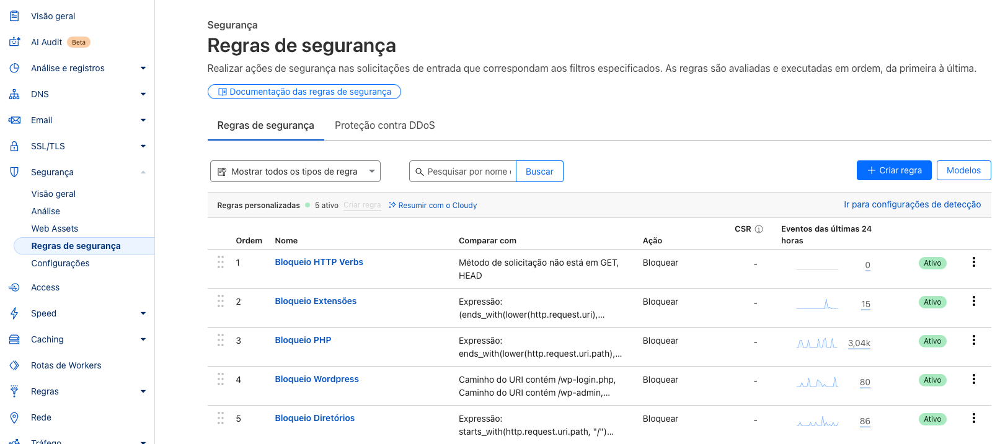
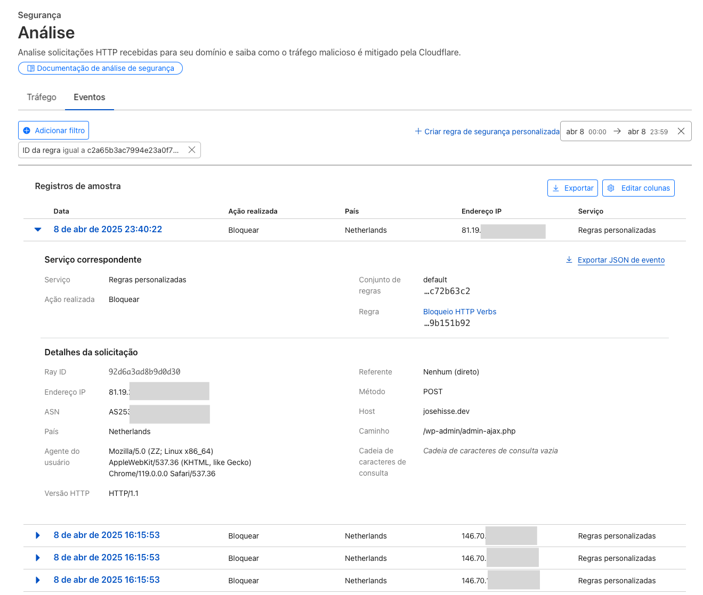
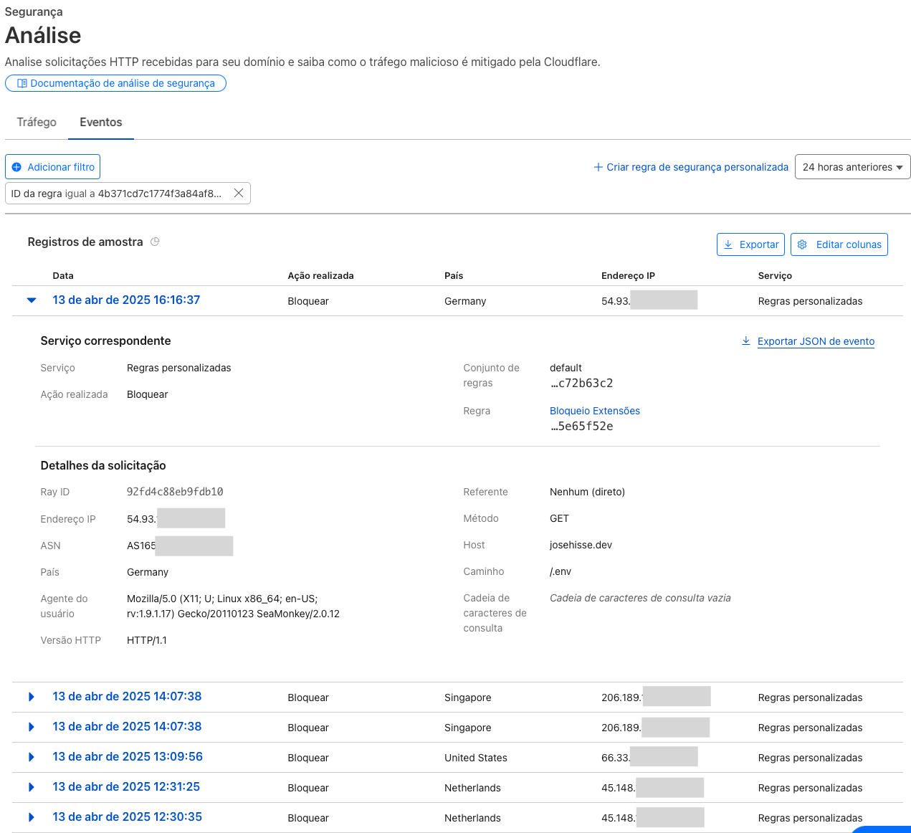
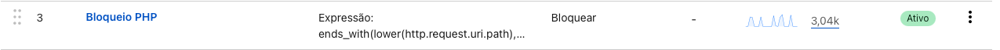
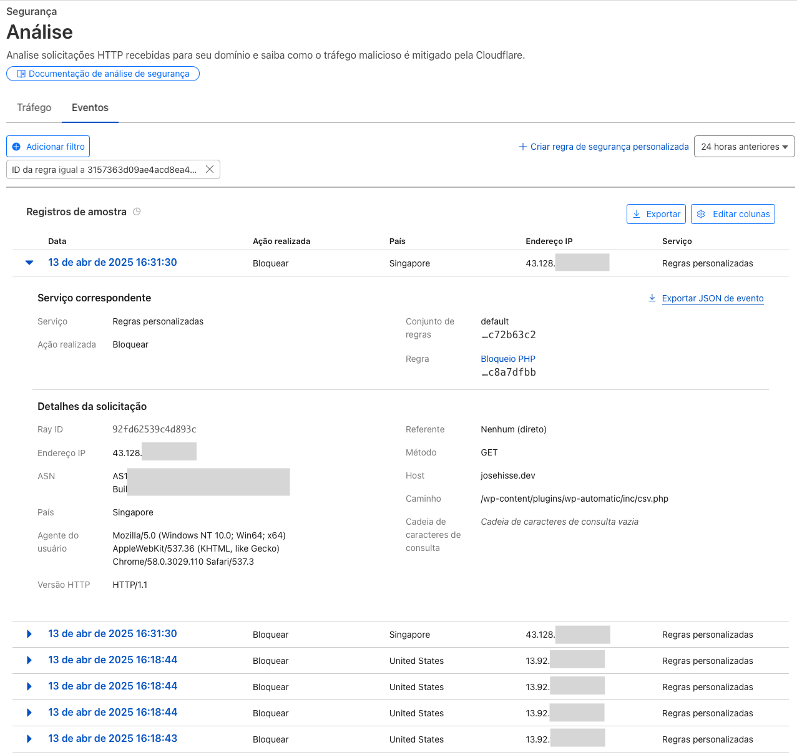
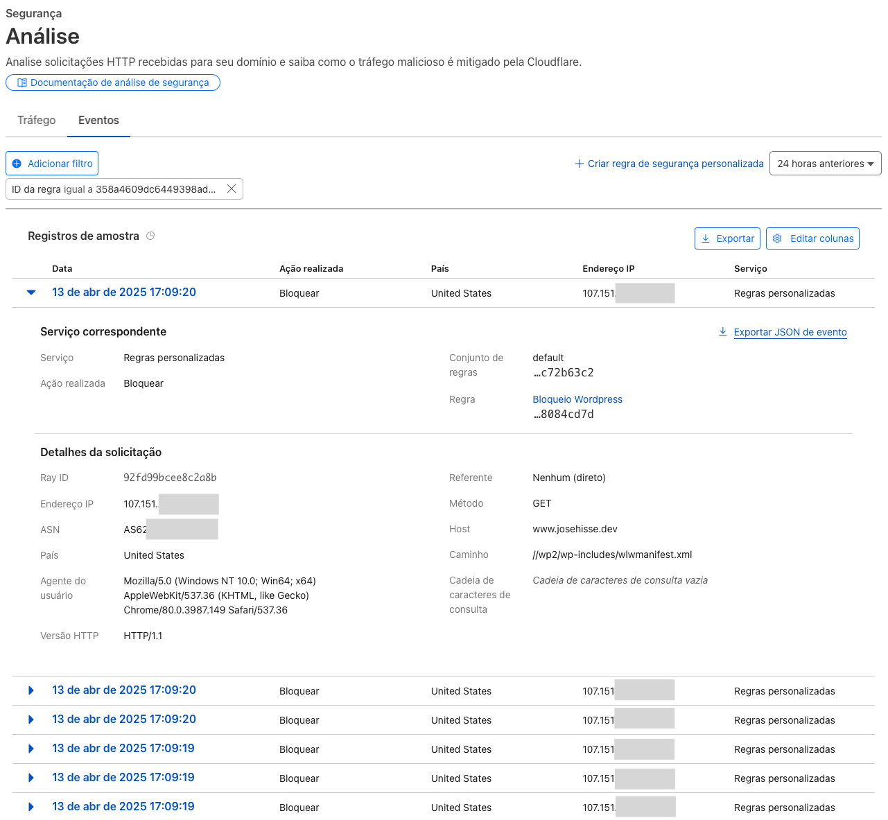
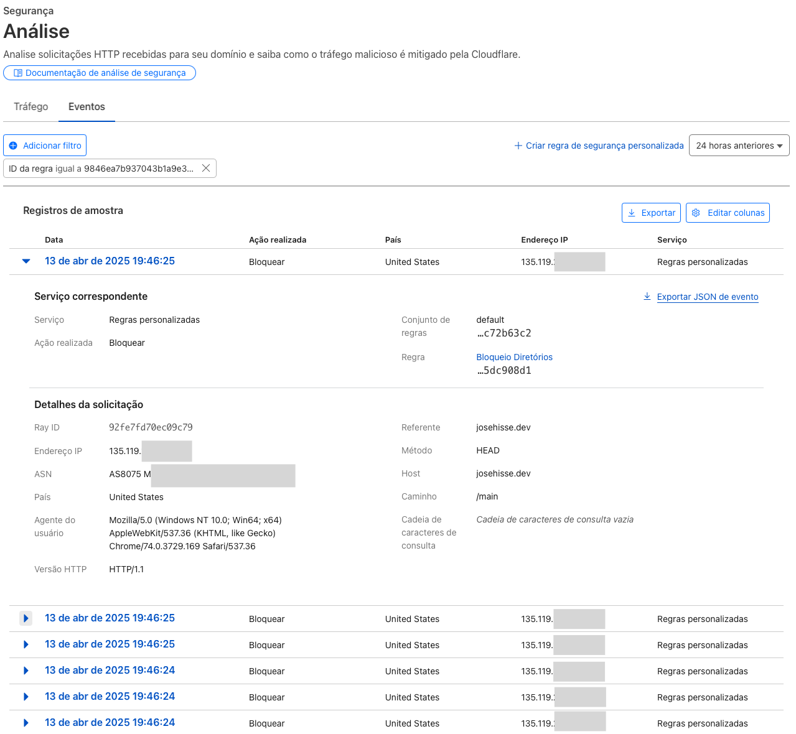
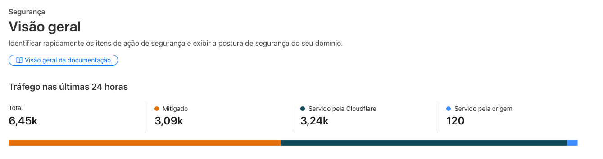

## Introdução

Parece engraçado e até absurdo, mas sites estáticos também precisam de atenção à segurança. Sem uma linguagem de backend, consultas ao banco de dados ou processamento no servidor, muitos desenvolvedores subestimam as vulnerabilidades que podem ser exploradas, deixando seus sites e infraestrutura expostos a diversos tipos de ataques. Mesmo um site puramente estático - HTML, CSS, JS - servido via plataformas como Cloudflare Pages - como é o caso deste blog - necessita de camadas de proteção adequadas.

Neste artigo, compartilho minha experiência em relação a este blog e explico os principais vetores que atacantes podem explorar, desde tentativas de acesso a arquivos de configuração até ataques direcionados a frameworks populares. Analisarei exemplos reais de tráfego malicioso detectado, demonstrando como, mesmo não comprometendo diretamente o conteúdo estático, essas tentativas representam riscos ao servidor de origem. Por fim, apresentarei estratégias para mitigar essas ameaças através de regras de firewall específicas na Cloudflare, criando camadas de proteção eficazes que reduzem significativamente a superfície de ataque.

## Por que sites estáticos também precisam de segurança?

Sites estáticos não estão imunes a ameaças. Atacantes frequentemente realizam varreduras em busca de vulnerabilidades comuns, independentemente da tecnologia utilizada. Embora a ausência de processamento server-side reduza certos vetores de ataque, a segurança está fortemente relacionada tanto à tecnologia quanto à infraestrutura em que o site está hospedado e a arquivos de configuração que podem estar expostos. Estas tentativas podem incluir:

- Busca por arquivos de configuração expostos que possam conter credenciais (como .env, config.json)
- Tentativas de explorar vulnerabilidades em frameworks populares como WordPress, mesmo quando não são usados
- Requisições para endpoints de administração ou arquivos sensíveis
- Métodos HTTP não autorizados
- Ataques de força bruta em diretórios em busca de arquivos sensíveis
- Ataques DDoS com intenção de sobrecarregar o servidor ou a CDN

Além disso, mesmo que essas tentativas falhem em um site estático, elas consomem recursos computacionais, podem impactar a performance do servidor ou revelar informações sobre sua infraestrutura para futuros ataques.

Implementar regras de segurança não é apenas sobre prevenir ataques bem-sucedidos, mas também sobre otimizar recursos, eliminar poluição nos logs e impedir a coleta de informações que poderiam facilitar outros tipos de ataques.

## Implementando regras de segurança na Cloudflare

A Cloudflare oferece, no plano gratuito, ferramentas para implementar [regras de segurança personalizadas](https://developers.cloudflare.com/security/rules/). Estas regras funcionam como filtros que analisam cada requisição antes que ela chegue ao seu servidor de origem, permitindo bloquear ou permitir o tráfego para a origem ou cache. Neste caso, vamos apresentar filtros para bloquear certos tipos de requisições. Esses filtros podem ser configurados na interface da Cloudflare, no menu "Segurança" > "Regras de segurança", se sua interface estiver em português, ou "Security" > "Security rules" se sua interface estiver em inglês. Lembrando que temos um limite de 5 filtros no plano gratuito.



Abaixo, apresento as regras que implementei em meu site e o raciocínio por trás de cada uma. Aqui vale uma observação, as regras abaixo fazem sentido no meu contexto, seu contexto pode ser bem diferente do meu e exigir regras diferentes. Portanto, avalie com cautela e ajuste conforme necessário.

### Regra 1: Bloqueando métodos HTTP não essenciais

```prolog
(not http.request.method in {"GET" "HEAD"})
```

Esta regra simples, porém eficaz, bloqueia qualquer método HTTP que não seja GET ou HEAD. Para um site estático e sem formulários, no meu caso, estes são os únicos métodos necessários.

Métodos como POST, PUT, DELETE ou PATCH são utilizados para modificar recursos no servidor, o que não faz sentido em um site em que a única coisa que pode ser obtida são arquivos estáticos, como html, css, javascript e imagens. Bloquear esses métodos elimina outros tipos de ataques que tentam explorar vulnerabilidades no servidor de hospedagem.



Podemos observar pela imagem que houve diversas tentativas de acesso utilizando métodos HTTP não permitidos, como POST. Essas requisições foram originadas de diferentes endereços IP e direcionadas a vários caminhos do site, incluindo tentativas de acesso a arquivos PHP e endpoints administrativos. Graças a esta regra, a Cloudflare bloqueou automaticamente todas essas requisições, impedindo que atingissem o servidor de origem. Este é um exemplo claro de como atacantes tentam explorar vulnerabilidades comuns utilizando uma varredura ampla, mesmo em sites que não utilizam tecnologias de backend dinâmicas.

### Regra 2: Protegendo contra exposição de arquivos sensíveis

```prolog
(ends_with(lower(http.request.uri), ".config")) or
(ends_with(lower(http.request.uri), ".db")) or
(ends_with(lower(http.request.uri), ".env")) or
(ends_with(lower(http.request.uri), ".key")) or
(ends_with(lower(http.request.uri), ".pwd")) or
(ends_with(lower(http.request.uri), ".sql")) or
(ends_with(lower(http.request.uri), "/.kube/config")) or
(ends_with(lower(http.request.uri), "/config.json")) or
(ends_with(lower(http.request.uri), "/config.xml")) or
(ends_with(lower(http.request.uri), "/config.yaml")) or
(ends_with(lower(http.request.uri), "/config.yml")) or
(ends_with(lower(http.request.uri), "/etc/shadow")) or
(ends_with(lower(http.request.uri), "/secrets.json")) or
(lower(http.request.uri) contains "/.git") or
(lower(http.request.uri) contains "/.ssh") or
(lower(http.request.uri) contains "/.svn")
```

Esta regra utiliza as funções `ends_with()` para verificar se URI termina com determinada string, `lower()` para garantir que a comparação seja case-insensitive, e `contains` para identificar padrões em qualquer parte do URI. Ela tem como objetivo bloquear tentativas de acessar arquivos de configuração, credenciais, bancos de dados e scripts que poderiam estar expostos erroneamente. Atacantes frequentemente tentam acessar esses arquivos, que podem conter informações como chaves de API, senhas ou detalhes da infraestrutura, para obter informações relevantes que possibilitariam outros tipos de ataques.

Mesmo que você tenha certeza de que esses arquivos não estão em seu site, bloquear essas requisições é uma boa prática. Isso evita que atacantes obtenham qualquer informação sobre a existência desses arquivos.



Na imagem acima, verificamos algumas tentativas de explorar arquivos sensíveis ocorridas em 13 de abril de 2025. Podemos perceber que uma varredura buscou especificamente um arquivo .env na raiz do site. Embora não haja perigo imediato em um site hospedado no Cloudflare Pages, a não ser que exista realmente um arquivo .env com credenciais na raiz, este exemplo ilustra por que é importante adotar medidas de segurança preventivas. Essas barreiras bloqueiam varreduras maliciosas e protegem contra possíveis erros do programador que poderiam expor informações sensíveis.

### Regra 3: Bloqueando tentativas de exploração PHP

```prolog
ends_with(lower(http.request.uri.path), ".php") or
ends_with(lower(http.request.uri.path), ".php3") or
ends_with(lower(http.request.uri.path), ".php4") or
ends_with(lower(http.request.uri.path), ".php5") or
ends_with(lower(http.request.uri.path), ".php6") or
ends_with(lower(http.request.uri.path), ".php7") or
ends_with(lower(http.request.uri.path), ".php8") or
ends_with(lower(http.request.uri.path), ".phtml") or
ends_with(lower(http.request.uri.path), "/phpinfo")
```

PHP continua sendo uma das tecnologias web mais exploradas devido à sua popularidade e ao histórico de vulnerabilidades. Isso justifica o alto número de tentativas de acesso nos logs das últimas 24 horas.



Mesmo que seu site não utilize PHP, varreduras automáticas tentarão acessar arquivos PHP, podendo sobrecarregar o servidor de origem e consumir recursos. Esta regra bloqueia requisições para qualquer arquivo PHP, incluindo variações menos comuns como .phtml ou diferentes versões numeradas. Também bloqueia especificamente o acesso ao `phpinfo`, um endpoint frequentemente visado que pode revelar informações detalhadas sobre o servidor.



Como não temos arquivos php, o bloqueio de arquivos PHP não afeta o funcionamento do site. Mesmo assim, devemos implementar esta regra para evitar, mais uma vez, sobrecarregar o servidor de origem.

### Regra 4: Proteção contra varredura WordPress

```prolog
(http.request.uri.path contains "/wp-admin") or
(http.request.uri.path contains "/wp-comments-post.php") or
(http.request.uri.path contains "/wp-content/") or
(http.request.uri.path contains "/wp-cron.php") or
(http.request.uri.path contains "/wp-includes/") or
(http.request.uri.path contains "/wp-json/") or
(http.request.uri.path contains "/wp-login.php") or
(http.request.uri.path contains "/xmlrpc.php")
```

WordPress é o CMS mais popular do mundo e, consequentemente, o mais atacado. Além disso, ele é feito com PHP e muitos usuários antigos ainda mantém seus sites com versões antigas e vulneráveis. Mesmo que seu site não utilize WordPress, você provavelmente receberá inúmeras tentativas de exploração direcionadas a endpoints WordPress comuns.

Esta regra bloqueia acessos a áreas administrativas do WordPress e outros componentes. Isso reduz significativamente os logs de acesso e economiza recursos que seriam desperdiçados processando essas requisições inúteis.



Podemos perceber que esta regra tem alguma sobreposição com a regra 3, que bloqueia arquivos php. Isso não é um problema, mas observando hoje, enquanto escrevo este artigo, percebo que o ideal era inverter a ordem da regra 3 e 4. Invertendo as regras, de forma que a regra 3, por ser avaliada primeiro, bloquearia tentativas de acesso ao WordPress antes que a regra 4 bloqueasse arquivos php no geral. Isso permitiria que eu tivesse controle de logs e métricas mais eficientes. É preferível que regras mais especificas sejam avaliadas primeiro.

Observando a imagem acima, notamos que o path `//wp2/wp-includes/wlwmanifest.xml` começa com duas barras. Isso pode ser tanto um erro na ferramenta utilizada pelos atacantes quanto algo proposital. Apesar da minha pouca experiência na área, acredito mais na segunda hipótese. Se não tomássemos cuidado e utilizássemos, por exemplo, `starts_with(http.request.uri.path, "/wp2/")`, a regra não bloquearia a tentativa de acesso devido à barra extra no inicio do path. Por isso, devemos analisar detalhadamente alguns logs de acesso para entender os padrões utilizados em varreduras.

### Regra 5: Limitando o acesso a diretórios e arquivos específicos

```prolog
starts_with(http.request.uri.path, "/")
and (http.request.uri.path ne "/")
and not (starts_with(lower(http.request.uri.path), "/blog"))
and not (starts_with(lower(http.request.uri.path), "/.well-known"))
and not (ends_with(lower(http.request.uri.path), ".html"))
and not (ends_with(lower(http.request.uri.path), ".txt"))
and not (ends_with(lower(http.request.uri.path), ".xml"))
and not (ends_with(lower(http.request.uri.path), ".ico"))
```

Esta regra é um pouco mais complexa de entender, mas ela implementa um princípio de segurança conhecido como "permitir apenas o necessário" ou "least privilege". Vemos um novo operador `ne`, que significa "not equal", ou seja, verificamos se o caminho é diferente de. A regra bloqueia o acesso a qualquer caminho que não seja explicitamente permitido, como a raiz do site ("/"), o diretório do blog ("/blog"), arquivos com extensões comuns (.html, .txt, .xml, .ico) e o diretório .well-known.

Ao restringir o acesso apenas aos caminhos esperados, você reduz significativamente a superfície de ataque do seu site. Qualquer tentativa de acessar diretórios ou arquivos não inclusos na regra será automaticamente bloqueada. Essa regra é mais abrangente e busca restringir o que as regras anteriores não conseguem.



Ela se torna eficaz contra paths comuns, porém não utilizados propriamente pelo site. Por exemplo, tentativas de acessos a diretórios como `/main`, `/backup`, `/bk`, `/bc`, `/home`, `/old` ou `/new`. Esses diretórios podem ser comuns em servidores mais antigos, geralmente gerenciados com FTP e sem controle de versão.

## Conclusão

Após implementar essas regras de segurança, observei uma redução significativa na poluição dos logs de acesso e nas tentativas de exploração. A Cloudflare fornece estatísticas detalhadas sobre as requisições bloqueadas, permitindo visualizar a quantidade surpreendente de tentativas de exploração que ocorreram nas últimas 24 horas.



É importante ressaltar que essas regras devem ser adaptadas às necessidades específicas do seu site. Por exemplo, se você utiliza um diretório `/home` para sua homepage, você deve adicionar o caminho `/home` na regra 5. Assim como em outras regras, o objetivo é bloquear tentativas de exploração que não sejam relevantes para o seu site.

A segurança é um processo contínuo. Mesmo com um site estático aparentemente simples, manter-se vigilante e implementar medidas de proteção é essencial para garantir que seu site não seja explorado por atacantes e scripts maliciosos.
