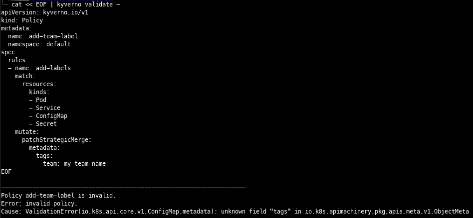
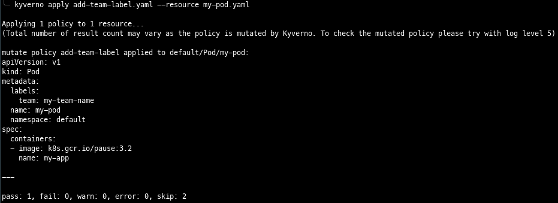

Gerenciar políticas e garantir que recursos do Kubernetes sigam determinadas regras pré definidas são as principais funções do [Kyverno](https://kyverno.io/). Com ele podemos definir um conjunto de regras que se aplicarão a deployments, statefulsets, pods ou qualquer outro tipo de recurso. E tudo isso é definido da mesma forma que bem conhecemos quando estamos acostumados com o Kubernetes, através de arquivos yaml.

## Pré requisitos

Como este artigo busca explorar de forma prática o funcionamento do Kyverno, precisamos que alguns softwares estejam instalados na máquina. Segue a lista dos que serão usados:

- [kind *versão: 0.11.1*](https://kind.sigs.k8s.io/) - O kind nos permite ter um cluster k8s local de forma rápida e fácil. Cada node do nosso clusters será executado como um container, por este motivo é necessário ter o docker ou o podman instalado na máquina.
- [kubectl *versão: 1.22.2*](https://kubernetes.io/docs/tasks/tools/#kubectl) - Este cli nos permite executar e controlar nosso cluster k8s.
- [kyverno cli *versão: 1.5.1*](https://kyverno.io/docs/kyverno-cli) - O command line do Kyverno nos permite testar as regras que definimos antes que elas sejam aplicadas ao cluster k8s.

## Aplicando uma política simples

Vamos iniciar esta seção criando um cluster kubernetes local. Este cluster será usado ao longo de todo este artigo e será onde executaremos nossos testes. Para isso precisamos ter o kind instalado e executar o seguinte comando no terminal:

```console
kind create cluster --name kyverno
```


Agora devemos instalar o Kyverno, vamos utilizar o método de instalação via yaml e instalar a versão *1.5.1*.

```console
kubectl create -f https://raw.githubusercontent.com/kyverno/kyverno/v1.5.1/definitions/release/install.yaml
```

Vamos aguardar a aplicação estar pronta para seguirmos adiante.

```console
kubectl wait --for=condition=available --timeout=300s deployment kyverno -n kyverno
```

Até o momento talvez não tenha ficado muito claro a função do Kyverno, por isso vamos definir uma regra simples, aplicar ao cluster e verificar como ele atua nos recursos do cluster.

Imagine que na empresa em que trabalhamos sempre devemos garantir que os recursos de nosso time tenha uma determinada label, ou seja, todos os recursos do nosso namespace devem possuir determinada label. Vamos defini-la por ```team: my-team-name``` e todos os nossos pods, services, configmaps e secrets devem ter esta label.

Na página oficial podemos encontrar um [conjunto de políticas de exemplo](https://release-1-5-0.kyverno.io/policies/) e na maioria das vezes já existe uma que é muito semelhante a sua necessidade. Por isso sempre vale a pena dar uma conferida antes de criar uma política do zero.

A primeira coisa que devemos saber sobre o Kyverno é que ele permite a definição de dois tipos de políticas. Uma é de escopo amplo, que permite a aplicação de determinada regra a todo o cluster, que se chama **ClusterPolicy**. A outra fica limitada ao namespace que ela está aplicada, ou seja, as regras só serão aplicadas aos recursos daquele namespace em questão, ela é chamada de **Policy**.

Vamos modificar a política já existente, [add label](https://release-1-5-0.kyverno.io/policies/other/add_labels/add_labels/), para que ela adicione a label ```team``` nos nossos recursos que estão limitados ao namespace *default*.

```yaml
apiVersion: kyverno.io/v1
kind: Policy
metadata:
  name: add-team-label 
  namespace: default
spec:
  rules:
  - name: add-labels
    match:
      resources:
        kinds:
        - Pod
    mutate:
      patchStrategicMerge:
        metadata:
          labels:
            team: my-team-name
```

Vamos salvar o conteúdo acima em um arquivo chamado ```add-team-label.yaml``` e em seguida aplicar em nosso cluster recém criado.

```console
kubectl apply -f add-team-label.yaml
```

Temos que validar a regra aplicada. Vamos criar um pod em nosso cluster e verificar em seguida se a label foi aplicada corretamente.

```yaml
apiVersion: v1
kind: Pod
metadata:
  name: my-pod
  namespace: default
spec:
  containers:
    - name: my-app
      image: k8s.gcr.io/pause:3.2
```

```console
kubectl apply -f my-pod.yaml
```

Agora vamos checar se a label ```team``` com o valor ```my-team-name``` foi aplicada com sucesso em nosso pod. A flag ```--show-labels``` mostra as labels dos pods na listagem.

```console
kubectl get pods --show-labels -n default
```


Vemos que a label obrigatória foi aplicada com sucesso em nosso recurso.

Acabamos de experimentar um caso de uso do Kyverno e podemos imaginar *n* outros casos de uso.

- Posso forçar que todos os meus deployments sempre tenham a chave *imagePullPolicy* definida com *Always*?
- Posso impedir que um recurso seja excluído?
- Posso garantir que as imagens utilizadas em pods nunca usem a tag *latest*?
- Posso tornar obrigatória a definição de limites de cpu e memória nos pods?

Todas essas perguntas acima tem a resposta afirmativa quando estamos utilizando o Kyverno.

## Tipos de políticas

Atualmente temos 3 principais comportamentos de políticas no Kyverno. Vamos listar abaixo quais são e qual a função de cada um.

- **Mutate Resources**: Aplica alterações no recurso, alguns exemplos incluem, adicionar determinada label ou annotation, definir limites de cpu e memória em pods ou até adicionar propriedades padrões aos recursos.
- **Validate Resources**: As regras de validação servem para validar se o recurso que está sendo aplicado no cluster está com determinada propriedade correta. Por exemplo, se a imagem não contém a tag latest ou se os limites de cpu e memória estão definidos.
- **Generator Resources**: Este tipo de política se aplica a casos de uso onde queremos criar um recurso assim que um novo recurso é definido. Um exemplo comum pode ser, quando criamos um namespace, queremos que seja criado de forma automática o ResourceQuota daquele namespace.

## Utilizando o Kyverno CLI

Poderíamos ter validado e testado a política apresentada no começo deste artigo antes de aplicá-la em nosso cluster. Isso é muito útil em processos de CI/CD, onde queremos realizar essas atividades de forma automática.

No Kyverno command line temos três principais comandos, o **validate**, utilizado para verificar se nossa especificação da política está correta e é válida. O comando **apply** aplica a política em uma especificação de recurso, como de um pod, por exemplo, e tem como output o recurso modificado. E por último temos o **test**, que varre o diretório especificado para executar uma série de testes.

### Kyverno CLI Validate

Vamos utilizar cada um dos três citados acima na ordem apresentada. O primeiro será o **validate** e seu uso é bastante simples. Com o arquivo yaml contendo nossa política, vamos executar o seguinte comando:

```console
kyverno validate add-team-label.yaml
```

A saída esperada desse comando é uma mensagem indicando que nossa política é válida, como esperado.


Por curiosidade vamos executar um comando para testar uma política inválida. Vamos alterar o campo *metadata.labels* para *metadata.tags*, como sabemos não existe o campo *metadata.tags* nas especificações do kubernetes, portanto nossa política deve ser apontada como inválida.

```console
cat << EOF | kyverno validate -
apiVersion: kyverno.io/v1
kind: Policy
metadata:
  name: add-team-label 
  namespace: default
spec:
  rules:
  - name: add-labels
    match:
      resources:
        kinds:
        - Pod
        - Service
        - ConfigMap
        - Secret
    mutate:
      patchStrategicMerge:
        metadata:
          tags:
            team: my-team-name
EOF
```



Como observado na imagem acima, nossa política foi diagnosticada como inválida. O que está correto, já que não existe o campo *metadata.tags*.

### Kyverno CLI Apply

O comando **apply**, como dito anteriormente, aplica determinada regra a um recurso e tem como output um yaml modificado.

```console
kyverno apply add-team-label.yaml --resource my-pod.yaml
```



### Kyverno CLI Test

Podemos executar testes em nossas políticas. Esses testes se assemelham a testes unitários, vamos defini-los em um arquivo chamado *test.yaml* e colocá-lo no mesmo diretório dos outros arquivos. O conteúdo deste arquivo será:

```yaml
name: add-always-pull-policy
policies:
  - always-pull-images.yaml
resources:
  - my-pod.yaml
results:
- policy: always-pull-images
  rule: always-pull-images
  resource: my-pod
  kind: Pod
  patchedResource: my-pod-patched.yaml
  result: pass
```

A regra que iremos executar neste teste é a [Always Pull Image](https://release-1-5-0.kyverno.io/policies/other/always-pull-images/always-pull-images/) e a colocaremos no arquivo *always-pull-images.yaml*.

```yaml
apiVersion: kyverno.io/v1
kind: ClusterPolicy
metadata:
  name: always-pull-images    
spec:
  rules:
  - name: always-pull-images
    match:
      resources:
        kinds:
        - Pod
    mutate:
      patchStrategicMerge:
        spec:
          containers:
          - (name): "?*"
            imagePullPolicy: Always
```

Outro arquivo que deve estar em nosso diretório é o que conterá a definição sem a política aplicada *my-pod.yaml*

```yaml
apiVersion: v1
kind: Pod
metadata:
  name: my-pod
  namespace: default
spec:
  containers:
    - name: my-app
      image: k8s.gcr.io/pause:3.2
```

Como queremos executar um teste que verifica a aplicação correta de uma política, precisamos ter um arquivo de definição com a política já aplicada ao recurso. Então, vamos criar um arquivo chamado *my-pod-patched.yaml* onde terá o estado final da definição.

```yaml
apiVersion: v1
kind: Pod
metadata:
  name: my-pod
  namespace: default
spec:
  containers:
    - name: my-app
      image: k8s.gcr.io/pause:3.2
      imagePullPolicy: Always
```

A estrutura final de diretórios é a seguinte:

```console
.
├── my-pod.yaml
├── my-pod-patched.yaml
├── always-pull-images.yaml
└── test.yaml
```

Agora basta executar os testes no terminal.

```console
kyverno test .
```


## Conclusão

Neste artigo exploramos uma função básica do Kyverno, quando alteramos um recurso de forma automática devido a uma regra. Recomendo ao leitor a experimentar outras políticas disponibilizadas no site e observar a consequência que ela causa quando um novo recurso é criado. Exploramos também um pouco mais o cli do Kyverno, muito útil em processos de ci/cd.

De forma geral o Kyverno se mostrou uma ferramenta muito interessante e com um caso de uso muito pertinente quando queremos trabalhar em um cluster kubernetes mais organizado, padronizado e seguro.

Lembrando que todo o artigo teve como referência a [página oficial do Kyverno](https://kyverno.io), onde contêm variados exemplos e uma ótima documentação.
