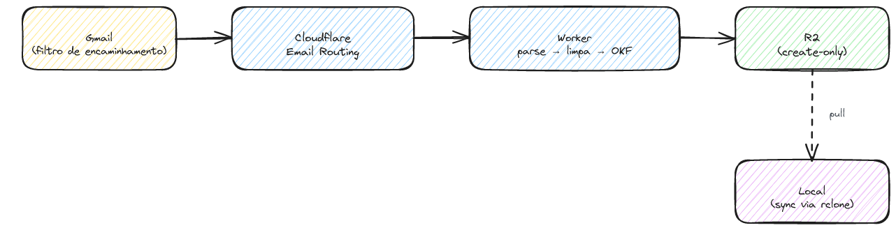

O objetivo deste post é documentar as decisões técnicas por trás de um pequeno serviço que recebe certos e-mails e os transforma em arquivos Markdown versionáveis (no formato OKF). O interesse aqui não é o resultado, e sim os trade-offs: o serviço roda inteiro dentro de um [Cloudflare Worker](https://developers.cloudflare.com/workers/), num ambiente que tira várias ferramentas do caminho e, com isso, força escolhas mais simples.

O fluxo é direto: um filtro no Gmail encaminha as mensagens de interesse para um endereço de ingestão, o [Cloudflare Email Routing](https://developers.cloudflare.com/email-routing/) entrega a mensagem crua ao Worker, e o Worker faz o parse do MIME, limpa o texto conforme o remetente, gera o Markdown OKF e grava o resultado no [R2](https://developers.cloudflare.com/r2/). A sincronização para a máquina local é um pull via [rclone](https://rclone.org/), não um push do Worker.

A escolha de não manter um servidor tradicional vem da natureza do problema: e-mail é um evento raro e assíncrono, e o Email Routing já invoca o Worker nativamente quando uma mensagem chega. Manter um processo no ar esperando esse evento seria custo sem contrapartida. O trade-off é o ambiente restrito: não há Node real, não há DOM, não há sistema de arquivos. O que sobra é o R2, um armazenamento de objetos, e é em cima dessa restrição que as três decisões abaixo fazem sentido.

## Decisão 1: o perfil de limpeza vem do remetente, nunca do conteúdo

Cada remetente manda e-mail com um formato próprio: rodapés, avisos legais, pixels de rastreamento, blocos de "não responda a esta mensagem". Para extrair só o texto útil, o processador aplica um perfil de limpeza específico por remetente. A pergunta é como decidir qual perfil usar.

A saída tentadora é olhar o conteúdo: se a mensagem menciona um banco, aplica-se o limpador daquele banco. O problema aparece no primeiro e-mail encaminhado. Um e-mail que só cita o banco de passagem acionaria o limpador errado e mutilaria o texto, porque o conteúdo é ambíguo e fácil de forjar.

A decisão é olhar o domínio autenticado do remetente, um fato do envelope, não uma pista do corpo. Confiar no domínio, porém, só se sustenta se o domínio for mesmo quem diz ser: por isso o Worker verifica a autenticação da mensagem (SPF, DKIM e DMARC) antes de aplicar qualquer perfil. Os detalhes de quais remetentes entram e que limites cada anexo respeita ficam de fora deste post de propósito, para não virar um mapa de como burlar o filtro. O princípio é o que interessa: autenticar a origem antes de confiar nela.

## Decisão 2: idempotência sem banco transacional

O Email Routing pode entregar a mesma mensagem mais de uma vez, seja por retry, seja por concorrência. Sem tratamento, o mesmo e-mail viraria dois arquivos. A resposta usual para isso seria uma transação em banco, exatamente a ferramenta que o Worker não tem.

O que o Worker tem é o R2. A decisão foi tratar o R2 como fonte de verdade e usar o hash do `Message-ID` como chave do arquivo. A gravação é create-only (`onlyIf: { etagDoesNotMatch: "*" }`): a escrita só vinga se a chave ainda não existe. Duas entregas concorrentes da mesma mensagem competem pela mesma chave, e a segunda é rejeitada na própria corrida, sem lock e sem transação.

Uma versão anterior colocava um cache KV na frente disso, para pular a leitura no R2 quando uma reentrega duplicada chegasse logo depois da primeira. Na prática, num volume de caixa de entrada pessoal, ele não pagava o próprio custo: o caminho comum, o de um e-mail novo, já fazia a leitura no R2 de qualquer forma, e a duplicata logo em seguida era rara demais para o cache economizar algo mensurável. O KV saiu do pipeline. A garantia de não duplicar nunca esteve nele, e sim no create-only do R2, então tirar o cache removeu uma dependência sem tocar na correção.

## Decisão 3: dead letter em vez de retry silencioso

Nem toda mensagem processa sem erro. O parse do MIME pode falhar, o remetente pode não ter perfil conhecido, um anexo pode fugir do previsto. A pergunta é o que fazer com a mensagem quando isso acontece.

Descartar em silêncio perde dados de forma invisível, e às vezes aquele e-mail é a única cópia. Um retry cego repete uma falha que, sendo determinística, vai falhar de novo do mesmo jeito. A escolha foi gravar o MIME cru numa pasta de falhas no próprio R2, uma dead letter. A mensagem original fica preservada, inspecionável e disponível para reprocessar depois que a causa for corrigida. A falha vira um artefato, não um buraco.

## Fechando

As três decisões seguem o mesmo fio: preferir o fato verificável à inferência conveniente. O domínio autenticado no lugar do conteúdo, o hash e o create-only no lugar do lock, o MIME cru preservado no lugar do retry cego. Nenhuma delas é sofisticada, e é esse o ponto.

O ambiente restrito do Worker, sem banco e sem servidor, acabou ajudando. Quando o ambiente tira suas ferramentas, a pergunta útil deixa de ser "como recupero o que já perdi" e passa a ser "qual é a menor fonte de verdade que ainda me sobra". Aqui, essa fonte foi o R2 com gravação create-only, e quase todo o resto se organizou em volta dela.
